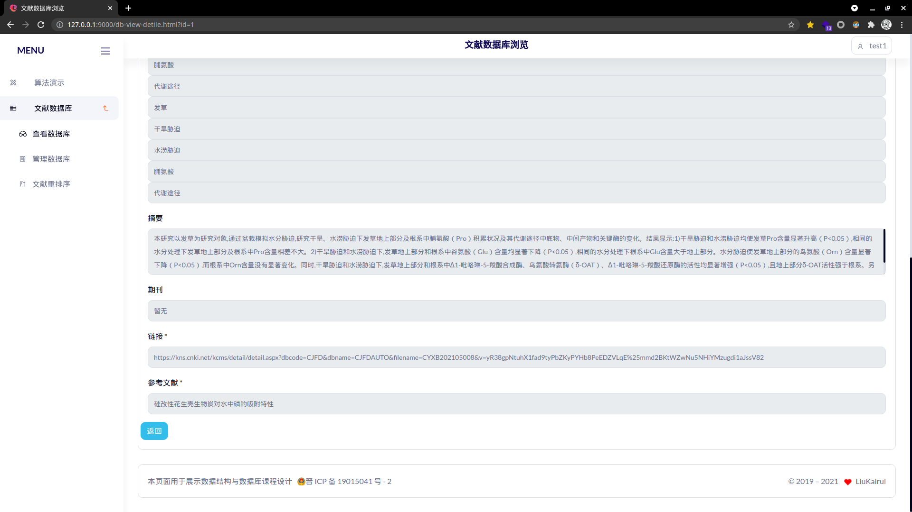

# Database Course Design

[TOC]

## Introduction to PageRank Algorithm

Before Google dominated Internet search, most search engines used the sorting method to determine the sorting based on the number of times the searched word appears in the webpages-the more frequently the webpages appear, the higher the ranking. This criterion cannot be said to be unreasonable, because a user searching for a word usually indicates an interest in that word. In this case, the more occurrences of the word in a web page, the more likely it is that the web page is what the user needs. Unfortunately, this seemingly reasonable method actually doesn't work. Because according to this method, any webpage with certain keywords tossed back and forth, no matter how bad the level is, once it is searched, it will be pushed to the top immediately, which undoubtedly creates a lot of spam pages. One of the most ironic is: in November 1997, before the birth of Google, when the four major search engines, called the early Internet giants, searched for their company's name, there was only one that could make it appear in the top ten of the search results. Within the name, the rest was squeezed away by the advertisement page.

PageRank, also known as page rank, Google left-hand ranking or Page ranking, is a link analysis proposed by Google founders Larry Page and Sergey Brin in 1997 when they built an early search system prototype. Algorithm. Since Google has achieved unprecedented commercial success, the algorithm has also become a computing model that other search engines and academia pay close attention to. At present, many important link analysis algorithms are derived from the PageRank algorithm. PageRank is a method used by Google to identify the rank/importance of a webpage, and it is the only standard used by Google to measure the quality of a website. After combining all other factors such as Title logo and Keywords logo, Google adjusts the results through PageRank, so that those web pages with more "rank/importance" will be ranked in the search results and the ranking of the site will be improved, thereby improving the search results. Relevance and quality.

The calculation of PageRank makes full use of two assumptions: quantity assumption and quality assumption. Proceed as follows:

- In the initial stage: Web pages build a Web graph through link relationships, and each page is set with the same PageRank value. After several rounds of calculation, the final PageRank value obtained by each page will be obtained. With each round of calculation, the current PageRank value of the webpage will be updated continuously.

- The calculation method of updating the PageRank score of the page in a round: In the calculation of the PageRank score of the updated page, each page will evenly distribute its current PageRank value to the out-links contained in the page, so that each link is obtained The corresponding weight. And each page sums the weights passed in by all in-chains that point to this page to get a new PageRank score. When each page obtains the updated PageRank value, a round of PageRank calculation is completed.

## Function and demand analysis

### PageRank algorithm demo version

Provide two modes: view mode and edit mode

- View mode:
  - Users can view the attributes of each node
  - Drag and drop nodes for easy observation
  - View PageRank matrix, probability matrix and other key Matrix
  - Export svg image: switch visualization mode: absolute value mapped to color/relative value mapped to color/no color, absolute value mapped to size/relative value mapped to size/no size
  - Clear the canvas and copy the matrix

- Edit mode:
  - Click to draw the node, shift+click to delete the node, drag to connect the edge
  - Switch visualization mode: absolute value mapped to color/relative value mapped to color/no color, absolute value mapped to size/relative value mapped to size/no size
  - Switch the presentation mode to step-by-step display/direct display of results option
  - Provide functions of clearing the canvas, exporting images, and copying the matrix
  - Switch visualization mode: absolute value mapped to color/relative value mapped to color/no color, absolute value mapped to size/relative value mapped to size/no size

### Document database management

Provides three modes for logged-in users: database viewing, database management, PageRank document discovery/sorting

- View the database schema:
  - Present the data in the form of a table, each row includes: the title of the document, the first author and the institution of the document (mouse hover over the text to view the entire content), keywords (mouse hover over the text to view the entire content), jump Forward link, the first reference (mouse hover over the text to view the entire content), included journals
  - Paging data, support setting the number of records displayed on each page, display the current display content position, and switch between pages
  - Support searching by any keyword
  - Click the View Details button to view all the information of the article, including:
    - Document ID and Title
    - All authors and organizations of the literature
    - All keywords in the literature
    - Literature summary
    - Literature source journals
    - Literature link
    - Literature references and reference links
  - After checking the checkbox in front of the document, click Sort to sort the selected documents by PageRank, and establish a directed edge between the two documents if and only if there is a direct citation relationship between the documents
- Database management mode
  - Provide the same content viewing functions, paging, and search as the viewing mode
  - Click the delete button to delete the direct connection between the user and the document
  - Click Edit to update the content of the document
  - Click Insert to insert a new document, you can manually insert it, or you can paste the HowNet link, and the server will crawl the basic information of the document and fill it in the table
  - PageRank document discovery/ranking mode
  - You can directly click to enter the document discovery mode, the user enters the keyword that you want to search, the server sends a request to HowNet to obtain the detailed information of the top 10 documents searched by HowNet, rank the PageRank, and show the user the sorted results
  - You can also select the sort function in the view database mode to sort the existing data

## Data structure design

### PageRank algorithm demo board

**Interactive drawing object design**

| variable             | function                            | variable                     | function                                            |
| -------------------- | ----------------------------------- | ---------------------------- | --------------------------------------------------- |
| gb_width gb_height   | Stencil height weight               | pr_probMatrix                | Probability matrix                                  |
| gb_rawData           | Original point set and edge set     | pr_rankValuePre              | PR value matrix 1                                   |
| gb_nodeID            | Current node ID                     | pr_rankValueRes              | PR value matrix 2                                   |
| gb_linkID            | Current edge ID                     | pr_oriProbMatrix             | PR original probability matrix                      |
| gb_nodeCnt           | Current number of valid nodes       | pr_deadNodeMatrix            | Matrix after processing deadNodes                   |
| gb_linkCnt           | Current effective number of edges   | d3_svgLink                   | Edge SVG object                                     |
| ct_onViewMod         | In image recognition mode           | d3_svgNode                   | Point SVG object                                    |
| ct_showColor         | Whether to choose a color           | d3_links                     | Edge results obtained in the position simulator     |
| ct_showColorRelative | Whether to display relative colors  | d3_nodes                     | Click the result obtained in the position simulator |
| ct_showSizeRelative  | Whether to display relative size    | d3_svg                       | Whole SVG object                                    |
| ct_step              | Whether to display the distribution | d3_simulation                | Force-directed graph simulator                      |
| var jx_formula       | MathJax formula                     | d3_tmpArrow                  | Use drag function in edit mode                      |
| var pr_beta          | Pr matrix damping coefficient       | d3_charge                    | Force-directed graph simulator node charge          |
| pr_prec              | Pr matrix allowable error           | d3_collide，d3_collideIterae | Force-directed graph simulator node impact force    |

| function    | action                          | function       | action                                    |
| ----------- | ------------------------------- | -------------- | ----------------------------------------- |
| d3_analog   | Compute node position function  | d3_refresh     | Canvas adaptive stretch function          |
| d3_plot     | Drawing function                | st_setStat     | Set status code                           |
| timelyFlash | Refresh listening event         | d3_export      | Export picture                            |
| drag        | Drag function                   | jx_genForm     | LaTeX formula for generating matrix       |
| clearAll    | Empty the canvas                | pr_calcMatrix  | Iterative PR matrix                       |
| Report      | Refresh parameter function      | pr_buildMatrix | Build a matrix function                   |
| addNode     | Add node function               | RreVirtual     | Judgement function for entering view mode |
| addLink     | Connected function              | tData          | Enter test data                           |
| delNode     | Delete node function            | emptyData      | Empty the canvas                          |
| initRepo    | Initialization instructions div | listening      | Listening events of the artboard          |

**PageRank matrix design**

| variable | function                 | variable | function            |
| -------- | ------------------------ | -------- | ------------------- |
| n        | Matrix rows              | beta     | Damping coefficient |
| m        | Number of matrix columns |          |                     |

| function       | action                  | function | action                                    |
| -------------- | ----------------------- | -------- | ----------------------------------------- |
| init()         | initialization          | check()  | Check whether the PR matrix has converged |
| graphConvert() | Convert graph to matrix | Rtime()  | Right multiplication                      |
| fillNum()      | Fill in the numbers     |          |                                           |

### PageRank Literature Database

The front end is a standard object in the DOM of HTML

The backend objects have

- account: account object

- artical: Document object
- author: author
- matrix: matrix object
- mysql: MySQL interface object
- prcnki: PR matrix object
- spider: crawler object
- userlg: user object

**Account Object**

| variable | effect                   | variable  | effect                   |
| -------- | ------------------------ | --------- | ------------------------ |
| uid      | User ID                  | username  | username                 |
| passwd   | User clear text password | passwdCry | User encryption password |

| function   | effect                                 | function   | effect                          |
| ---------- | -------------------------------------- | ---------- | ------------------------------- |
| insertDB() | Insert yourself into the user database | queryDB()  | Query objects in the database   |
| deleteDB() | Delete yourself from the database      | updateDB() | Update registration information |
| idExt()    | Determine whether the ID exists        | getInfo()  | Get users based on ID           |

**Document Object**

| variable | **Document Object** effect                 | variable | effect                                                |
| -------- | ------------------------------------------ | -------- | ----------------------------------------------------- |
| refList  | Reference list (that is an Artical object) | refNmLk  | Reference list (that is {Title, Link} key-value pair) |
| link     | Document Basic Information-Link            | title    | Document Basic Information-Title                      |
| author   | Author name string array                   | organ    | Organization name string array                        |
| Source   | Literature source journals                 | year     | Publication year                                      |
| keyword  | Keyword string array                       | summary  | Summary                                               |
| ArtID    | Document ID                                | nopair   | Document author organizes an array of key-value pairs |

| function     | effect                                                       | function       | effect                                                       |
| ------------ | ------------------------------------------------------------ | -------------- | ------------------------------------------------------------ |
| getArtID()   | Get document ID from database                                | getArtbyLink() | Crawl data based on HowNet links                             |
| insertArt()  | Insert basic data into the database                          | insertKey()    | Insert keywords into the database                            |
| insertRef()  | Insert citations into the database                           | makeNopair()   | Convert Author and Orgnaize string arrays into key-value pairs |
| insertAth()  | Insert author information into the database                  | insertAthMap() | Insert author relationship into database                     |
| pushDB()     | Insert all data into the database                            | removeDB()     | Delete article                                               |
| queryDB()    | Any keyword search                                           | getKey()       | Query all keywords                                           |
| getRef()     | Query search references                                      | getAth()       | Get user information                                         |
| getArtFull() | Query all information in the literature                      | getUserArts()  | Get all the document objects of the specified ID user        |
| getArtList() | Get a list of all document IDs for users with a specified ID | updateDB()     | Update database information                                  |
| updateArt()  | Update basic information of the literature                   | updateKey()    | Update keywords                                              |
| updateRef()  | Update references                                            | updateAthMap() | Update author mapping                                        |
| toShow()     | Convert the object to the front-end page 1 to display the required format | toDetile()     | Convert the object to the front-end page 2 to display the required format |

**Author Object**

| variable | effect      | variable | effect        |
| -------- | ----------- | -------- | ------------- |
| name     | Author name | organize | organize name |

| function   | effect                              | function   | effect          |
| ---------- | ----------------------------------- | ---------- | --------------- |
| insertDB() | Insert the author into the database | queryDB()  | Database search |
| queryID()  | Get object ID                       | deleteDB() | Delete object   |
| updateDB() | Update database                     |            |                 |

**Matrix Object**

The definition of PR_Matrix is almost the same as that of the PageRank algorithm demo version, but it is used in the backend

**Database connection object**

| variable | effect                                     |
| -------- | ------------------------------------------ |
| cnnt     | Return variables after database connection |

| function      | effect                  | function   | effect                                           |
| ------------- | ----------------------- | ---------- | ------------------------------------------------ |
| commonQuery() | Package general query   | sqlGener() | SQL command generation function (anti-injection) |
| close()       | Disconnect the database |            |                                                  |

**文献PR矩阵对象**

| variable     | **Document Object** effect | variable     | effect              |
| ------------ | -------------------------- | ------------ | ------------------- |
| nodeList     | Document ID array          | matrix       | Probability matrix  |
| nodeRes      | Sort results               | nodeRef      | Node Reference List |
| rankValuePre | Transition matrix          | rankValueRes | Result matrix       |

| function        | effect                                                       | function | effect                                                       |
| --------------- | ------------------------------------------------------------ | -------- | ------------------------------------------------------------ |
| pr_calcMatrix() | Iterate once                                                 | sortPR() | Sort<definition                                              |
| work()          | Convert the ID list into a matrix and calculate the return result (used to query the data already in the database) | workWT() | Convert the Title list into a matrix and calculate the return result (used to sort the data found by the keyword search) |

**Crawler tool object design**

| variable   | **Document Object** effect                          | variable   | effect                                                   |
| ---------- | --------------------------------------------------- | ---------- | -------------------------------------------------------- |
| ArtUrl     | Document Crawler-Document Link                      | artTex     | Document Crawler-Document Page HTML                      |
| ArtUrlH    | Document crawler-dynamic encryption ID request host | refTex     | Document Crawler-Reference Document Ajax Results HTML    |
| RefUrlH    | Document crawler-reference file Ajax request host   | Keywds     | Keyword Crawler-Keyword                                  |
| optionsArt | Document crawler-document page request header       | KeyUrlH    | Keyword crawler-search result request host               |
| optionsRef | Document crawler-citation page request header       | optionsKey | Keyword crawler-search result request header             |
| artOpt     | Document Crawler-Document Dynamic Encryption ID     | artLst     | Keyword crawler-search result {Title, Link} object array |
| keyTex     | Keyword crawler-result page                         |            |                                                          |

| function      | effect                                          | function  | effect                                                |
| ------------- | ----------------------------------------------- | --------- | ----------------------------------------------------- |
| init()        | Initialization function                         | getSrc()  | Request a web page to obtain an encrypted document ID |
| findMainArt() | Analyze the basic information of the literature | findRef() | Analyze references                                    |
| findKeyword() | Analyze literature keywords                     | getList() | Keyword search-get results                            |

**用户行为对象**

| variable | **Document Object** effect | variable  | effect      |
| -------- | -------------------------- | --------- | ----------- |
| UID      | User UID                   | ArticalID | Document ID |

| function   | effect                                 | function  | effect              |
| ---------- | -------------------------------------- | --------- | ------------------- |
| insertDB() | Insert user behavior into the database | queryDB() | Query user behavior |
| deleteDB() | Delete user behavior                   |           |                     |

## Database Design

- Entity: **Website User USER**

  It should contain three attributes:

  - User identifier UID: The primary key is automatically generated by the database auto-increment function
  - Username Username: Text with unlimited length, unique value
  - Encrypted password passwdRSA: unlimited length Text is not empty Generated by 10 times of Hash

- Entity: **Artical Basic Information of Article**

  It should contain the following attributes:

  - Document Identifier ArticalID: The primary key is automatically generated by the database auto-increment function
  - Title of the document: unlimited length Text is not empty
  - Source journal Source: unlimited length Text is empty by default
  - Journal Abstract Summary: Unlimited length Text is empty by default
  - Periodical Knowledge Network link link: unlimited length Text is not empty and unique

- Entity: **Author AUTHOR**

  Since an author may write multiple articles, and an article may have multiple authors, directly storing with ARTIAL will cause data redundancy. We split the authors as an independent table, and because there are many bidirectional authors and articles. To many relationships, we also need to establish the relationship between the author and the article to connect the two tables, the author should have the following attributes

  - Author's unique identifier AUID: The primary key is automatically generated by the database auto-increment function
  - Author name Author: unlimited length Text is empty by default
  - The author's organization Organize: unlimited length, default empty
  - The author and his organization are unique

- Relationship: **Reference REFERENCE**

  We cannot include all references of articles in the ARTICAL table into the ARTICAL table, otherwise the ARTICAL table will become infinite, so we will make each reference independently into a new table, so the table should have the following attributes

  - The identifier of the original document (the document citing this document) ArticalID: the foreign key of the ARTICAL label ArticalID
  - Reference title RefTitle: unlimited length Text
  - Reference link RefLink: Text can be empty without limitation (some references on CNKI do not have citation links)
  - Reference Identifier RefID: If this reference already exists in the ARTICAL table (determined by the link), then it’s ArticalID here, otherwise it’s empty

- Relationship: **Keywords KEYWORDS**

  An article has multiple keywords. In order to reduce data redundancy, we separate the keywords into a table, which should have the following attributes

  - Article identifier ArticalID: is the foreign key of ARTICAL.ArticalID
  - Keyword: Text with unlimited length
  
- Relationship: **User Operation USERDB**

  Used for which article a user deletes/adds to the database, with the following attributes

  - User identifier UID: is the foreign key of USER.UID
  - Article identifier ArticalID: is the foreign key of ARTICAL.ArticalID

- Relationship: **Author of the article AUTHORMAP**

  Used for the two-way many-to-many relationship between the article and the author, so use AUTHORMAP to connect two data tables, with the following attributes

  - Article identifier ArticalID: is the foreign key of ARTICAL.ArticalID
  - Author unique identifier AUID: is the foreign key of AUTHOR.AUID

ER diagram


Relations between tables 


For SQL code, see the first code snippet of "Detailed Design"

## Technology stack

- Graphic library selection

  There are two mainstream HTML drawing methods: HTML5’s new style Canvas and the more primitive SVG drawing. Canvas is a pixel-by-pixel efficient drawing technology, and SVG is a vector graphics standard that provides a series of graphic elements and animations. The definition and event mechanism can be used independently or embedded in HTML. Considering the demand for dynamic interaction effects, SVG is more suitable for this problem.

  I chose the D3.js visualization library that supports SVG drawing. The full name of D3 is Data-Driven Documents. As the name implies, it is a data-driven document library. The force-directed graph simulator of D3.js is very suitable to help us dynamically calculate the layout position of the nodes in the canvas, so that the nodes do not overlap each other, and the edges are as little as possible.

  D3.js realizes the calculation of the node position after determining the edge point in the PageRank drawing board, and the node drag and drop in the **view mode**

- Selection of UI framework

  I used the mainstream BootStrap framework, and selected a page template in the official example to modify it

- Selection of math formula renderer

  I chose the mainstream MathJax library, which can dynamically render LaTeX formulas in HTML documents into images, and provides the function of copying formulas

- back-end use technology and front-end and back-end interaction technology

  

## Overall design

**File distribution**

```
.
├── app.js 				// Express application
├── configure.json		// configure file
├── js                  // Node modules I designed 
│   ├── account.js      // user Object
│   ├── artical.js      // artical Object
│   ├── author.js       // author Object
│   ├── matrix.js       // matrix Object
│   ├── mysql.js        // SQL connection Object
│   ├── prcnki.js       // pr_matrix Object
│   ├── spider.js       // web spider Object
│   └── userlg.js       // user action Obgect
├── node_modules
│   └── ......           // npm packages I use(not list)
├── package.json         // npm package list for install one step)
├── package-lock.json    // npm package version list
├── public               // public static floder
│   ├── css		         // style sheet
│   │   ├── bs_backend.css
│   │   ├── bs_backend_plugin.min.css
│   │   ├── bs_template.css
│   │   ├── detile.css
│   │   ├── simplify.css
│   │   ├── style.css.map
│   │   ├── style.less
│   │   └── svg.css
│   ├── images
│   │   ├── error
│   │   │   ├── 02.png
│   │   │   ├── 404.png
│   │   │   └── 500.png
│   │   ├── favicon.ico
│   │   ├── icp.png
│   │   ├── loader.gif
│   │   ├── login
│   │   │   ├── 01.png
│   │   │   └── mail.png
│   │   └── logo.png
│   └── js                    // page JS
│       ├── axios.min.js      // Tripartite library
│       ├── bs_app.js         // Tripartite library
│       ├── bs_backend_bundle.min.js  // Tripartite library
│       ├── bs_chart.js       // Tripartite library
│       ├── bs_customizer.js  // Tripartite library
│       ├── bs_template.js    // Tripartite library
│       ├── bs_treeview.js    // Tripartite library
│       ├── d3.js             // Tripartite library
│       ├── datatables.js     // Tripartite library
│       ├── db_mgr_edit.js
│       ├── db_mgr_insert.js
│       ├── db_mgr.js
│       ├── db_view_detile.js
│       ├── db_view.js
│       ├── logcheck.js
│       ├── login.js
│       ├── search.js
│       ├── simplify.js
│       ├── svg.js
│       ├── sweetalert.min.js // Tripartite library
│       └── tex-mml-chtml.js  // Tripartite library
├── README.md
├── SQL.sql                   // SQL scripts
└── views         // Art-Template render page template
    ├── 404.html
    ├── 500.html
    ├── db-mgr-edit.html
    ├── db-mgr.html
    ├── db-mgr-insert.html
    ├── db-mgr-insert-spider.html
    ├── db-view-detile.html
    ├── db-view.html
    ├── index.html
    ├── login.html
    ├── search-cki.html
    ├── search.html
    ├── search-res.html
    └── Tmplate.html
```

**Front-end and back-end interaction**

- -`GET` `/or /index.html` to visit the homepage

  Backend returns a static page

- `GRT` `/db-view.html` to access the database query page

  The front end sends Tocken validity check to the back end, if invalid, jump to the login interface, and effectively initiate a GET request

  The backend receives the GET request, verifies the validity of Tocken for the second time, calls the Artical object, gets all the user's article object array, calls toShow() to convert to displayable content, uses the Art-Template to render the template, sends it, and unexpectedly returns 500. page

- `GET` `/db-view-detile.html` to visit the article detail information page

  Click on the front end to view details and send a request to the back end

  The backend receives the GET request, checks whether the query ID is in the database, queries the ID, obtains all the information of the article, converts the information into a displayable format, uses the Art-Template to render the page, sends it, and returns 500 if it is accidental

- -`GET` `/db-mgr.html` to access the database management page

  The front end sends Tocken validity check to the back end, if invalid, jump to the login interface, and effectively initiate a GET request

  The backend receives the GET request, verifies the validity of Tocken for the second time, calls the Artical object, gets all the user's article object array, calls toShow() to convert to displayable content, uses the Art-Template to render the template, sends it, and unexpectedly returns 500. page

- `POST` `/delete-row` delete document data

  The front end clicks the delete icon, the front end sends an Ajax POST request to the back end, including TOCKEN in the request header, and the deleted document ID in the request body.

  The backend receives the request, performs secondary authentication, calls the user behavior record object to delete the record, returns the status, and returns 500 if abnormal

- `GET` `/db-mgr-insert.html` insert document

  Return to static insert page

- `POST` `/db-mgr-insert-spider` document crawler interface

  Enter the HowNet link on the front end, select auto-fill information, and POST-body contains the link information

  The backend receives a POST request, creates a new document object, uses getArtbyLink to obtain the object, uses Art-Template to render the replaced content, and sends the page. If an error occurs when obtaining the object, it returns 500.

  The front end receives the success status and replaces the HTML element

- `POST` `/db-mgr-insert-DB` insert documents into the database

  The front-end obtains the form information and sends it to the back-end using POST

  The back end receives, constructs the Artical object, inserts, and returns the status

  The front end receives the status and displays the Alert prompt

- `POST` `/db-mgr-edit.html` database document editing page

  The front-end sends the document ID to be edited, and the back-end queries whether the ID is legal after receiving it. If it is legal, it obtains all the document information, renders the page, and sends it back. Return 500 on error

- `POST` `/db-mgr-update-DB` update document data API

  The front-end compares the modified content with the original text, sends the comparison differences to the back-end, and the back-end decomposes the differences into tables and updates them separately. Since the primary key changes during database design, the foreign keys change accordingly, so there is no conflict.

- `GET` `/login.html` login page request

  Return to static page

- `GET` `/login.html` login page request

  Return to static page

- `POST` `/login-tk` login request

  The front end sends the user name and password. After the back end receives it, it checks whether the user name exists. If it exists, it checks whether the encrypted password is the same as the database cipher text, and returns the status

- `POST` `/is-login` to determine whether Tocken is legal

  Returns whether the status is legal

- `GET` `/search-res` to get PR ranking results of literature database

  The front end sends the document ID list, the back end receives it, judges the legitimacy of the list, calls the Prcnki object to sort, renders the list to Art-Template, and returns the result

- `GET ``/search.html` keyword search page

  Return to static page

- `GET` `/search-cki.html` to get keyword search results

  The front-end sends keywords, the top 10 results of the back-end Knownet crawler, performs PR sorting, and returns to the rendering page

- `GET` `/public` to get the contents of the public folder

  Return the requested CSS/JS

- `GET` `*` returns 404 at the bottom of the pocket

**Back-end design**

- **Crawler System**

  - Crawl CNKI literature information according to the link
    - Add a HowNet custom request header to the request header, get the basic page HTML, get thedocument ID from the basic page, send the document ID to the HowNet encryption API, get the dynamic encrypted document ID, and send the encrypted document ID to the HowNet Reference API, Get reference HTML code
    - Match basic information
    - Matched keywords
    - Match references
    - Return Artical object
  - Get a list of documents based on keywords
    - Add a HowNet custom request header to the request header to get the HTML of the search result page
    - Parse the HTML page to get the list of documents
    - Back to the literature list

- Database interface design

  - SQL command generation function

    We can parse the attributes and return instructions according to the incoming object. Due to the need to query NULL, we need to execute whether to allow Key=null. We also need to specify the key-value connector (usually `=` or `,` ) And the connector between the object (usually `AND`, `OR`, `,`), for example, there are the following requirements

  - Find the author ID whose Organize is **empty** and the author is "Liu", then it should be set

     `allowNull = true, connect ='AND', Symbol ='=' `

     Incoming {Author: "Liu", Organize: Null}

    Generate query statement

    `Author = Liu and Organize is Null`

  - Find the author ID whose Organize is arbitrary and the author is "Liu", then it should be set

    `allowNull = false, connect ='AND', Symbol ='=' `

     Incoming {Author: "Liu", Organize: Null}

     Generate query statement

    `Author = Liu`

- Artical/Author/Account/Userlg additions, deletions, and modifications, see "Detailed Design"


## Detailed design

- SQL definition code

  ```mysql
  create database PRTest;
  use PRTest;
  
  create table AUTHOR(
      AUID int PRIMARY KEY AUTO_INCREMENT,
      -- Author varchar(20),
      Author text,
      -- Organize varchar(30),
      Organize text,
      unique (Author,Organize)
  );
  
  create table ARTICAL(
      ArticalID int PRIMARY KEY AUTO_INCREMENT,
      -- Title varchar(50) not null,
      Title text not null,
      -- Source varchar(50) null,
      Source text null,
      Summary text null,
      link text not null unique
  );
  
  create table AUTHORMAP(
      ArticalID int not null,
      AUID int null,
      FOREIGN KEY(ArticalID) REFERENCES ARTICAL(ArticalID) ON DELETE CASCADE ON UPDATE RESTRICT,
      FOREIGN KEY(AUID) REFERENCES AUTHOR(AUID) ON DELETE CASCADE ON UPDATE RESTRICT,
      unique(ArticalID,AUID)
  );
  
  create table KEYWORDS(
      ArticalID int,
      -- Keyword varchar(10),
      Keyword text,
      FOREIGN key(ArticalID) REFERENCES ARTICAL(ArticalID) ON DELETE CASCADE ON UPDATE RESTRICT
      -- unique(ArticalID,Keyword)
  );
  
  create table REFERENCE(
      ArticalID int,
      -- RefTitle varchar(50),
      RefTitle text,
      RefLink text null,
      RefID int null,
      FOREIGN key(ArticalID) REFERENCES ARTICAL(ArticalID) ON DELETE CASCADE ON UPDATE RESTRICT
  );
  
  create table USER(
      UID int AUTO_INCREMENT,
      Username text not null unique,
      passwdRSA text not null,
      PRIMARY KEY (UID)
  );
  
  create table USERDB(
      UID int,
      ArticalID int,
      FOREIGN KEY (UID) REFERENCES USER(UID) ON DELETE CASCADE ON UPDATE RESTRICT,
      FOREIGN KEY (ArticalID) REFERENCES ARTICAL(ArticalID) ON DELETE CASCADE ON UPDATE RESTRICT,
      unique (UID,ArticalID)
  );
  ```

- Configure`./configure.json`

  ```JSON
  {
      "_connect":{
          "host"     : "localhost",
          "user"     : "root",
          "password" : "lkr0101",
          "database" : "PRTest"
      },
      SECRET: 'fsadflkasdjvancrac'
  }
  ```

- Express frame`./app.js`

  ```js
  var fs=require("fs");
  const express = require('express');
  const Author = require("./js/author");
  const Userlg = require("./js/userlg");
  const Artical = require("./js/artical");
  const mysql = require("./js/mysql")
  var bodyParser = require('body-parser');
  const querystring = require("querystring");
  const jwt = require('jsonwebtoken');
  const bcrypt = require('bcrypt')
  const Account = require('./js/account');
  const User = require("./js/account");
  const Prcnki = require("./js/prcnki");
  const Spider = require("./js/spider");
  
  const app = express();
  app.use(express.json())
  app.use(bodyParser.json())
  app.use(bodyParser.urlencoded({ extended: true }))
  var sql=mysql.sql;
  
  const SECRET = 'fsadflkasdjvancrac';
  
  app.engine("html",require("express-art-template"))
  
  const authVfy = async (req, res, next) => {
      var raw = String(req.headers.authorization).split(' ').pop();
      if(raw===undefined||raw===null||raw === ""||raw==="undefined")// 奇怪的API
          if(req.query.uid!=undefined&&req.query.uid!=null&&req.query.uid!=""){raw=req.query.uid;}
          else{req.body.userID="false";req.query.userID=false;next();}
      var user=new User();
      try{
          id=await jwt.verify(raw, SECRET);
      }catch(e){
          res.render("./500.html");
          return;
      }
      if(!("TKID" in id)){req.body.userID=false;req.query.userID=false;next();}
      var stat = await user.idExt(id.TKID)
      req.body.userID=stat?id.TKID:false;
      req.query.userID=req.body.userID;
      next();
  }
  
  app.get("/",function(req,res){
      fs.readFile("./views/index.html",function(error,data){
          if(error){
              res.render("./404.html");
              return;
          }
          res.render('./index.html');
      })
  })
  
  app.get("/index.html",function(req,res){
      fs.readFile("./views/index.html",function(error,data){
          if(error){
              res.render("./404.html");
              return;
          }
          res.render('./index.html');
      })
  })
  
  app.get("/db-view.html",authVfy,async function(req,res){
      fs.readFile("./views/db-view.html",async function(error,data){
          if(error){
              res.render("./404.html");
              return;
          }
          var art = new Artical();
          var ans = await art.getUserArts(req.query.userID,true);   // TOCKEN
          if(!ans){
              res.render("./500.html");
              return;
          }
          res.render('./db-view.html',{artList:ans});
      })
  })
  
  app.get("/db-view-detile.html",async function(req,res){
      fs.readFile("./views/db-view-detile.html",async function(error,data){
          if(error){
              res.render("./404.html");
              return;
          }
          if(!("id" in req.query)){
              res.render("./500.html");
              return;
          }
          var art=new Artical();art.ArtID=req.query.id;
          await art.getArtFull();
          art.toDetile();
          res.render('./db-view-detile.html',{art:art,userID:req.query.userID});
      })
  })
  
  app.get("/db-mgr.html",authVfy,async function(req,res){
      fs.readFile("./views/db-mgr.html",async function(error,data){
          if(error){
              res.render("./404.html");
              return;
          }
          var art = new Artical()
          var ans = await art.getUserArts(req.query.userID,true);
          if(!ans){
              res.render("./500.html");
              return;
          }
          res.render('./db-mgr.html',{artList:ans});
      })
  })
  
  app.post("/delete-row",authVfy, async function(req,res){
      res.setHeader('Access-Control-Allow-Origin','*')
      if(req.body.userID===undefined||req.body.userID===null||req.body.userID===false){res.send(false);return false;} 
      var uslg = new Userlg(req.body.userID,req.body.artID);
      var state = await uslg.deleteDB()
      res.send(state);
  })
  
  app.get("/db-mgr-insert.html",async function(req,res){
      fs.readFile("./views/db-mgr-insert.html",async function(error,data){
          if(error){
              res.render("./404.html");
              return;
          }
          res.render('./db-mgr-insert.html');
      })
  })
  
  app.post("/db-mgr-insert-spider",function(req,res){
      fs.readFile("./views/db-mgr-insert-spider.html",async function(error,data){
          res.setHeader('Access-Control-Allow-Origin','*')
          if(error){res.send(false)}
          else{
              var art = new Artical();
              art.link=req.body.link;
              var getSOK = await art.getArtbyLink(req.body.link)
              if(!getSOK)res.send(false);
              else{
                  await art.toDetile()
                  res.render('./db-mgr-insert-spider.html',{art:art});
              }
          }
      })
  })
  
  app.post("/db-mgr-insert-DB",authVfy,async function(req,res){
      if(req.body.userID===undefined||req.body.userID===null||req.body.userID===false){res.send(false);return false;} 
      var art = new Artical();
      var reqart = JSON.parse(req.body.art);
      art.title=reqart.title;
      art.nopair=JSON.parse(JSON.stringify(reqart.nopair));
      art.keyword=JSON.parse(JSON.stringify(reqart.keyword));
      art.summary=reqart.summary;
      art.Source=reqart.source;
      art.link=reqart.link;
      art.refNmLk=JSON.parse(JSON.stringify(reqart.refNmLk));
      var stat = await art.pushDB();
      if(stat){
          var userlg=new Userlg(req.body.userID,art.ArtID);
          await userlg.insertDB()
      }
      res.send(stat);
  });
  
  app.get("/db-mgr-edit.html",async function(req,res){
      fs.readFile("./views/db-mgr-edit.html",async function(error,data){
          if(error){
              res.render("./404.html");
              return;
          }
          if(!("id" in req.query)){
              res.render("./500.html");
              return;
          }
          var art=new Artical();art.ArtID=req.query.id;
          await art.getArtFull();
          art.toDetile();
          res.render('./db-mgr-edit.html',{art:art});
      })
  })
  
  app.post("/db-mgr-update-DB",async function(req,res){
      var art = new Artical();
      art.nopair=new Array();
      art.ArtID=req.body.ArtID;
      if(art.ArtID==""||art.ArtID==null||art.ArtID==undefined)return false;
      var chg = JSON.parse(req.body.chg);
      if("chnopair" in chg && chg.chnopair.length>0){
          await new Promise((resolve,reject)=>{
              chg.chnopair.forEach(async (d,i)=>{
                  let tmp = new Author(d.oname,d.oorganize);
                  if(d.oname==undefined||d.oorganize==undefined||d.oname==null||d.oorganize==null||d.oname==""||d.oorganize==""){
                      let tmp = new Author(d.nname,d.norganize);            
                      await tmp.insertDB();
                      art.nopair.push({"name":d.nname,"organize":d.norganize})
                  }else{
                      await tmp.updateDB(d.nname,d.norganize,false);
                  }
                  if(i==chg.chnopair.length-1)resolve()
              })
          })
          if(art.nopair.length!=0)art.insertAthMap();
      }
      if("chkeyword" in chg && chg.chkeyword.length>0){
          await new Promise((resolve,reject)=>{
              chg.chkeyword.forEach(async (d,i)=>{
                  if(d.okey==undefined||d.okey==null||d.okey=="")art.keyword.push(d.nkey);
                  else await art.updateKey(d.okey,d.nkey);
                  if(i==chg.chkeyword.length-1)resolve();
              });
          })
          if(art.keyword.length!=0)await art.insertKey();
      }
      if("chrefNmLk" in chg && chg.chrefNmLk.length>0){
          chg.chrefNmLk.forEach(async (d,i)=>{
              if(d.oTitle==undefined||d.oLink==undefined||d.oTitle==null||d.oLink==null||d.oTitle==""||d.oLink==""){
                  art.refNmLk.push({"Title":d.nTitle,"Link":d.nLink});
              }else await art.updateRef(d.oLink,{"RefTitle":d.nTitle,"RefLink":d.nLink});
          });
          await art.insertRef()
      }
      var obj={
          "title":(chg.title==undefined||chg.title==null||chg.title=="")?null:chg.title,
          "summary":(chg.summary==undefined||chg.summary==null||chg.summary=="")?null:chg.summary,
          "Source":(chg.source==undefined||chg.source==null||chg.source=="")?null:chg.source,
          "link":(chg.link==undefined||chg.link==null||chg.link=="")?null:chg.link
      };
      if(("title" in chg)||("summary" in chg)||("source" in chg)||("link" in chg))await art.updateArt(obj);
      res.send(true);
  });
  
  app.get("/login.html",function(req,res){
      fs.readFile("./views/login.html",function(error,data){
          if(error){
              res.render("./404.html");
              return;
          }
          res.render('./login.html');
      })
  })
  
  app.post("/login-tk",async function(req,res){
      var username = req.body.username;
      var passwd = req.body.passwd;
      var account = new Account(null,username,passwd);
      var userdata = await account.queryDB(username)
      if(userdata === null || userdata === false || userdata.length==0){res.send(false);return false;}
      if(bcrypt.compareSync(passwd,userdata[0].passwdRSA)){
          const token = jwt.sign({
              TKID: String(userdata[0].UID)
          }, SECRET);
          res.send(token);
          return true;
      }
      res.send(false);
      return false;
  });
  
  app.all("/is-login",authVfy,async(req,res)=>{
      if(req.body.userID!=undefined&&req.body.userID!=null&&req.body.userID!=""&&req.body.userID!="undefined"){
          var user = new User();
          var uname = await user.getInfo(req.body.userID);
          res.send(uname[0].Username);
      }
      else 
          res.send(false);
      return;
  })
  
  app.get("/search-res",async function(req,res){
      var ndlst = JSON.parse(req.query.ndlst);
      var prcnki = new Prcnki();
      prcnki.nodeList=ndlst;
      var prresult = await prcnki.work();
      var sendlist = new Array();
      await new Promise((resolve,reject)=>{
          if(prresult.length==0)resolve();
          prresult.forEach(async(d,i)=>{
              var artf = new Artical();
              artf.ArtID=d.artID;
              await artf.getArtFull();
              artf.toShow()
              sendlist.push(artf);
              if(i===prresult.length-1)resolve();
          })
      })
      res.render("./search-res.html",{artList:sendlist})
  });
  
  app.get("/search.html",function(req,res){
      fs.readFile("./views/search.html",function(error,data){
          if(error){
              res.render("./404.html");
              return;
          }
          res.render('./search.html');
      })
  });
  
  app.get("/search-cki.html",async function(req,res){
      var kidx=new Array();
      var prcnki = new Prcnki();
      var key = req.query.keywd;
      var spd = new Spider();
      var sendlst=new Array();
      prcnki.artListMP = await spd.getList(key);
      prcnki.artListOJ = new Array();
      for(var i = 0;i<prcnki.artListMP.length;i++){
          var art = new Artical();
          await art.getArtbyLink(prcnki.artListMP[i].Link);
          art.ArtID=new Date().getTime().toString()+i;
          if(art.title){
              prcnki.artListOJ.push(art);
              kidx.push(art.ArtID)
          }
      }
      var prans = await prcnki.workWT();
      for(var i=0;i<prans.length;i++){
          var nart = prcnki.artListOJ[kidx.indexOf(prans[i].artID)];
          nart.toShow();
          sendlst.push(nart);
      }
      res.render("./search-cki.html",{artList:sendlst})
  });
  
  app.use("/public/",express.static("./public/"))
  
  app.get("*",function(req,res){
      res.render("./404.html");
      return;
  })
  
  app.listen(9000,()=>{console.log("Working")})
  ```

- Account Object`./js/account.js`

  ```js
  var mysql=require('./mysql');
  var bcrypt = require('bcrypt');
  // var
  var sql=mysql.sql;
  
  function User(_uid,_username,_passwd,_passwdCry){
      this.uid=_uid;
      this.username=_username;
      this.passwd=_passwd;
      this.passwdCry=_passwdCry;
      if(this.passwdCry==null && this.passwd!=null)
          this.passwdCry=bcrypt.hashSync(this.passwd,10)
  }
  
  User.prototype.check=function(pwd){
      if(bcrypt.hashSync(pwd,10)==this.passwdCry)return true;
      return false;
  }
  
  User.prototype.insertDB=async function(){
      if(!(this.username&&this.passwd))return false;
      var res;
      this.passwdCry=bcrypt.hashSync(this.passwd,10);
      sqlCmd="insert into `USER` SET "+ sql.sqlGener({'Username':this.username,'passwdRSA':this.passwdCry},",")
      await new Promise((resolve,reject)=>{
          sql.cnnt.query(sqlCmd,(err, result)=>{
              if(err)res=false;
              else res=true;
              resolve();
          });
      });
      return res;
  }
  
  User.prototype.queryDB=async function(username){
      if(!this.username)return false;
      var sqlCmd="select * from `USER` where Username = "+sql.cnnt.escape(this.username)
      var res;
      await new Promise((resolve,reject)=>{
          sql.cnnt.query(sqlCmd,(err, result)=>{
              if(err)res=false; 
              else res=result;
              resolve();
          });
      });
      return res;
  }
  
  User.prototype.deleteDB=async function(){
      var res;
      var sqlCmd="delete from `USER` where Username = "+sql.cnnt.escape(this.username)
      await new Promise((resolve,reject)=>{
          sql.cnnt.query(sqlCmd,(err, result)=>{
              if(err)res=fasle;        
              else res=true;
              resolve();
          });
      });
  }
  
  User.prototype.updateDB=async function(username=null,passwd=null){
      if(!this.username)username=this.username;
      if(!this.passwd)passwd=this.passwd;
      var passwd=bcrypt.hashSync(this.passwd,10),sqlCmd='update `USER` set ',res;
      sqlCmd+=sql.sqlGener({'Username':this.username,'passwdRSA':this.passwd},',',false);
      sqlCmd+=' where Username = '+sql.cnnt.escape(this.username)
      await new Promise((resolve,reject)=>{
          sql.cnnt.query(sqlCmd,(err,result)=>{
              if(err)res=false;      
              else res=true;
              resolve();
          });
      });
  }
  
  User.prototype.idExt=async function(UID=null){
      if(UID===undefined||UID===null)return false;
      var getID=false;
      var sqlCmd="select * from `USER` where UID = "+sql.cnnt.escape(UID)
      await new Promise((resolve,reject)=>{
          sql.cnnt.query(sqlCmd,(err, result)=>{
              if(err)getID=false;else getID=true;
              resolve();
          });
      });
      return getID;
  }
  
  User.prototype.getInfo=async function(UID=null){
      if(UID===undefined||UID===null)return false;
      var getID=false;
      var sqlCmd="select * from `USER` where UID = "+sql.cnnt.escape(UID)
      await new Promise((resolve,reject)=>{
          sql.cnnt.query(sqlCmd,(err, result)=>{
              if(err)getID=false;else getID=result;
              resolve();
          });
      });
      return getID;
  }
  
  module.exports=User;
  
  // (async ()=>{
  //     var user1 = new User(null,"test1","test1");
  //     var user2 = new User(null,"test2","test2");
  //     var user3 = new User(null,"finalU1","SWU");
  //     var user4 = new User(null,"finalU2","SWU");
  //     await user1.insertDB();
  //     await user2.insertDB();
  //     await user3.insertDB();
  //     await user4.insertDB();
  //     console.log("init OK")
  // })()
  ```

- Artical Object`./js/artical.js`

  ```js
  var mysql=require("./mysql")
  var Spider = require("./spider")
  var Author = require("./author")
  var sql=mysql.sql;
  
  function Artical(){
      // url of Art Page ==> Object
      // deep-深度
      // fa-引用他的文章(Obj)
      // Title-题名
      // Author-作者
      // Organ-机构
      // Source-刊名
      // year-时间
      // Keyword-关键词
      // Summary-摘要
      // Link-链接: 
      // spider.ArtUrl=url;
      this.refList=new Array();
      this.refNmLk=new Array();
      this.link="";
      this.title="";
      this.author=new Array();
      this.organ=new Array();
      this.Source="";
      this.year="";
      this.keyword=new Array();
      this.summary="";
      this.deep;
      this.fa;
      this.ArtID=null;
      this.nopair=null;
  }
  
  Artical.prototype.getArtID= async function(){
      if(!this.link)return false;
      var art=this,res=true;
      var sqlCmd='select distinct ArticalID from `ARTICAL` where link = '+sql.cnnt.escape(this.link);
      await new Promise((resolve,reject)=>{
          sql.cnnt.query(sqlCmd,(err,result)=>{
              if(err || !result.length)res=false;
              else {art.ArtID=result[0].ArticalID;res=art.ArtID=result[0].ArticalID;resolve()} 
              resolve();
          })
      })
      return res;
  }
  
  Artical.prototype.getArtbyLink= async function(arturl,resolve,reject){
      var spider=new Spider();
      var getSOK = await spider.getSrc(arturl,resolve,reject)
      if(!getSOK)return getSOK;
      await spider.findMainArt(this)
      await spider.findRef(this)
      return true;
  };
  
  // * 增
  Artical.prototype.insertArt= async function(allowNull=false){
      if(!(this.title && this.link))return;
      var sqlCmd='insert into `ARTICAL` SET ',res;
      sqlCmd+=sql.sqlGener({'Title':this.title,'Source':this.Source,'Summary':this.summary,'link':this.link},',',allowNull);
      await new Promise((resolve,reject)=>{
          sql.cnnt.query(sqlCmd,(err, result)=>{
              if(err)res=false;
              else res=result;
              resolve();
          });
      })
      return res;
  };
  
  Artical.prototype.insertKey=async function(allowNull=false){
      if(!this.keyword.length)return true;
      var art = this;
      if(!this.ArtID)await this.getArtID();
      await this.keyword.forEach(async (ele,idx)=>{
          var sqlCmd='insert into `KEYWORDS` set '+sql.sqlGener({'ArticalID':art.ArtID,'Keyword':ele},',',allowNull);
          await new Promise((resolve,reject)=>{
              sql.cnnt.query(sqlCmd,(err, result)=>{resolve()});
          })
      })
      return true;
  };
  
  Artical.prototype.insertRef=async function(allowNull=false){
      if(!this.refNmLk.length)return true;
      var art = this;
      if(!this.ArtID)await this.getArtID();
      await this.refNmLk.forEach(async (ele,idx)=>{
          var id;
          {let rart=new Artical();rart.link=ele.Link;id = await rart.getArtID();}
          id=id?id:null;
          var sqlCmd='insert into `REFERENCE` set '+sql.sqlGener({'ArticalID':art.ArtID,'RefTitle':ele.Title,'RefLink':ele.Link,'RefID':id},',',false);
          await new Promise((resolve,reject)=>{
              sql.cnnt.query(sqlCmd,(err, result)=>{resolve()});
          })
      })
      return true;
  };
  
  Artical.prototype.makeNopair=function(){
      var nameList=this.author;
      if(!nameList.length)nameList.push(null);
      var orgList=this.organ;
      if(!orgList.length)orgList.push(null);
      var lenName = nameList.length;
      var lenOrg = orgList.length;
      var len=Math.max(lenName,lenOrg);
      this.nopair=new Array();
      for(var i=0;i<len;i++)
          this.nopair.push({'name':nameList[i%lenName],'organize':orgList[i%lenOrg]});
  }
  
  Artical.prototype.insertAth=async function(){
      if(!this.nopair)this.makeNopair();
      this.nopair.forEach(async (ele,idx)=>{
          author = new Author(ele.name,ele.organize);
          await author.insertDB();
      });
      return true;
  };
  
  Artical.prototype.insertAthMap=async function(){
      if(!this.nopair || !this.nopair.length)return true;
      if(!this.ArtID)await this.getArtID()
      var art = this;
      await new Promise((resolve,reject)=>{
          if(!this.nopair.length>0)resolve();
          this.nopair.forEach(async (ele,idx)=>{
              var author=new Author(ele.name,ele.organize);
              var nid=await author.queryID();
              var sqlCmd='insert into `AUTHORMAP` set '+sql.sqlGener({'ArticalID':art.ArtID,'AUID':nid},',',false);
              await new Promise((resolve2,reject2)=>{
                  sql.cnnt.query(sqlCmd,(err, result)=>{resolve2()});
              })
              if(idx==this.nopair.length-1)resolve();
          })
      })
      return true;
  };
  
  Artical.prototype.pushDB=async function(url){
      await this.insertArt();
      if(!this.ArtID)SI = await this.getArtID();
      if(this.ArtID==null) return false;
      var SK = await this.insertKey();
      var SR = await this.insertRef();
      var ST = await this.insertAth();
      var SM = await this.insertAthMap();
      return SK&&SR&&ST&&SM;
  }
  
  // * 删除
  
  Artical.prototype.removeDB=async function(){
      if(!this.ArtID)await this.getArtID();
      var sqlCmdK = 'delete from KEYWORDS where ArticalID = '+sql.cnnt.escape(this.ArtID);
      await new Promise((resolve,reject)=>{
          sql.cnnt.query(sqlCmdK,(err, result)=>{resolve();});
      })
      var sqlCmdR = 'delete from REFERENCE where ArticalID = '+sql.cnnt.escape(this.ArtID);
      await new Promise((resolve,reject)=>{
          sql.cnnt.query(sqlCmdR,(err, result)=>{resolve();});
      })
      var sqlCmdAM = 'delete from AUTHORMAP where ArticalID = '+sql.cnnt.escape(this.ArtID);
      await new Promise((resolve,reject)=>{
          sql.cnnt.query(sqlCmdAM,(err, result)=>{resolve();});
      })
      var sqlCmdA = 'delete from ARTICAL where ArticalID = '+sql.cnnt.escape(this.ArtID);
      await new Promise((resolve,reject)=>{
          sql.cnnt.query(sqlCmdA,(err, result)=>{resolve();});
      })
  };
  
  // * 查 => List
  
  Artical.prototype.queryDB=async function(uid,qys){
      if(!(uid||Object.getOwnPropertyNames(qys).length))return false;
      var res,sqlCmd="select * from `USERDB`,`ARTICAL`,`KEYWORDS`,`AUTHORMAP`,`AUTHOR`,`REFERENCE` "
      sqlCmd+=" where uid = "+sql.cnnt.escape(uid)
      if(Object.getOwnPropertyNames(qys).length)sqlCmd+=" and (";
      sqlCmd+=sql.sqlGener(qys," or ",false," like ");
      if(Object.getOwnPropertyNames(qys).length)sqlCmd+=" )";
      await new Promise((resolve,reject)=>{
          sql.cnnt.query(sqlCmd,(err,result)=>{
              res=err?false:result;
              resolve();
          })
      })
      return res;
  }
  
  Artical.prototype.getKey=async function(){
      if(!this.ArtID)await this.getArtID()
      var klist=new Array(),res,sqlCmd="select * from `KEYWORDS` where `ArticalID`= "+sql.cnnt.escape(this.ArtID);
      await new Promise((resolve,reject)=>{
          sql.cnnt.query(sqlCmd,(err,result)=>{
              res=err?false:result;
              resolve();
          })
      })
      if(!res)return res;
      res.forEach((d,i)=>{klist.push(d.Keyword)})
      this.keyword=klist;
      return true;
  }
  
  Artical.prototype.getRef=async function(){
      if(!this.ArtID)await this.getArtID()
      this.refNmLk=new Array();
      var flist=new Array(),res,sqlCmd="select * from `REFERENCE` where `ArticalID`= "+sql.cnnt.escape(this.ArtID);
      await new Promise((resolve,reject)=>{
          sql.cnnt.query(sqlCmd,(err,result)=>{
              res=err?false:result;
              resolve();
          })
      })
      if(!res)return res;
      res.forEach((d,i)=>{flist.push({'ArticalID':this.ArtID,'Title':d.RefTitle,'Link':d.RefLink,'RefID':d.RefID})})
      this.refNmLk=flist;
      return true;
  }
  
  Artical.prototype.getAth=async function(){
      if(!this.ArtID)await this.getArtID()
      var tlist=new Array(),res,sqlCmd="select * from AUTHORMAP m INNER JOIN AUTHOR a on m.AUID=a.AUID where `ArticalID`= "+sql.cnnt.escape(this.ArtID);
      await new Promise((resolve,reject)=>{
          sql.cnnt.query(sqlCmd,(err,result)=>{
              res=err?false:result;
              resolve();
          })
      })
      if(!res)return res;
      res.forEach((d,i)=>{tlist.push({'name':d.Author,'organize':d.Organize})})
      this.nopair=tlist;
      return true;
  }
  
  Artical.prototype.getBase=async function(){
      if(!this.ArtID)await this.getArtID()
      var robj,res,sqlCmd="select * from ARTICAL where `ArticalID`= "+sql.cnnt.escape(this.ArtID);
      await new Promise((resolve,reject)=>{
          sql.cnnt.query(sqlCmd,(err,result)=>{
              res=(err||result.length<=0)?false:result[0];
              resolve();
          })
      })
      if(!res)return res;
      this.title=res.Title;
      this.Source=res.Source;
      this.summary=res.Summary;
      this.link=res.link;
      return true; 
  }
  
  Artical.prototype.getArtFull=async function(){
      var GA = await this.getAth();
      var GR = await this.getRef();
      var GK = await this.getKey();
      var GS = await this.getBase();
      return GA&&GR&&GK&&GS;
  }
  
  Artical.prototype.getUserArts=async function(ID,show=false){
      if(!ID)return false;
      var art=new Artical();
      var artsObj=new Array();
      var artLst = await art.getArtList(ID);
      if(artLst===false)return false;
      await new Promise((resolve,reject)=>{
          if(artLst.length==0)resolve();
          artLst.forEach(async(d,i)=>{
              if(artLst.length==0)resolve();
              var tmp = new Artical();
              tmp.ArtID=d;
              if(!await tmp.getArtFull())return true;
              if(show)tmp.toShow();
              artsObj.push(tmp);
              if(i==artLst.length-1)resolve()
          });
      })
      return artsObj;
  }
  
  Artical.prototype.getArtList=async function(UID=null){
      if(!UID)return false;
      var res,lst=new Array(),sqlCmd="select * from USERDB where UID = "+sql.cnnt.escape(UID);
      await new Promise((resolve,reject)=>{
          sql.cnnt.query(sqlCmd,(err,result)=>{
              res=err?false:result;
              resolve();
          })
      })
      if(res===false)return false;
      res.forEach((d,i)=>{lst.push(d.ArticalID);})
      return lst;
  }
  
  // * 修改
  
  Artical.prototype.updateDB = async function(nobj){
      var artN={"Title":nobj.title,"Source":nobj.Source,"Summary":nobj.summary,"link":nobj.link};
      await this.updateArt(artN);
      return;
  }
  
  
  Artical.prototype.updateArt = async function(nart){
      if(!Object.getOwnPropertyNames(nart).length)return false;
      var res,sqlCmd = 'update `ARTICAL` set '+sql.sqlGener(nart,',',false)+' where ArticalID = '+sql.cnnt.escape(this.ArtID);
      await new Promise((resolve,reject)=>{
          sql.cnnt.query(sqlCmd,(err,result)=>{
              res=err?false:true;
              resolve();
          })
      })
      return res;
  }
  
  Artical.prototype.updateKey = async function(okey,nkey){
      if(!(this.ArtID||Object.getOwnPropertyNames(testObj).length))return false;
      var res,sqlCmd = 'update `KEYWORDS` set '+sql.sqlGener({'Keyword':nkey},',',false)+' where ArticalID = '+sql.cnnt.escape(this.ArtID)+' and Keyword = '+sql.cnnt.escape(okey);
      await new Promise((resolve,reject)=>{
          sql.cnnt.query(sqlCmd,(err,result)=>{
              res=err?false:true;
              resolve();
          })
      })
      return res;
  }
  
  Artical.prototype.updateRef = async function(olink,obj){
      if(!(olink&&Object.getOwnPropertyNames(obj).length))return false;
      var res,sqlCmd = 'update `REFERENCE` set '+sql.sqlGener(obj,',',false)+' where ArticalID = '+sql.cnnt.escape(this.ArtID)+' and Reflink = "'+olink+'"';
      await new Promise((resolve,reject)=>{
          sql.cnnt.query(sqlCmd,(err,result)=>{
              res=err?false:true;
              resolve();
          })
      })
      return res;
  }
  
  Artical.prototype.updateAthMap = async function(oathID=null,athID=null){
      if(!(athID||oathID))return false;
      // quert
      var res,sqlCmd = 'update `AUTHORMAP` set `AUID = `'+sql.cnnt.escape(athID)+' where '+sql.sqlGener({'ArticalID':this.ArtID,'AUID':oathID},',',false)
      await new Promise((resolve,reject)=>{
          sql.cnnt.query(sqlCmd,(err,result)=>{
              res=err?false:true;
              resolve();
          })
      })
      return res;
  }
  
  Artical.prototype.toShow=function(){
      var tmpauthor="";
      var tmpkey="";
      var tmpref="";
      if(this.nopair!=null)this.nopair.forEach((d,i)=>{tmpauthor+=d.name+"/"+d.organize+"\n"})
      if(this.keyword!=null)this.keyword.forEach((d,i)=>{tmpkey+=d+"\n";})
      if(this.refNmLk!=null)this.refNmLk.forEach((d,i)=>{tmpref+=d.Title+"/\n"})
      if(tmpauthor=="")tmpauthor="暂无";this.showAth=tmpauthor;
      if(tmpkey=="")tmpkey="暂无";this.showKey=tmpkey;
      if(tmpref=="")tmpref="暂无";this.showRef=tmpref;
      if(this.Source===null||this.Source=="")this.Source="暂无";
      if(this.summary===null||this.summary=="")this.summary="暂无";
      if(this.title=="")this.title="暂无";
      return;
  }
  
  Artical.prototype.toDetile=function(){
      if(!this.nopair)this.makeNopair();
      if(!this.nopair.length)this.nopair.push({"name":"暂无","organize":"暂无"});
      if(!this.keyword.length)this.keyword.push("暂无");
      if(!this.refNmLk.length)this.refNmLk.push({"Title":"暂无","Link":"暂无"});
      if(this.Source===null||this.Source=="")this.Source="暂无";
      if(this.title=="")this.title="暂无";
      if(this.summary===null||this.summary==="")this.summary="暂无"
      return;
  }
  
  module.exports=Artical;
  ```

- Author Object`./js/author.js`

  ```js
  var mysql=require("./mysql")
  var sql=mysql.sql;
  
  function Author(_name=null,_orgnaize=null){
      this.name=_name;
      this.organize=_orgnaize;
  }
  
  // 对于Insert函数，是否有 key=null 对结果都没有影响
  // 对于Query 函数，默认不支持 key is null
  // 对于Delete函数，默认支持 key is null
  // 对于Update函数，默认查询支持 key is null 强制修改不支持null,写null会替换为原文
  
  Author.prototype.insertDB=async function(allowNull=false){
      if(!(this.name || this.organize))return false;
      var sqlCmd='insert into `AUTHOR` SET ',res;
      sqlCmd+=sql.sqlGener({'Author':this.name,'Organize':this.organize},',',allowNull);
      await new Promise((resolve,reject)=>{
          sql.cnnt.query(sqlCmd,(err, result)=>{
              if(err)res=false;
              else res=true;
              resolve();
          });
      });
      return res;
  }
  
  Author.prototype.queryDB=async function(name=null,organize=null,fuzzy=false,allowNull=false){
      var sqlCmd='select * from `AUTHOR` ';
      if(name||organize)sqlCmd+='  where  ';
      sqlCmd+=sql.sqlGener({'Author':name,'Organize':organize},'and',allowNull)
      let res,err;
      await new Promise((resolve,reject)=>{
          sql.cnnt.query(sqlCmd,(err, result)=>{
              if(err)res=false;  
              else res=result;
              resolve();       
          });
      })
      return res;
  }
  
  Author.prototype.queryID=async function(){
      if(!(this.name||this.organize))return false;
      var sqlCmd='select AUID from `AUTHOR` where ',res;
      sqlCmd += sql.sqlGener({'Author':this.name,'Organize':this.organize},'and',true);
      await new Promise((resolve,reject)=>{
          sql.cnnt.query(sqlCmd,(err, result)=>{
              if(err||result.length<=0)res=false;
              else res=result[0].AUID;
              resolve();
          });
      });
      return res;
  }
  
  Author.prototype.deleteDB=async function(allowNull=true){                                             // 允许null做到精准删除
      if(!(this.name||this.organize))return false;
      var sqlCmd='delete from `AUTHOR` WHERE ',res;
      sqlCmd+=sql.sqlGener({'Author':this.name,'Organize':this.organize},'and',allowNull)
      await new Promise((resolve,reject)=>{
          sql.cnnt.query(sqlCmd,(err, result)=>{
              if(err)res=false;
              else res=true;
              resolve();
          });
      });
      return res;
  }
  
  Author.prototype.updateDB=async function(nname=null,norg=null,allowNull=true){                        // 允许null做到精准更新
      if(!(nname||norg))return res;
      if(!nname)nname=this.name;
      if(!norg)norg=this.organize;
      var sqlCmd='update `AUTHOR` set ',res;
      sqlCmd+=sql.sqlGener({'Author':nname,'Organize':norg},',',allowNull);
      sqlCmd+=' where '
      sqlCmd+=sql.sqlGener({'Author':this.name,'Organize':this.organize},'and',false);           // 不得更新到null
      await new Promise((resolve,reject)=>{
          sql.cnnt.query(sqlCmd,(err,result)=>{
              if(err)res=false;        
              else result=true;
              resolve()
          });
      });
      return res; 
  }
  
  module.exports=Author;
  ```

- matrix Module`./js/matrix.js`

  ```js
  function pr_Matrix(n,m,beta){
      this.n=n;
      this.m=m;
      this.beta=beta;
      this.eps=0.05
      this.matrix=new Array();
      for(var i=0;i<n;i++)
          this.matrix[i]=new Array();
      this.fillNum(0);
  }
  
  pr_Matrix.prototype.buildMatrix=function(nodes,edge){
      var mx=this;
      var odeg=new Array(mx.m).fill(0);
      edge.forEach(function(d,i){
          var u=nodes.indexOf(d.u);
          var v=nodes.indexOf(d.v);
          if(u==-1||v==-1)return true;
          odeg[u]++;
          mx.matrix[v][u]++;
      })    
  
      odeg.forEach(function(d,i){
          for(var j=0;j<mx.n;j++)
              if(d!=0)mx.matrix[j][i]/=d;
      })
          
      odeg.forEach(function(d,i){
          for(var j=0;j<mx.n;j++)
              if(d==0)mx.matrix[j][i]=1/mx.n;
      })
      
      mx.matrix.forEach(function(d){
          for(var i=0;i<mx.m;i++)
              d[i]=mx.beta*d[i]+(1-mx.beta)/mx.n;
      })
  }
  
  pr_Matrix.prototype.Rtime=function(rightVal){
      var res=new pr_Matrix(this.n,1,0);
      for(var i=0;i<this.n;i++)
          for(var j=0;j<rightVal.m;j++){
              var noderes=0;
              for(p=0;p<this.m;p++)
                  noderes+=this.matrix[i][p]*rightVal.matrix[p][j];
              res.matrix[i][j]=noderes;1
          }
      return res;
  }
  
  pr_Matrix.prototype.fillNum=function(val){
      for(var i=0;i<this.n;i++)
          for(var j=0;j<this.m;j++)
              this.matrix[i][j]=val;
  }
  
  pr_Matrix.prototype.check=function(d){
      for(i=0;i<this.matrix.length;i++)
          for(j=0;j<this.matrix[i].length;j++)
              if(Math.abs(this.matrix[i][j]-d.matrix[i][j])>this.eps)
                  return true;
      return false;
  }
  
  module.exports=pr_Matrix
  ```

- Database connection interface module`./js/mysql.js`

  ```js
  var mysql = require('mysql');
  
  var _connect={
      host     : 'localhost',
      user     : 'root',
      password : 'lkr0101',
      database : 'PRTest'
  }
  
  function SQL(_cnnt=_connect){
      this.cnnt = mysql.createConnection(_cnnt);
  }
  
  SQL.prototype.commonQuery=function(cmd,resove,reject){
      this.cnnt.query(cmd,function (err, result) {
          if(err){reject(err.message)}
          else resove(result)
      });
  }
  
  SQL.prototype.sqlGener=function(obj,symbol,allowNull=false,cntSym='='){
      var res="";
      for(i in obj)
          if(obj[i]!=null||allowNull){
              if(res.length)res+=" "+symbol+" ";                  // TODO escape
              if(obj[i]==null || obj[i]==undefined) res+=i+" is NULL";
              else res+=i+" "+cntSym+" '"+obj[i]+"'";
          }
      return res
  }
  
  SQL.prototype.close=function(){
      this.cnnt.end();
  }
  
  exports.sql=new SQL();
  exports.SQL=SQL;
  ```

- CNKI search matrix module`./js/prcnki.js`

  ```js
  const prMatrix=require("./matrix")
  const Artical=require("./artical")
  
  function Prcnki(){
      this.nodeList=new Array();
      this.matrix=null;
      this.nodeRes=new Array();
      this.nodeRef=new Array();
      this.rankValuePre=null;
      this.rankValueRes=null;
  }
  
  Prcnki.prototype.work=async function(){
      var nodemap=new Array();
      await new Promise((resolve,reject)=>{
          if(this.nodeList.length==0)resolve();
          this.nodeList.forEach(async (d,i)=>{
              var art=new Artical();
              art.ArtID=d;
              var stat = await art.getBase();
              if(!stat)return true;
              stat = await art.getRef();
              if(!stat)return true;
              nodemap.push({'ArtID':art.ArtID,'title':art.title})
              art.refNmLk.forEach((d,i)=>{
                  this.nodeRef.push({"u":art.title,"v":d.Title});
              });
              if(i==this.nodeList.length-1)resolve();
          })
      });
      this.nodeList=new Array();
      nodemap.forEach((d,i)=>{
          this.nodeList.push(d.title);
      })
      this.pr_probMatrix=new prMatrix(this.nodeList.length,this.nodeList.length,0.8)
      this.pr_rankValuePre=new prMatrix(this.nodeList.length,1,-1)
      this.pr_rankValueRes=new prMatrix(this.nodeList.length,1,-1)
      this.pr_probMatrix.buildMatrix(this.nodeList,this.nodeRef)
      this.pr_rankValuePre.fillNum(1/this.nodeList.length)
      this.pr_rankValueRes.fillNum(1/this.nodeList.length)
      do{
          this.pr_calcMatrix();
      }while(this.pr_rankValuePre.check(this.pr_rankValueRes,this));
      var res=new Array();
      this.nodeList.forEach((d,i)=>{
          res.push({"artID":nodemap[i].ArtID,"pr":this.pr_rankValueRes.matrix[i][0]});
      })
      res.sort(this.sortPR);
      return res;
  }
  
  Prcnki.prototype.pr_calcMatrix=function(){
      var mx=this;
      this.pr_rankValuePre=JSON.parse(JSON.stringify(this.pr_rankValueRes));
      this.pr_rankValuePre.__proto__=this.pr_rankValueRes.__proto__;
      this.pr_rankValueRes=this.pr_probMatrix.Rtime(this.pr_rankValuePre);
      return;
  };
  
  Prcnki.prototype.sortPR=function(a,b){  
      return b.pr-a.pr
  }
  
  Prcnki.prototype.workWT=async function(){
      this.nodemap=new Array();
      // 根据NodeList ID 构建Ref
      await new Promise((resolve,reject)=>{
          if(this.artListOJ.length==0)resolve();
          this.artListOJ.forEach(async (d,i)=>{
              this.nodemap.push({'ArtID':d.ArtID,'title':d.title})
              d.refNmLk.forEach((d2,i2)=>{
                  this.nodeRef.push({"u":d.title,"v":d2.Title});
              });
              if(i==this.artListOJ.length-1)resolve();
          })
      });
      this.artTitleList=new Array();
      this.nodemap.forEach((d,i)=>{this.artTitleList.push(d)});
      this.pr_probMatrix=new prMatrix(this.artListOJ.length,this.artListOJ.length,0.8)
      this.pr_rankValuePre=new prMatrix(this.artListOJ.length,1,-1)
      this.pr_rankValueRes=new prMatrix(this.artListOJ.length,1,-1)
      this.pr_probMatrix.buildMatrix(this.artTitleList,this.nodeRef)
      this.pr_rankValuePre.fillNum(1/this.artListOJ.length)
      this.pr_rankValueRes.fillNum(1/this.artListOJ.length)
      do{
          this.pr_calcMatrix();
      }while(this.pr_rankValuePre.check(this.pr_rankValueRes,this));
      var res=new Array();
      this.artTitleList.forEach((d,i)=>{
          res.push({"artID":this.artListOJ[i].ArtID,"pr":this.pr_rankValueRes.matrix[i][0]});
      })
      res.sort(this.sortPR);
      return res;
  }
  
  module.exports=Prcnki;
  ```

- Crawler module`./js/spider.js`

  ```js
  var request = require('request');
  var Iconv = require('iconv-lite');
  const cheerio = require('cheerio');
  const superagent = require('superagent');
  const querystring = require('querystring');
  
  // 封装爬虫工具
  function Spider(){
      // 爬文章和引用
      this.ArtUrl='';
      this.ArtUrlH='https://kns.cnki.net/kcms/detail/detail.aspx?';
      this.RefUrlH='https://kns.cnki.net/kcms/detail/frame/list.aspx?';
      this.optionsArt=new Object();
      this.optionsRef=new Object();
      this.artOpt=new Object();
      this.artTex="";
      this.refTex="";
      
      // 关键词搜索
      this.Keywds='';
      this.KeyUrlH='https://kns.cnki.net/KNS8/Brief/GetGridTableHtml';
      this.optionsKey=new Object();
      this.artLst=new Array();
      this.keyTex="";
  }
  
  Spider.prototype.init=function(){
      this.ArtUrl="";
      this.artTex="";
      this.refTex="";
  }
  
  Spider.prototype.getSrc=async function(url,resolve,reject){
      //获取Art Ref 的html
      var getOK=true;
      spd=this;
      this.ArtUrl=url;
      this.optionsArt = {
          encoding: null,
          method: 'GET',
          url: this.ArtUrl,
          headers: {
              'Host': 'kns.cnki.net',
              'Referer': 'https://kns.cnki.net/kns8/defaultresult/index',
          },
          body: '{ "headers":{"normalizedNames":{},"lazyUpdate":null}}'
      };
      await new Promise((resolve,reject)=>{
          request(this.optionsArt,(error, response, body)=>{
              if(error)reject();
              spd.artTex=body.toString();
              let $ = cheerio.load(spd.artTex);
              spd.artOpt.vl=$('#listv').attr('value');
              var ops=querystring.parse(spd.ArtUrl.split('detail.aspx?')[1]);
              for (var ele in ops){
                  spd.artOpt[ele]=ops[ele];
              }
              spd.optionsRef = {
                  encoding: null,
                  method: 'GET',
                  url: spd.RefUrlH+'dbcode='+spd.artOpt.dbcode+'&filename='+spd.artOpt.filename+'&dbname='+spd.artOpt.dbname+'&RefType=1'+'&vl='+spd.artOpt.vl,
                  headers: {
                      'Host': 'kns.cnki.net',
                      'Referer': spd.ArtUrl,
                  },
                  body: '{ "headers":{"normalizedNames":{},"lazyUpdate":null}}'
              };
              resolve()
          });
      }).catch(()=>{getOK=false});
      await new Promise((resolve,reject)=>{
          request(spd.optionsRef,function (error, response, body) {
              spd.refTex=body.toString();
              resolve()
          });
      }).catch(()=>{getOK=false});
      return getOK;
  }
  
  Spider.prototype.findMainArt= async function(art,resolve,reject){
      // url of Art Page ==> Object
      // deep-深度
      // fa-引用他的文章(Obj)
      // Title-题名
      // Author-作者
      // Organ-机构
      // Source-刊名
      // year-时间
      // Keyword-关键词
      // Summary-摘要
      // Link-链接: 
      // spider.ArtUrl=url;
      art.link=this.ArtUrl;
      let $ = cheerio.load(this.artTex);
      $('.brief .wx-tit').each((idx, ele) => {
          art.title=$(ele).find("h1").text();
          art.author=new Array();
          $(ele).find(".author span").each((idx,ele)=>{
              art.author.push($(ele).text().replace(/[0-9]{1,}$/,""))
          })
          art.organ=new Array();
          $(ele).find("h3:not(.author)").find("span,a").each((idx,ele)=>{
              art.organ.push($(ele).text().replace(/^[0-9]{1,}\. /,""))
          });
      });
      art.source=$('.top-tip>span>a:first-of-type').text()
      art.year=$('.top-tip>span>a:last-of-type').text().split(",")[0]
      art.keyword=new Array()
      $("p[class=keywords] a").each((idx,ele)=>{
          art.keyword.push($(ele).text().replaceAll(" ","").replaceAll("\n",'').replaceAll(";",''));
      });
      art.summary=$("#ChDivSummary").text()
      return;
  }
  
  Spider.prototype.findRef=async function(art,resolve,reject){
      let $ = cheerio.load(this.refTex.toString());
      art.refNmLk=new Array();
      $(".essayBox a[target=kcmstarget]").each((idx,ele)=>{
          art.refNmLk.push({
              Title: $(ele).text(),
              Link: 'https://kns.cnki.net/'+$(ele).attr('href')
          });
      })
      return;
  }
  
  Spider.prototype.findKeyword= async function(keyWord,resolve,reject){
      var spd=this;
      this.Keywds=keyWord;
      let formdate={
          QueryJson:'{"Platform":"","DBCode":"SCDB","KuaKuCode":"CJFQ,CDMD,CIPD,CCND,CISD,SNAD,BDZK,CCVD,CJFN,CCJD","QNode":{"QGroup":[{"Key":"Subject","Title":"","Logic":1,"Items":[{"Title":"主题","Name":"SU","Value":"'+this.Keywds+'","Operate":"%=","BlurType":""}],"ChildItems":[]}]}}',
          DBCode:'SCDB',
          KuaKuCodes:'CJFQ,CDMD,CIPD,CCND,CISD,SNAD,BDZK,CCVD,CJFN,CCJD',
          RecordsCntPerPage:10
      }
      this.optionsKey = {
          'method': 'POST',
          'url': this.KeyUrlH,
          'headers': {
              'Content-Type': 'application/x-www-form-urlencoded; charset=UTF-8',
              'Host': 'kns.cnki.net',
              'Referer': 'https://kns.cnki.net/kns8/defaultresult/index',
          },
          formData: formdate
      };
  
      await new Promise((resolve,reject)=>{
          request(spd.optionsKey,(error, response, body)=>{
              let $ = cheerio.load(body);
              $('#gridTable tbody tr').each((idx,ele)=>{
                  var gts=querystring.parse($(ele).find('.name a').attr('href'));
                  spd.artLst.push({
                      Title:$(ele).find('.name a').text().replaceAll(" ","").replaceAll("\n",""),
                      Link:'https://kns.cnki.net/kcms/detail/detail.aspx?dbcode='+gts.DbCode+'&dbname='+gts.DbName+'&filename='+gts.FileName
                  })
              });
              resolve()
          })
      });
  }
  
  Spider.prototype.getList= async function(keywords){
      // new Promise((resolve,reject)=>{this.findKeyword(keywords,resolve,reject)})
      await this.findKeyword(keywords);
      return this.artLst
  }
  
  module.exports=Spider;  
  ```

- User Behavior Recording Module`./js/userlg.js`

  ```js
  var mysql=require("./mysql")
  var sql=mysql.sql;
  
  function Userlg(_uid,_aid){
      this.UID = _uid;
      this.ArticalID = _aid;
  }
  
  Userlg.prototype.insertDB=async function(){
      if(!(this.ArticalID||this.UID))return false;
      var sqlCmd = 'insert into USERDB SET '+sql.sqlGener({'UID':this.UID,"ArticalID":this.ArticalID},',',false);
      await new Promise((resolve,reject)=>{
          sql.cnnt.query(sqlCmd,(err, result)=>{
              resolve();
          });
      })
      return;
  }
  
  Userlg.prototype.queryDB=async function(UID=null){
      if(!UID)UID=this.UID;
      var res=new Array();
      var sqlCmd = 'insert into USERDB SET '+sql.sqlGener({'UID':this.UID,"ArticalID":this.ArticalID},',',false);
      await new Promise((resolve,reject)=>{
          sql.cnnt.query(sqlCmd,(err, result)=>{
              if(err) reject()
              else resolve(result);
          });
      }).then((ele)=>{
          ele.forEach(element => {res.push(element)});
      }).catch(()=>{res=null})
      return res;
  }
  
  Userlg.prototype.deleteDB=async function(){
      if(!(this.UID&&this.ArticalID))return false;
      var res,sqlCmd = 'delete from USERDB WHERE '+sql.sqlGener({'UID':this.UID,"ArticalID":this.ArticalID},'and',false);
      await new Promise((resolve,reject)=>{
          sql.cnnt.query(sqlCmd,(err, result)=>{res=err?false:result;resolve();});
      })
      return res;
  }
  
  module.exports=Userlg;
  ```

- Front-end CSS: BootStrap Chinese `./public/css/simplify.css`   

  ```css
  #DataTables_Table_0_length ::before{
      content: "每页显示";
      font-size: 16px;
  }
  
  #DataTables_Table_0_length ::after{
      content: "记录";
      font-size: 16px;
  }
  
  #DataTables_Table_0_filter ::before{
      content: "搜索";
      font-size: 16px;
  }
  
  .ligth-body{
      table-layout:fixed;
      word-wrap:break-word;
      white-space:nowrap; 
      text-overflow: ellipsis;
  }
  
  .ligth-body td{
      max-width: 0px;
      word-wrap:break-word;
      white-space:nowrap; 
      overflow: hidden;
      text-overflow: ellipsis;
  }
  
  .dataTables_wrapper .no-footer{
      width: 99%;
  }
  ```

- Front-end CSS: Document details page style `./public/css/detile.css`       

  ```css
  #lineAt{
      line-height: 45px;
      font-size: 30px;
  }
  
  #newAth{
      font-size: 1.5rem;
      line-height: 1;
      vertical-align: middle;
  }
  ```

- Front-end CSS: Home page layout style `./public/css/svg.css`

  ```css
  /* 这个文件仅用于测试 没有压缩与格式化 结构混乱! */
  html,
  body {
    height: 100%;
    width: 100%;
  }
  .svgLink,
  .svgLinktmp {
    marker-end: url(#arrow);
  }
  .controler > form input[type$="radio"] {
    width: 50px;
    height: 50px;
  }
  .row .svgView {
    width: 100%;
    height: 100%;
    float: left;
    box-sizing: border-box;
    overflow: hidden;
  }
  .row .controler {
    width: 20%;
    height: 100%;
    float: left;
    box-sizing: border-box;
    overflow: auto;
  }
  .row .exp {
    width: 100%;
    height: 100%;
    font-size: 20px;
    float: left;
    box-sizing: border-box;
    overflow: auto;
  }
  form > * {
    float: left;
  }
  .noover {
    padding: 0;
  }
  .click {
    color: red;
  }
  .unclick {
    color: green;
  }
  .repcard,
  .formcard,
  .card-body {
    padding: 0;
  }
  .content-page,
  .wrapper {
    height: 100%;
  }
  .content-page {
    padding-top: 70px;
  }
  .container-fluid {
    height: 100%;
  }
  .row {
    height: 100%;
  }
  .col-lg-10,
  .col-lg-2 {
    height: 75%;
    overflow: hidden;
  }
  .col-lg-7,
  .col-lg-5 {
    height: 25%;
  }
  .card .card-header {
    padding: 10px;
  }
  .col-lg-7 > .card-block,
  .col-lg-5 > .card-block {
    height: 100%;
    margin-bottom: 0;
  }
  #repOut {
    height: calc(100%-29px);
  }
  .ft {
    margin-top: 20px;
    min-height: 0;
    height: auto !important;
    padding: 20px 0;
    background-color: #ccc;
    color: #999;
    text-align: center;
  }
  .ft p {
    margin: 0;
  }
  #mbox {
    position: relative;
  }
  #mbox i.open {
    position: relative;
    right: -35px;
  }
  #iq-sidebar-toggle i {
    font-size: 20px;
  }
  .form-control {
    display: inline-block;
    width: auto;
  }
  .mybtn {
    border: 1px solid #dce3e8;
    border-radius: 2px;
    color: #40485b;
    background-color: #fff;
  }
  .mybtn:hover {
    border: 1px solid rgba(173, 173, 173, 0.9);
  }
  .mybtn:nth-of-type(2),
  .mybtn:nth-of-type(5) {
    border-left-style: none;
    border-right-style: none;
    border-radius: 0;
  }
  .mybtn:nth-of-type(1),
  .mybtn:nth-of-type(4) {
    border-radius: 2px 0 0 2px;
  }
  .mybtn:nth-of-type(3),
  .mybtn:nth-of-type(6) {
    border-radius: 0 2px 2px 0;
  }
  #setSZ,
  #setCol,
  #setSP {
    height: 31px !important;
    font-size: 16px;
    padding: 2px;
    line-height: 29px;
  }
  #setSP {
    margin-right: 2px;
  }
  form {
    position: relative;
    height: 100%;
    vertical-align: middle;
  }
  form > * {
    line-height: 29px;
    margin: 0;
    position: relative;
  }
  .mathEnv2 > h1,
  .mathEnv > h1 {
    position: relative;
    top: 50%;
    transform: translateY(-50%);
    display: block;
    text-align: center;
    color: rgba(17, 10, 87, 0.2);
  }
  form > p {
    margin: 0 2px;
  }
  .mathEnv2,
  .mathEnv {
    position: relative;
    width: 100%;
    height: 100%;
    overflow: auto;
    float: left;
    box-sizing: border-box;
  }
  .formcard {
    height: 100% ;
  }
  .mathEnv2 {
    overflow: auto;
  }
  .content-page {
    overflow-y: auto;
  }
  .content-page .ft {
    overflow: hidden;
  }
  .iq-top-navbar .iq-navbar-custom {
    height: 100%;
  }
  .ft a {
    color: #999;
  }
  button[disabled] {
    cursor: not-allowed !important;
    opacity: 0.65 !important;
  }
  footer {
    margin-top: 20px;
    margin-bottom: 10px;
  }
  footer .card {
    padding: 20px;
  }
  .col-lg-2 .card-body {
    padding: 10px;
  }
  /*# sourceMappingURL=./style.css.map */
  ```

- Art-Template Page: http 404 `./view/404.html`

  ```html
  <!doctype html>
  <html lang="zh-CN">
  
  <head>
      <meta charset="utf-8">
      <meta name="viewport" content="width=device-width, initial-scale=1, shrink-to-fit=no">
      <title>页面丢了...</title>
      <!-- Basic Favicon CSS -->
      <link rel="shortcut icon" href="/images/favicon.ico" />
      <link rel="stylesheet" href="https://maxst.icons8.com/vue-static/landings/line-awesome/line-awesome/1.3.0/css/line-awesome.min.css">
      <link rel="stylesheet" href="/public/css/bs_backend_plugin.min.css">
      <link rel="stylesheet" href="/public/css/bs_backend.css">
      <link rel="stylesheet" href="/public/css/bs_template.css">
  </head>
  
  <body class=" ">
    <!-- loader Start -->
    <div id="loading">
      <div id="loading-center">
      </div>
    </div>
    <!-- loader END -->
  
    <div class="wrapper">
      <div class="container">
        <div class="row no-gutters height-self-center">
          <div class="col-sm-12 text-center align-self-center">
            <div class="iq-error position-relative">
              
              <h2 class="mb-0 mt-4">哦不, 你访问的页面找不到了.</h2>
              <p>你可能访问了一个不存在的页面.</p>
              <a class="btn btn-primary d-inline-flex align-items-center mt-3" href="index.html"><i
                  class="ri-home-4-line"></i>回到主页</a>
            </div>
          </div>
        </div>
      </div>
    </div>
  
    <!-- Backend Bundle JavaScript -->
    <script src="/public/js/bs_backend_bundle.min.js"></script>
    <!-- Table Treeview JavaScript -->
    <script src="/public/js/bs_treeview.js"></script>
    <!-- Chart Custom JavaScript -->
    <script src="/public/js/bs_customizer.js"></script>
    <!-- Chart Custom JavaScript -->
    <script async src="/public/js/bs_chart.js"></script>
    <!-- app JavaScript -->
    <script src="/public/js/bs_app.js"></script>
  </body>
  
  </html>
  ```

- Art-Template Page: http 500 `./view/500.html`

  ```html
  <!doctype html>
  <html lang="zh-CN">
  
  <head>
      <meta charset="utf-8">
      <meta name="viewport" content="width=device-width, initial-scale=1, shrink-to-fit=no">
      <title>服务器出错了...</title>
      <!-- Basic Favicon CSS -->
      <link rel="shortcut icon" href="/public/images/favicon.ico" />
      <link rel="stylesheet" href="https://maxst.icons8.com/vue-static/landings/line-awesome/line-awesome/1.3.0/css/line-awesome.min.css">
      <link rel="stylesheet" href="/public/css/bs_backend_plugin.min.css">
      <link rel="stylesheet" href="/public/css/bs_backend.css">
      <link rel="stylesheet" href="/public/css/bs_template.css">
  </head>
  
  <body class=" ">
    <!-- loader Start -->
    <div id="loading">
      <div id="loading-center">
      </div>
    </div>
    <!-- loader END -->
  
    <div class="wrapper">
      <div class="container">
        <div class="row no-gutters height-self-center">
          <div class="col-sm-12 text-center align-self-center">
            <div class="iq-error position-relative">
              
              <h2 class="mb-0">哦不, 这个页面无法工作.</h2>
              <p>服务器可能出现了点小问题.</p>
              <a class="btn btn-primary d-inline-flex align-items-center mt-3" href="index.html"><i
                  class="ri-home-4-line"></i>回到主页</a>
  
            </div>
          </div>
        </div>
      </div>
    </div>
  
    <!-- Backend Bundle JavaScript -->
    <script src="/public/js/bs_backend_bundle.min.js"></script>
    <!-- Table Treeview JavaScript -->
    <script src="/public/js/bs_treeview.js"></script>
    <!-- Chart Custom JavaScript -->
    <script src="/public/js/bs_customizer.js"></script>
    <!-- Chart Custom JavaScript -->
    <script async src="/public/js/bs_chart.js"></script>
    <!-- app JavaScript -->
    <script src="/public/js/bs_app.js"></script>
  </body>
  
  </html>
  ```

- Art-Template Page: Document editing page`./view/db-mgr-edit.html`

  ```html
  <!doctype html>
  <html lang="zh-CN">
  
  <head>
      <meta charset="utf-8">
      <meta name="viewport" content="width=device-width, initial-scale=1, shrink-to-fit=no">
      <title>文献数据库编辑</title>
      <!-- Basic Favicon CSS -->
      <link rel="shortcut icon" href="/public/images/favicon.ico" />
      <link rel="stylesheet" href="https://maxst.icons8.com/vue-static/landings/line-awesome/line-awesome/1.3.0/css/line-awesome.min.css">
      <link rel="stylesheet" href="/public/css/bs_backend_plugin.min.css">
      <link rel="stylesheet" href="/public/css/bs_backend.css">
      <link rel="stylesheet" href="/public/css/bs_template.css">
      <link rel="stylesheet" href="/public/css/detile.css">
  </head>
  
  <body class=" color-light ">
      <!-- 加载界面 -->
      <div id="loading">
          <div id="loading-center">
          </div>
      </div>
      <!-- 主界面 -->
      <div class="wrapper">
          <!-- 侧边栏 -->
          <div class="iq-sidebar  sidebar-default ">
              <!-- 顶标签 -->
              <div class="iq-sidebar-logo d-flex align-items-center justify-content-between">
                  <a href="index.html" class="header-logo">
                      <h5 class="logo-title light-logo ml-3">MENU</h5>
                  </a>
                  <div class="iq-menu-bt-sidebar ml-0">
                      <i class="las la-bars wrapper-menu"></i>
                  </div>
              </div>
              <div class="data-scrollbar" data-scroll="1">
                  <nav class="iq-sidebar-menu">
                      <ul id="iq-sidebar-toggle" class="iq-menu">
                          <li class="">
                              <a href="index.html" class="svg-icon">
                                  <i class="las la-pencil-ruler"></i>
                                  <span class="ml-4">算法演示</span></a>
                          </li>
                          <li class="active ">
                              <a href="#product" class="collapsed" data-toggle="collapse" aria-expanded="false">
                                  <i class="las la-server"></i>
                                  <span class="ml-4">文献数据库</span>
                                  <svg class="svg-icon iq-arrow-right arrow-active" width="20" height="20"
                                      xmlns="http://www.w3.org/2000/svg" viewBox="0 0 24 24" fill="none"
                                      stroke="currentColor" stroke-width="2" stroke-linecap="round"
                                      stroke-linejoin="round">
                                      <polyline points="10 15 15 20 20 15"></polyline>
                                      <path d="M4 4h7a4 4 0 0 1 4 4v12"></path>
                                  </svg>
                              </a>
                              <ul id="product" class="iq-submenu collapse" data-parent="#iq-sidebar-toggle">
                                  <li class="">
                                      <a href="/db-view.html">
                                          <i class="las la-binoculars"></i><span>查看数据库</span>
                                      </a>
                                  </li>
                                  <li class="active">
                                      <a href="/db-mgr.html">
                                          <i class="lab la-wpforms"></i><span>管理数据库</span>
                                      </a>
                                  </li>
                                  <li class="">
                                      <a href="/search.html">
                                          <i class="las la-sort-amount-up"></i><span>文献重排序</span>
                                      </a>
                                  </li>
                              </ul>
                          </li>
                      </ul>
                  </nav>
                  <div class="p-3"></div>
              </div>
          </div>
          <!-- 顶栏 -->
          <div class="iq-top-navbar">
              <div class="iq-navbar-custom">
                  <nav class="navbar navbar-expand-lg navbar-light p-0">
                      <div id="nav-title" class="d-flex align-items-center justify-content-between">
                          <i class="ri-menu-line wrapper-menu"></i>
                          <a href="index.html" class="header-logo">
                              <h5 class="logo-title ml-3">文献数据库编辑</h5>
                          </a>
                      </div>
                      <div class="d-flex align-items-center">
                          <button class="navbar-toggler" type="button" data-toggle="collapse"
                              data-target="#navbarSupportedContent" aria-controls="navbarSupportedContent"
                              aria-label="Toggle navigation">
                              <i class="ri-menu-3-line"></i>
                          </button>
                          <div class="collapse navbar-collapse" id="navbarSupportedContent">
                              <ul class="navbar-nav ml-auto navbar-list align-items-center">
                                  <li class="nav-item nav-icon dropdown">
                                  </li>
                                  <li>
                                      <a id="lgbtn" href="/login.html" class="btn border add-btn shadow-none mx-2 d-none d-md-block">
                                          <i class="las la-plus-circle mr-2"></i>
                                          <span>登录</span>
                                      </a>
                                      <!-- <a href="#" class="btn border add-btn shadow-none mx-2 d-none d-md-block"
                                      data-toggle="modal" data-target="#new-order">
                                      <i class="lar la-user mr-2"></i>
                                      LiuKairui
                                      </a> -->
                                  </li>
                                  <li class="nav-item nav-icon search-content">
                                      <a href="#" class="search-toggle rounded" id="dropdownSearch" data-toggle="dropdown"
                                          aria-haspopup="true" aria-expanded="false">
                                          <i class="ri-search-line"></i>
                                      </a>
                                      <div class="iq-search-bar iq-sub-dropdown dropdown-menu"
                                          aria-labelledby="dropdownSearch">
                                          <form action="#" class="searchbox p-2">
                                              <div class="form-group mb-0 position-relative">
                                                  <input type="text" class="text search-input font-size-12"
                                                      placeholder="type here to search...">
                                                  <a href="#" class="search-link"><i class="las la-search"></i></a>
                                              </div>
                                          </form>
                                      </div>
                                  </li>
                              </ul>
                          </div>
                      </div>
                  </nav>
              </div>
          </div>
          <!-- 内容栏 -->
          <div class="content-page">
              <div class="container-fluid add-form-list">
                  <div class="row">
                      <div class="col-sm-12">
                          <div class="card">
                              <div class="card-header d-flex justify-content-between">
                                  <div class="header-title">
                                      <h4 class="card-title">添加文献</h4>
                                  </div>
                              </div>
                              <div class="card-body">
                                  <form action="page-list-category.html" data-toggle="validator">
                                      <div class="row">
                                          <div class="col-md-12">
                                              <div class="form-group">
                                                  <label>文献ID *</label>
                                                  <input id="ArtID" type="text" class="form-control" value="{{art.ArtID}}" required readonly>
                                              </div>
                                          </div>
                                          <div class="col-md-12">
                                              <div class="form-group">
                                                  <label>标题 *</label>
                                                  <input id="inp_title" type="text" class="form-control" ovalue="{{art.title}}" value="{{art.title}}" required >
                                              </div>
                                          </div>
                          
                                          <div class="col-md-12">
                                              <div class="form-group ">
                                                  <label>作者</label>
                                                      {{each art.nopair item}}
                                                      <div class="row col-12" id="inp_nopair">
                                                          <input type="text" class="form-control col-5" ovalue="{{item.name}}" value="{{item.name}}"  >
                                                          <i class="las la-at" id="lineAt"></i>
                                                          <input type="text" class="form-control col-5" ovalue="{{item.organize}}" value="{{item.organize}}" >
                                                      </div>
                                                      {{/each}}
                                              </div>
                                          </div>
                          
                                          <div class="col-md-12">
                                              <div class="form-group">
                                                  <label>关键字 </label>
                                                  {{each art.keyword item}}
                                                      <input id="inp_keyword" type="text" class="form-control" ovalue="{{item}}" value="{{item}}" >
                                                  {{/each}}
                                              </div>
                                          </div>
                          
                                          <div class="col-md-12">
                                              <div class="form-group">
                                                  <label>摘要</label>
                                                  <textarea id="inp_summary" class="form-control" rows="3" ovalue="{{art.summary}}">{{art.summary}}</textarea>
                                              </div>
                                          </div>
                          
                                          <div class="col-md-12">
                                              <div class="form-group">
                                                  <label>期刊 </label>
                                                  <input id="inp_source" type="text" class="form-control" ovalue="{{art.Source}}" value="{{art.Source}}" >
                                              </div>
                                          </div>
                          
                                          <div class="col-md-12">
                                              <div class="form-group">
                                                  <label>链接 *</label>
                                                  <input id="inp_link" type="text" class="form-control" ovalue="{{art.link}}" value="{{art.link}}" required >
                                              </div>
                                          </div>
                          
                                          <div class="col-md-12">
                                              <div class="form-group">
                                                  <label>参考文献</label>
                                                  {{each art.refNmLk item}}
                                                      <div class="row col-12" id="inp_ref">
                                                          <input type="text" class="form-control col-6" ovalue="{{item.Title}}" value="{{item.Title}}" >
                                                          <input type="text" class="form-control col-6" ovalue="{{item.Link}}" value="{{item.Link}}" >
                                                      </div>
                                                  {{/each}}
                                              </div>
                                          </div>
                                      <a id="btn_bk" href="javascript:;" class="btn btn-primary mr-2">返回</a>
                                      <a id="btn_ns" href="#" class="btn btn-secondary mr-2">更改</a>
                                      <a id="btn_rs" href="#" class="btn btn-light mr-2">重置</a>
                                  </form>
                              </div>
                          </div>
                      </div>
                  </div>
                  <!-- Page end  -->
              </div>
          </div>
      </div>
      <!-- Wrapper End-->
      <footer class="iq-footer">
          <div class="container-fluid">
              <div class="card">
                  <div class="card-body">
                      <div class="row">
                          <div class="col-lg-6">
                              <ul class="list-inline mb-0">
                                  <li class="list-inline-item">本页面用于展示数据结构与数据库课程设计</li>
                                  <li class="list-inline-item"><a href="https://beian.miit.gov.cn/"
                                          target="_blank">晋 ICP 备 19015041 号 - 2</a></li>
                              </ul>
                          </div>
                          <div class="col-lg-6 text-right">
                              <span class="mr-1">
                                  © 2019 – <script>
                                      document.write(new Date().getFullYear())
                                  </script>
                              </span> <i class="las la-heart with-love"></i> LiuKairui
                          </div>
                      </div>
                  </div>
              </div>
          </div>
      </footer>
      <!-- Backend Bundle JavaScript -->
      <script src="/public/js/bs_backend_bundle.min.js"></script>
      <!-- Table Treeview JavaScript -->
      <script src="/public/js/bs_treeview.js"></script>
      <!-- Chart Custom JavaScript -->
      <script src="/public/js/bs_customizer.js"></script>
      <!-- Chart Custom JavaScript -->
      <script async src="/public/js/bs_chart.js"></script>
      <!-- app JavaScript -->
      <script src="/public/js/sweetalert.min.js"></script>
      <script src="/public/js/bs_app.js"></script>
      <script src="/public/js/db_mgr_edit.js"></script>
      <script src="/public/js/logcheck.js"></script>
  </body>
  
  </html>
  ```

- Art-Template Page: Database management page `./view/db-mgr.html`

  ```html
  <!doctype html>
  <html lang="zh-CN">
  
  <head>
      <meta charset="utf-8">
      <meta name="viewport" content="width=device-width, initial-scale=1, shrink-to-fit=no">
      <title>文献数据库浏览</title>
      <!-- Basic Favicon CSS -->
      <link rel="shortcut icon" href="/public/images/favicon.ico" />
      <link rel="stylesheet" href="https://maxst.icons8.com/vue-static/landings/line-awesome/line-awesome/1.3.0/css/line-awesome.min.css">
      <link rel="stylesheet" href="/public/css/bs_backend_plugin.min.css">
      <link rel="stylesheet" href="/public/css/bs_backend.css">
      <link rel="stylesheet" href="/public/css/bs_template.css">
  </head>
  
  <body class=" color-light ">
      <!-- 加载界面 -->
      <div id="loading">
          <div id="loading-center">
          </div>
      </div>
      <!-- 主界面 -->
      <div class="wrapper">
          <!-- 侧边栏 -->
          <div class="iq-sidebar  sidebar-default ">
              <!-- 顶标签 -->
              <div class="iq-sidebar-logo d-flex align-items-center justify-content-between">
                  <a href="index.html" class="header-logo">
                      <h5 class="logo-title light-logo ml-3">MENU</h5>
                  </a>
                  <div class="iq-menu-bt-sidebar ml-0">
                      <i class="las la-bars wrapper-menu"></i>
                  </div>
              </div>
              <div class="data-scrollbar" data-scroll="1">
                  <nav class="iq-sidebar-menu">
                      <ul id="iq-sidebar-toggle" class="iq-menu">
                          <li class="">
                              <a href="index.html" class="svg-icon">
                                  <i class="las la-pencil-ruler"></i>
                                  <span class="ml-4">算法演示</span></a>
                          </li>
                          <li class="active">
                              <a href="#product" class="collapsed" data-toggle="collapse" aria-expanded="false">
                                  <i class="las la-server"></i>
                                  <span class="ml-4">文献数据库</span>
                                  <svg class="svg-icon iq-arrow-right arrow-active" width="20" height="20"
                                      xmlns="http://www.w3.org/2000/svg" viewBox="0 0 24 24" fill="none"
                                      stroke="currentColor" stroke-width="2" stroke-linecap="round"
                                      stroke-linejoin="round">
                                      <polyline points="10 15 15 20 20 15"></polyline>
                                      <path d="M4 4h7a4 4 0 0 1 4 4v12"></path>
                                  </svg>
                              </a>
                              <ul id="product" class="iq-submenu collapse" data-parent="#iq-sidebar-toggle">
                                  <li class="">
                                      <a href="/db-view.html">
                                          <i class="las la-binoculars"></i><span>查看数据库</span>
                                      </a>
                                  </li>
                                  <li class="active">
                                      <a href="/db-mgr.html">
                                          <i class="lab la-wpforms"></i><span>管理数据库</span>
                                      </a>
                                  </li>
                                  <li class="">
                                      <a href="/search.html">
                                          <i class="las la-sort-amount-up"></i><span>文献重排序</span>
                                      </a>
                                  </li>
                              </ul>
                          </li>
                      </ul>
                  </nav>
                  <div class="p-3"></div>
              </div>
          </div>
          <!-- 顶栏 -->
          <div class="iq-top-navbar">
              <div class="iq-navbar-custom">
                  <nav class="navbar navbar-expand-lg navbar-light p-0">
                      <div id="nav-title" class="d-flex align-items-center justify-content-between">
                          <i class="ri-menu-line wrapper-menu"></i>
                          <a href="index.html" class="header-logo">
                              <h5 class="logo-title ml-3">文献数据库浏览</h5>
                          </a>
                      </div>
                      <div class="d-flex align-items-center">
                          <button class="navbar-toggler" type="button" data-toggle="collapse"
                              data-target="#navbarSupportedContent" aria-controls="navbarSupportedContent"
                              aria-label="Toggle navigation">
                              <i class="ri-menu-3-line"></i>
                          </button>
                          <div class="collapse navbar-collapse" id="navbarSupportedContent">
                              <ul class="navbar-nav ml-auto navbar-list align-items-center">
                                  <li class="nav-item nav-icon dropdown">
                                  </li>
                                  <li>
                                      <a id="lgbtn" href="/login.html" class="btn border add-btn shadow-none mx-2 d-none d-md-block">
                                          <i class="las la-plus-circle mr-2"></i>
                                          <span>登录</span>
                                      </a>
                                      <!-- <a href="#" class="btn border add-btn shadow-none mx-2 d-none d-md-block"
                                      data-toggle="modal" data-target="#new-order">
                                      <i class="lar la-user mr-2"></i>
                                      LiuKairui
                                      </a> -->
                                  </li>
                                  <li class="nav-item nav-icon search-content">
                                      <a href="#" class="search-toggle rounded" id="dropdownSearch" data-toggle="dropdown"
                                          aria-haspopup="true" aria-expanded="false">
                                          <i class="ri-search-line"></i>
                                      </a>
                                      <div class="iq-search-bar iq-sub-dropdown dropdown-menu"
                                          aria-labelledby="dropdownSearch">
                                          <form action="#" class="searchbox p-2">
                                              <div class="form-group mb-0 position-relative">
                                                  <input type="text" class="text search-input font-size-12"
                                                      placeholder="type here to search...">
                                                  <a href="#" class="search-link"><i class="las la-search"></i></a>
                                              </div>
                                          </form>
                                      </div>
                                  </li>
                              </ul>
                          </div>
                      </div>
                  </nav>
              </div>
          </div>
          <!-- 内容栏 -->
          <div class="content-page">
              <div class="container-fluid">
                  <div class="row">
                      <div class="col-lg-12">
                          <div class="d-flex flex-wrap align-items-center justify-content-between mb-4">
                              <div>
                                  <h4 class="mb-3">管理你的文献数据库</h4>
                              </div>
                              <a href="/db-mgr-insert.html" class="btn btn-primary add-list"><i class="las la-chevron-circle-right"></i>插入
                              </a>
                          </div>
                      </div>
                      <div class="col-lg-12">
                          <div class="table-responsive rounded mb-3">
                              <table class="data-table table mb-0 tbl-server-info">
                                  <thead class="bg-white text-uppercase">
                                      <tr class="ligth ligth-data">
                                          <th>ID</th>
                                          <th>标题</th>
                                          <th>作者与组织</th>
                                          <th>关键字</th>
                                          <th>链接</th>
                                          <th>参考文献</th>
                                          <th>来源期刊</th>
                                          <th>操作</th>
                                      </tr>
                                  </thead>
                                  <tbody class="ligth-body">
                                      {{each artList item}}
                                      <tr>
                                          <td title="{{item.ArtID}}">{{item.ArtID}}</td>
                                          <td title="{{item.title}}">{{item.title}}</td>
                                          <td title="{{item.showAth}}">{{item.showAth.split("\n")[0]}}</td>
                                          <td title="{{item.showKey}}">{{item.showKey.split("\n")[0]}}</td>
                                          <td><a href="{{item.link}}">点击访问</a></td>
                                          <td title="{{item.showRef}}">{{item.showRef.split("/")[0]}}</td>
                                          <td><a class="artLink">{{item.Source}}</a></td>
                                          <td>
                                              <div class="d-flex align-items-center list-action">
                                                  <!-- IDBUG -->
                                                  <a class="badge bg-success mr-2" data-toggle="tooltip"
                                                      data-placement="top" title="" data-original-title="编辑" 
                                                      href="/db-mgr-edit.html?id={{item.ArtID}}"><i class="las la-pencil-alt mr-0"></i></a>
                                                  <a class="badge bg-warning mr-2" data-toggle="tooltip" id="{{"delArt_"+item.ArtID}}"
                                                      data-placement="top" title="" data-original-title="删除"
                                                      href="#"><i class="lar la-trash-alt mr-0"></i></a>
                                              </div>
                                          </td>
                                      </tr>
                                      {{/each}}
                                  </tbody>
                              </table>
                          </div>
                      </div>
                  </div>
                  <!-- Page end  -->
              </div>
          </div>
      </div>
      <!-- Wrapper End-->
      <footer class="iq-footer">
          <div class="container-fluid">
              <div class="card">
                  <div class="card-body">
                      <div class="row">
                          <div class="col-lg-6">
                              <ul class="list-inline mb-0">
                                  <li class="list-inline-item">本页面用于展示数据结构与数据库课程设计</li>
                                  <li class="list-inline-item"><a href="https://beian.miit.gov.cn/"
                                          target="_blank">晋 ICP 备 19015041 号 - 2</a></li>
                              </ul>
                          </div>
                          <div class="col-lg-6 text-right">
                              <span class="mr-1">
                                  © 2019 – <script>
                                      document.write(new Date().getFullYear())
                                  </script>
                              </span> <i class="las la-heart with-love"></i> LiuKairui
                          </div>
                      </div>
                  </div>
              </div>
          </div>
      </footer>
      <!-- Backend Bundle JavaScript -->
      <script src="/public/js/bs_backend_bundle.min.js"></script>
      <!-- Table Treeview JavaScript -->
      <script src="/public/js/bs_treeview.js"></script>
      <!-- Chart Custom JavaScript -->
      <script src="/public/js/bs_customizer.js"></script>
      <!-- Chart Custom JavaScript -->
      <script async src="/public/js/bs_chart.js"></script>
      <!-- app JavaScript -->
      <script src="/public/js/bs_app.js"></script>
      <!-- Chinese Simplify of tmp -->
      <script src="/public/js/simplify.js"></script>
      <link rel="stylesheet" href="/public/css/simplify.css">
      <script src="/public/js/axios.min.js"></script>
      <script src="/public/js/sweetalert.min.js"></script>
      <script src="/public/js/db_mgr.js"></script>
      <script src="/public/js/logcheck.js"></script>
  </body>
  
  </html>
  ```

- Art-TemplatePage: Database Insert `./view/db-mgr-insert.html`

  ```html
  <!doctype html>
  <html lang="zh-CN">
  
  <head>
      <meta charset="utf-8">
      <meta name="viewport" content="width=device-width, initial-scale=1, shrink-to-fit=no">
      <title>文献数据库编辑</title>
      <!-- Basic Favicon CSS -->
      <link rel="shortcut icon" href="/public/images/favicon.ico" />
      <link rel="stylesheet" href="https://maxst.icons8.com/vue-static/landings/line-awesome/line-awesome/1.3.0/css/line-awesome.min.css">
      <link rel="stylesheet" href="/public/css/bs_backend_plugin.min.css">
      <link rel="stylesheet" href="/public/css/bs_backend.css">
      <link rel="stylesheet" href="/public/css/bs_template.css">
      <link rel="stylesheet" href="/public/css/detile.css">
  </head>
  
  <body class=" color-light ">
      <!-- 加载界面 -->
      <div id="loading">
          <div id="loading-center">
          </div>
      </div>
      <!-- 主界面 -->
      <div class="wrapper">
          <!-- 侧边栏 -->
          <div class="iq-sidebar  sidebar-default ">
              <!-- 顶标签 -->
              <div class="iq-sidebar-logo d-flex align-items-center justify-content-between">
                  <a href="index.html" class="header-logo">
                      <h5 class="logo-title light-logo ml-3">MENU</h5>
                  </a>
                  <div class="iq-menu-bt-sidebar ml-0">
                      <i class="las la-bars wrapper-menu"></i>
                  </div>
              </div>
              <div class="data-scrollbar" data-scroll="1">
                  <nav class="iq-sidebar-menu">
                      <ul id="iq-sidebar-toggle" class="iq-menu">
                          <li class="">
                              <a href="index.html" class="svg-icon">
                                  <i class="las la-pencil-ruler"></i>
                                  <span class="ml-4">算法演示</span></a>
                          </li>
                          <li class="active ">
                              <a href="#product" class="collapsed" data-toggle="collapse" aria-expanded="false">
                                  <i class="las la-server"></i>
                                  <span class="ml-4">文献数据库</span>
                                  <svg class="svg-icon iq-arrow-right arrow-active" width="20" height="20"
                                      xmlns="http://www.w3.org/2000/svg" viewBox="0 0 24 24" fill="none"
                                      stroke="currentColor" stroke-width="2" stroke-linecap="round"
                                      stroke-linejoin="round">
                                      <polyline points="10 15 15 20 20 15"></polyline>
                                      <path d="M4 4h7a4 4 0 0 1 4 4v12"></path>
                                  </svg>
                              </a>
                              <ul id="product" class="iq-submenu collapse" data-parent="#iq-sidebar-toggle">
                                  <li class="">
                                      <a href="/db-view.html">
                                          <i class="las la-binoculars"></i><span>查看数据库</span>
                                      </a>
                                  </li>
                                  <li class="active">
                                      <a href="/db-mgr.html">
                                          <i class="lab la-wpforms"></i><span>管理数据库</span>
                                      </a>
                                  </li>
                                  <li class="">
                                      <a href="/search.html">
                                          <i class="las la-sort-amount-up"></i><span>文献重排序</span>
                                      </a>
                                  </li>
                              </ul>
                          </li>
                      </ul>
                  </nav>
                  <div class="p-3"></div>
              </div>
          </div>
          <!-- 顶栏 -->
          <div class="iq-top-navbar">
              <div class="iq-navbar-custom">
                  <nav class="navbar navbar-expand-lg navbar-light p-0">
                      <div id="nav-title" class="d-flex align-items-center justify-content-between">
                          <i class="ri-menu-line wrapper-menu"></i>
                          <a href="index.html" class="header-logo">
                              <h5 class="logo-title ml-3">文献数据库编辑</h5>
                          </a>
                      </div>
                      <div class="d-flex align-items-center">
                          <button class="navbar-toggler" type="button" data-toggle="collapse"
                              data-target="#navbarSupportedContent" aria-controls="navbarSupportedContent"
                              aria-label="Toggle navigation">
                              <i class="ri-menu-3-line"></i>
                          </button>
                          <div class="collapse navbar-collapse" id="navbarSupportedContent">
                              <ul class="navbar-nav ml-auto navbar-list align-items-center">
                                  <li class="nav-item nav-icon dropdown">
                                  </li>
                                  <li>
                                      <a id="lgbtn" href="/login.html" class="btn border add-btn shadow-none mx-2 d-none d-md-block">
                                          <i class="las la-plus-circle mr-2"></i>
                                          <span>登录</span>
                                      </a>
                                      <!-- <a href="#" class="btn border add-btn shadow-none mx-2 d-none d-md-block"
                                      data-toggle="modal" data-target="#new-order">
                                      <i class="lar la-user mr-2"></i>
                                      LiuKairui
                                      </a> -->
                                  </li>
                                  <li class="nav-item nav-icon search-content">
                                      <a href="#" class="search-toggle rounded" id="dropdownSearch" data-toggle="dropdown"
                                          aria-haspopup="true" aria-expanded="false">
                                          <i class="ri-search-line"></i>
                                      </a>
                                      <div class="iq-search-bar iq-sub-dropdown dropdown-menu"
                                          aria-labelledby="dropdownSearch">
                                          <form action="#" class="searchbox p-2">
                                              <div class="form-group mb-0 position-relative">
                                                  <input type="text" class="text search-input font-size-12"
                                                      placeholder="type here to search...">
                                                  <a href="#" class="search-link"><i class="las la-search"></i></a>
                                              </div>
                                          </form>
                                      </div>
                                  </li>
                              </ul>
                          </div>
                      </div>
                  </nav>
              </div>
          </div>
          <!-- 内容栏 -->
          <div class="content-page">
              <div class="container-fluid add-form-list">
                  <div class="row">
                      <div class="col-sm-12">
                          <div class="card">
                              <div class="card-header d-flex justify-content-between">
                                  <div class="header-title">
                                      <h4 class="card-title">添加文献</h4>
                                  </div>
                              </div>
                              <div class="card-body">
                                  <form action="page-list-category.html" data-toggle="validator">
                                      <div class="row">
                                          <div class="col-md-12">
                                              <div class="input-group">
                                                  <input id="cnkilink" type="text" class="form-control" placeholder="输入知网链接"
                                                      aria-label="cnkiLink">
                                                  <div class="input-group-append">
                                                      <button id="auis" class="btn btn-primary" type="button">自动填充</button>
                                                  </div>
                                              </div>
                                          </div>
                                          <div class="col-md-12">
                                              <div class="form-group">
                                                  <label>标题 *</label>
                                                  <input id="inp_title" type="text" class="form-control" placeholder="" required >
                                              </div>
                                          </div>
  
                                          <div class="col-md-12">
                                              <div class="form-group ">
                                                  <label>作者</label>
                                                      <div class="row col-12" id="inp_nopair">
                                                          <input type="text" class="form-control col-5" placeholder=""  >
                                                          <i class="las la-at" id="lineAt"></i>
                                                          <input type="text" class="form-control col-5" placeholder="" >
                                                      </div>
                                              </div>
                                          </div>
  
                                          <div class="col-md-12">
                                              <div class="form-group">
                                                  <label>关键字 </label>
                                                  <input id="inp_keyword" type="text" class="form-control" placeholder="" >
                                              </div>
                                          </div>
  
                                          <div class="col-md-12">
                                              <div class="form-group">
                                                  <label>摘要</label>
                                                  <textarea id="inp_summary" class="form-control" rows="3" ></textarea>
                                              </div>
                                          </div>
  
                                          <div class="col-md-12">
                                              <div class="form-group">
                                                  <label>期刊 </label>
                                                  <input id="inp_source" type="text" class="form-control" placeholder="" >
                                              </div>
                                          </div>
  
                                          <div class="col-md-12">
                                              <div class="form-group">
                                                  <label>链接 *</label>
                                                  <input id="inp_link" type="text" class="form-control" placeholder="" required >
                                              </div>
                                          </div>
  
                                          <div class="col-md-12">
                                              <div class="form-group">
                                                  <label>参考文献</label>
                                                  <div class="row col-12" id="inp_ref">
                                                      <input type="text" class="form-control col-6" >
                                                      <input type="text" class="form-control col-6" >
                                                  </div>
                                              </div>
                                          </div>
                                          
                                      <a id="btn_bk" href="javascript:;" class="btn btn-primary mr-2">返回</a>
                                      <a id="btn_ns" href="javascript:;" class="btn btn-secondary mr-2">插入</a>
                                      <a id="btn_rs" href="/db-mgr-insert.html" class="btn btn-light mr-2">重置</a>
                                  </form>
                              </div>
                          </div>
                      </div>
                  </div>
                  <!-- Page end  -->
              </div>
          </div>
      </div>
      <!-- Wrapper End-->
      <footer class="iq-footer">
          <div class="container-fluid">
              <div class="card">
                  <div class="card-body">
                      <div class="row">
                          <div class="col-lg-6">
                              <ul class="list-inline mb-0">
                                  <li class="list-inline-item">本页面用于展示数据结构与数据库课程设计</li>
                                  <li class="list-inline-item"><a href="https://beian.miit.gov.cn/"
                                          target="_blank">晋 ICP 备 19015041 号 - 2</a></li>
                              </ul>
                          </div>
                          <div class="col-lg-6 text-right">
                              <span class="mr-1">
                                  © 2019 – <script>
                                      document.write(new Date().getFullYear())
                                  </script>
                              </span> <i class="las la-heart with-love"></i> LiuKairui
                          </div>
                      </div>
                  </div>
              </div>
          </div>
      </footer>
      <!-- Backend Bundle JavaScript -->
      <script src="/public/js/bs_backend_bundle.min.js"></script>
      <!-- Table Treeview JavaScript -->
      <script src="/public/js/bs_treeview.js"></script>
      <!-- Chart Custom JavaScript -->
      <script src="/public/js/bs_customizer.js"></script>
      <!-- Chart Custom JavaScript -->
      <script async src="/public/js/bs_chart.js"></script>
      <!-- app JavaScript -->
      <script src="/public/js/sweetalert.min.js"></script>
      <script src="/public/js/bs_app.js"></script>
      <script src="/public/js/db_mgr_insert.js"></script>
      <script src="/public/js/logcheck.js"></script>
  </body>
  
  </html>
  ```

- Art-Template Page: Crawler resultsXML `./view/db-mgr-insert-spider.html`

  ```html
  <div class="card">
      <div class="card-header d-flex justify-content-between">
          <div class="header-title">
              <h4 class="card-title">添加文献</h4>
          </div>
      </div>
      <div class="card-body">
          <form action="page-list-category.html" data-toggle="validator">
              <div class="row">
                  <div class="col-md-12">
                      <div class="input-group">
                          <input id="cnkilink" type="text" class="form-control" value="{{art.link}}"
                              aria-label="cnkiLink">
                          <div class="input-group-append">
                              <button id="auis" class="btn btn-primary" type="button">自动填充</button>
                          </div>
                      </div>
                  </div>
                  <div class="col-md-12">
                      <div class="form-group">
                          <label>标题 *</label>
                          <input id="inp_title" type="text" class="form-control" value="{{art.title}}" required >
                      </div>
                  </div>
  
                  <div class="col-md-12">
                      <div class="form-group ">
                          <label>作者</label>
                              {{each art.nopair item}}
                              <div class="row col-12" id="inp_nopair">
                                  <input type="text" class="form-control col-5" value="{{item.name}}"  >
                                  <i class="las la-at" id="lineAt"></i>
                                  <input type="text" class="form-control col-5" value="{{item.organize}}" >
                              </div>
                              {{/each}}
                      </div>
                  </div>
  
                  <div class="col-md-12">
                      <div class="form-group">
                          <label>关键字 </label>
                          {{each art.keyword item}}
                              <input id="inp_keyword" type="text" class="form-control" value="{{item}}" >
                          {{/each}}
                      </div>
                  </div>
  
                  <div class="col-md-12">
                      <div class="form-group">
                          <label>摘要</label>
                          <textarea id="inp_summary" class="form-control" rows="3" >{{art.summary}}</textarea>
                      </div>
                  </div>
  
                  <div class="col-md-12">
                      <div class="form-group">
                          <label>期刊 </label>
                          <input id="inp_source" type="text" class="form-control" value="{{art.Source}}" >
                      </div>
                  </div>
  
                  <div class="col-md-12">
                      <div class="form-group">
                          <label>链接 *</label>
                          <input id="inp_link" type="text" class="form-control" value="{{art.link}}" required >
                      </div>
                  </div>
  
                  <div class="col-md-12">
                      <div class="form-group">
                          <label>参考文献</label>
                          {{each art.refNmLk item}}
                              <div class="row col-12" id="inp_ref">
                                  <input type="text" class="form-control col-6" value="{{item.Title}}" >
                                  <input type="text" class="form-control col-6" value="{{item.Link}}" >
                              </div>
                          {{/each}}
                      </div>
                  </div>
                  
              <a id="btn_bk" href="javascript:;" class="btn btn-primary mr-2">返回</a>
              <a id="btn_ns" href="javascript:;" class="btn btn-secondary mr-2">插入</a>
              <a id="btn_rs" href="/db-mgr-insert.html" class="btn btn-light mr-2">重置</a>
          </form>
      </div>
  </div>
  ```

  

- Art-Template Page: View literature `./view/db-view-detile.html`

  ```html
  <!doctype html>
  <html lang="zh-CN">
  
  <head>
      <meta charset="utf-8">
      <meta name="viewport" content="width=device-width, initial-scale=1, shrink-to-fit=no">
      <title>文献数据库浏览</title>
      <!-- Basic Favicon CSS -->
      <link rel="shortcut icon" href="/public/images/favicon.ico" />
      <link rel="stylesheet" href="https://maxst.icons8.com/vue-static/landings/line-awesome/line-awesome/1.3.0/css/line-awesome.min.css">
      <link rel="stylesheet" href="/public/css/bs_backend_plugin.min.css">
      <link rel="stylesheet" href="/public/css/bs_backend.css">
      <link rel="stylesheet" href="/public/css/bs_template.css">
      <link rel="stylesheet" href="/public/css/detile.css">
  </head>
  
  <body class=" color-light ">
      <!-- 加载界面 -->
      <div id="loading">
          <div id="loading-center">
          </div>
      </div>
      <!-- 主界面 -->
      <div class="wrapper">
          <!-- 侧边栏 -->
          <div class="iq-sidebar  sidebar-default ">
              <!-- 顶标签 -->
              <div class="iq-sidebar-logo d-flex align-items-center justify-content-between">
                  <a href="index.html" class="header-logo">
                      <h5 class="logo-title light-logo ml-3">MENU</h5>
                  </a>
                  <div class="iq-menu-bt-sidebar ml-0">
                      <i class="las la-bars wrapper-menu"></i>
                  </div>
              </div>
              <div class="data-scrollbar" data-scroll="1">
                  <nav class="iq-sidebar-menu">
                      <ul id="iq-sidebar-toggle" class="iq-menu">
                          <li class="">
                              <a href="index.html" class="svg-icon">
                                  <i class="las la-pencil-ruler"></i>
                                  <span class="ml-4">算法演示</span></a>
                          </li>
                          <li class="active ">
                              <a href="#product" class="collapsed" data-toggle="collapse" aria-expanded="false">
                                  <i class="las la-server"></i>
                                  <span class="ml-4">文献数据库</span>
                                  <svg class="svg-icon iq-arrow-right arrow-active" width="20" height="20"
                                      xmlns="http://www.w3.org/2000/svg" viewBox="0 0 24 24" fill="none"
                                      stroke="currentColor" stroke-width="2" stroke-linecap="round"
                                      stroke-linejoin="round">
                                      <polyline points="10 15 15 20 20 15"></polyline>
                                      <path d="M4 4h7a4 4 0 0 1 4 4v12"></path>
                                  </svg>
                              </a>
                              <ul id="product" class="iq-submenu collapse" data-parent="#iq-sidebar-toggle">
                                  <li class="active">
                                      <a href="/db-view.html">
                                          <i class="las la-binoculars"></i><span>查看数据库</span>
                                      </a>
                                  </li>
                                  <li class="">
                                      <a href="/db-mgr.html">
                                          <i class="lab la-wpforms"></i><span>管理数据库</span>
                                      </a>
                                  </li>
                                  <li class="">
                                      <a href="/search.html">
                                          <i class="las la-sort-amount-up"></i><span>文献重排序</span>
                                      </a>
                                  </li>
                              </ul>
                          </li>
                      </ul>
                  </nav>
                  <div class="p-3"></div>
              </div>
          </div>
          <!-- 顶栏 -->
          <div class="iq-top-navbar">
              <div class="iq-navbar-custom">
                  <nav class="navbar navbar-expand-lg navbar-light p-0">
                      <div id="nav-title" class="d-flex align-items-center justify-content-between">
                          <i class="ri-menu-line wrapper-menu"></i>
                          <a href="index.html" class="header-logo">
                              <h5 class="logo-title ml-3">文献数据库浏览</h5>
                          </a>
                      </div>
                      <div class="d-flex align-items-center">
                          <button class="navbar-toggler" type="button" data-toggle="collapse"
                              data-target="#navbarSupportedContent" aria-controls="navbarSupportedContent"
                              aria-label="Toggle navigation">
                              <i class="ri-menu-3-line"></i>
                          </button>
                          <div class="collapse navbar-collapse" id="navbarSupportedContent">
                              <ul class="navbar-nav ml-auto navbar-list align-items-center">
                                  <li class="nav-item nav-icon dropdown">
                                  </li>
                                  <li>
                                      <a id="lgbtn" href="/login.html" class="btn border add-btn shadow-none mx-2 d-none d-md-block">
                                          <i class="las la-plus-circle mr-2"></i>
                                          <span>登录</span>
                                      </a>
                                      <!-- <a href="#" class="btn border add-btn shadow-none mx-2 d-none d-md-block"
                                      data-toggle="modal" data-target="#new-order">
                                      <i class="lar la-user mr-2"></i>
                                      LiuKairui
                                      </a> -->
                                  </li>
                                  <li class="nav-item nav-icon search-content">
                                      <a href="#" class="search-toggle rounded" id="dropdownSearch" data-toggle="dropdown"
                                          aria-haspopup="true" aria-expanded="false">
                                          <i class="ri-search-line"></i>
                                      </a>
                                      <div class="iq-search-bar iq-sub-dropdown dropdown-menu"
                                          aria-labelledby="dropdownSearch">
                                          <form action="#" class="searchbox p-2">
                                              <div class="form-group mb-0 position-relative">
                                                  <input type="text" class="text search-input font-size-12"
                                                      value="type here to search...">
                                                  <a href="#" class="search-link"><i class="las la-search"></i></a>
                                              </div>
                                          </form>
                                      </div>
                                  </li>
                              </ul>
                          </div>
                      </div>
                  </nav>
              </div>
          </div>
          <!-- 内容栏 -->
          <div class="content-page">
              <div class="container-fluid add-form-list">
                  <div class="row">
                      <div class="col-sm-12">
                          <div class="card">
                              <div class="card-header d-flex justify-content-between">
                                  <div class="header-title">
                                      <h4 class="card-title">文献详情</h4>
                                  </div>
                              </div>
                              <div class="card-body">
                                  <form action="page-list-category.html" data-toggle="validator">
                                      <div class="row">
                                          <div class="col-md-12">
                                              <div class="form-group">
                                                  <label>文献ID *</label>
                                                  <input type="text" class="form-control" value="{{art.ArtID}}" required readonly>
                                              </div>
                                          </div>
                                          <div class="col-md-12">
                                              <div class="form-group">
                                                  <label>标题 *</label>
                                                  <input type="text" class="form-control" value="{{art.title}}" required readonly>
                                              </div>
                                          </div>
  
                                          <div class="col-md-12">
                                              <div class="form-group">
                                                  <label>作者 *</label>
                                                  {{each art.nopair item}}
                                                  <div class="row col-12">
                                                      <input type="text" class="form-control col-5" value="{{item.name}}" required readonly>
                                                      <i class="las la-at" id="lineAt"></i>
                                                      <input type="text" class="form-control col-6" value="{{item.organize}}" required readonly>
                                                  </div>
                                                  {{/each}}
                                              </div>
                                          </div>
  
                                          <div class="col-md-12">
                                              <div class="form-group">
                                                  <label>关键字 </label>
                                                  {{each art.keyword item}}
                                                  <input type="text" class="form-control" value="{{item}}" readonly>
                                                  {{/each}}
                                              </div>
                                          </div>
  
                                          <div class="col-md-12">
                                              <div class="form-group">
                                                  <label> 摘要</label>
                                                  <textarea class="form-control" rows="3" readonly>{{art.summary}}</textarea>
                                              </div>
                                          </div>
  
                                          <div class="col-md-12">
                                              <div class="form-group">
                                                  <label>期刊 </label>
                                                  <input type="text" class="form-control" value="{{art.Source}}" readonly>
                                              </div>
                                          </div>
  
                                          <div class="col-md-12">
                                              <div class="form-group">
                                                  <label>链接 *</label>
                                                  <input type="text" class="form-control" value="{{art.link}}" required readonly>
                                              </div>
                                          </div>
  
                                          <div class="col-md-12">
                                              <div class="form-group">
                                                  <label>参考文献 *</label>
                                                  {{each art.refNmLk item}}
                                                  <input type="text" class="form-control" value="{{item.Title}}" readonly>
                                                  {{/each}}
                                              </div>
                                          </div>
                                      <a id="BK" href="javascript:;" class="btn btn-primary mr-2">返回</a>
                                  </form>
                              </div>
                          </div>
                      </div>
                  </div>
                  <!-- Page end  -->
              </div>
          </div>
      </div>
      <!-- Wrapper End-->
      <footer class="iq-footer">
          <div class="container-fluid">
              <div class="card">
                  <div class="card-body">
                      <div class="row">
                          <div class="col-lg-6">
                              <ul class="list-inline mb-0">
                                  <li class="list-inline-item">本页面用于展示数据结构与数据库课程设计</li>
                                  <li class="list-inline-item"><a href="https://beian.miit.gov.cn/"
                                          target="_blank">晋 ICP 备 19015041 号 - 2</a></li>
                              </ul>
                          </div>
                          <div class="col-lg-6 text-right">
                              <span class="mr-1">
                                  © 2019 – <script>
                                      document.write(new Date().getFullYear())
                                  </script>
                              </span> <i class="las la-heart with-love"></i> LiuKairui
                          </div>
                      </div>
                  </div>
              </div>
          </div>
      </footer>
      <!-- Backend Bundle JavaScript -->
      <script src="/public/js/bs_backend_bundle.min.js"></script>
      <!-- Table Treeview JavaScript -->
      <script src="/public/js/bs_treeview.js"></script>
      <!-- Chart Custom JavaScript -->
      <script src="/public/js/bs_customizer.js"></script>
      <!-- Chart Custom JavaScript -->
      <script async src="/public/js/bs_chart.js"></script>
      <!-- app JavaScript -->
      <script src="/public/js/bs_app.js"></script>
      <script src="/public/js/sweetalert.min.js"></script>
      <script src="/public/js/logcheck.js"></script>
      <script src="/public/js/db_view_detile.js"></script>
  </body>
  
  </html>
  ```

  

- Art-Template Page: Database View `./view/db-view.html`

  ```html
  <!doctype html>
  <html lang="zh-CN">
  
  <head>
      <meta charset="utf-8">
      <meta name="viewport" content="width=device-width, initial-scale=1, shrink-to-fit=no">
      <title>文献数据库浏览</title>
      <!-- Basic Favicon CSS -->
      <link rel="shortcut icon" href="/public/images/favicon.ico" />
      <link rel="stylesheet" href="https://maxst.icons8.com/vue-static/landings/line-awesome/line-awesome/1.3.0/css/line-awesome.min.css">
      <link rel="stylesheet" href="/public/css/bs_backend_plugin.min.css">
      <link rel="stylesheet" href="/public/css/bs_backend.css">
      <link rel="stylesheet" href="/public/css/bs_template.css">
  </head>
  
  <body class=" color-light ">
      <!-- 加载界面 -->
      <div id="loading">
          <div id="loading-center">
          </div>
      </div>
      <!-- 主界面 -->
      <div class="wrapper">
          <!-- 侧边栏 -->
          <div class="iq-sidebar  sidebar-default ">
              <!-- 顶标签 -->
              <div class="iq-sidebar-logo d-flex align-items-center justify-content-between">
                  <a href="index.html" class="header-logo">
                      <h5 class="logo-title light-logo ml-3">MENU</h5>
                  </a>
                  <div class="iq-menu-bt-sidebar ml-0">
                      <i class="las la-bars wrapper-menu"></i>
                  </div>
              </div>
              <div class="data-scrollbar" data-scroll="1">
                  <nav class="iq-sidebar-menu">
                      <ul id="iq-sidebar-toggle" class="iq-menu">
                          <li class="">
                              <a href="index.html" class="svg-icon">
                                  <i class="las la-pencil-ruler"></i>
                                  <span class="ml-4">算法演示</span></a>
                          </li>
                          <li class="active">
                              <a href="#product" class="collapsed" data-toggle="collapse" aria-expanded="false">
                                  <i class="las la-server"></i>
                                  <span class="ml-4">文献数据库</span>
                                  <svg class="svg-icon iq-arrow-right arrow-active" width="20" height="20"
                                      xmlns="http://www.w3.org/2000/svg" viewBox="0 0 24 24" fill="none"
                                      stroke="currentColor" stroke-width="2" stroke-linecap="round"
                                      stroke-linejoin="round">
                                      <polyline points="10 15 15 20 20 15"></polyline>
                                      <path d="M4 4h7a4 4 0 0 1 4 4v12"></path>
                                  </svg>
                              </a>
                              <ul id="product" class="iq-submenu collapse" data-parent="#iq-sidebar-toggle">
                                  <li class="active">
                                      <a href="/db-view.html">
                                          <i class="las la-binoculars"></i><span>查看数据库</span>
                                      </a>
                                  </li>
                                  <li class="">
                                      <a href="/db-mgr.html">
                                          <i class="lab la-wpforms"></i><span>管理数据库</span>
                                      </a>
                                  </li>
                                  <li class="">
                                      <a href="/search.html">
                                          <i class="las la-sort-amount-up"></i><span>文献重排序</span>
                                      </a>
                                  </li>
                              </ul>
                          </li>
                      </ul>
                  </nav>
                  <div class="p-3"></div>
              </div>
          </div>
          <!-- 顶栏 -->
          <div class="iq-top-navbar">
              <div class="iq-navbar-custom">
                  <nav class="navbar navbar-expand-lg navbar-light p-0">
                      <div id="nav-title" class="d-flex align-items-center justify-content-between">
                          <i class="ri-menu-line wrapper-menu"></i>
                          <a href="index.html" class="header-logo">
                              <h5 class="logo-title ml-3">文献数据库浏览</h5>
                          </a>
                      </div>
                      <div class="d-flex align-items-center">
                          <button class="navbar-toggler" type="button" data-toggle="collapse"
                              data-target="#navbarSupportedContent" aria-controls="navbarSupportedContent"
                              aria-label="Toggle navigation">
                              <i class="ri-menu-3-line"></i>
                          </button>
                          <div class="collapse navbar-collapse" id="navbarSupportedContent">
                              <ul class="navbar-nav ml-auto navbar-list align-items-center">
                                  <li class="nav-item nav-icon dropdown">
                                  </li>
                                  <li>
                                      <a id="lgbtn" href="/login.html" class="btn border add-btn shadow-none mx-2 d-none d-md-block">
                                          <i class="las la-plus-circle mr-2"></i>
                                          <span>登录</span>
                                      </a>
                                      <!-- <a href="#" class="btn border add-btn shadow-none mx-2 d-none d-md-block"
                                      data-toggle="modal" data-target="#new-order">
                                      <i class="lar la-user mr-2"></i>
                                      LiuKairui
                                      </a> -->
                                  </li>
                                  <li class="nav-item nav-icon search-content">
                                      <a href="#" class="search-toggle rounded" id="dropdownSearch" data-toggle="dropdown"
                                          aria-haspopup="true" aria-expanded="false">
                                          <i class="ri-search-line"></i>
                                      </a>
                                      <div class="iq-search-bar iq-sub-dropdown dropdown-menu"
                                          aria-labelledby="dropdownSearch">
                                          <form action="#" class="searchbox p-2">
                                              <div class="form-group mb-0 position-relative">
                                                  <input type="text" class="text search-input font-size-12"
                                                      placeholder="type here to search...">
                                                  <a href="#" class="search-link"><i class="las la-search"></i></a>
                                              </div>
                                          </form>
                                      </div>
                                  </li>
                              </ul>
                          </div>
                      </div>
                  </nav>
              </div>
          </div>
          <!-- 内容栏 -->
          <div class="content-page">
              <div class="container-fluid">
                  <div class="row">
                      <div class="col-lg-12">
                          <div class="d-flex flex-wrap align-items-center justify-content-between mb-4">
                              <div>
                                  <h4 class="mb-3">查看你的文献数据库</h4>
                              </div>
                              <a href="#" id="Sort" class="btn btn-primary add-list"><i class="las la-chevron-circle-right"></i>排序
                              </a>
                          </div>
                      </div>
                      <div class="col-lg-12">
                          <div class="table-responsive rounded mb-3">
                              <table class="data-table table mb-0 tbl-server-info">
                                  <thead class="bg-white text-uppercase">
                                      <tr class="ligth ligth-data">
                                          <th>选择</th>
                                          <th>标题</th>
                                          <th>作者与组织</th>
                                          <th>关键字</th>
                                          <th>链接</th>
                                          <th>参考文献</th>
                                          <th>来源期刊</th>
                                          <th>操作</th>
                                      </tr>
                                  </thead>
                                  <tbody class="ligth-body">
                                      {{each artList item}}
                                      <tr>
                                          <td>
                                              <div class="checkbox d-inline-block">
                                                  <input type="checkbox" class="checkbox-input" id="{{"checkbox"+item.ArtID}}">
                                              </div>
                                          </td>
                                          <td title="{{item.title}}">{{item.title}}</td>
                                          <td title="{{item.showAth}}">{{item.showAth.split("\n")[0]}}</td>
                                          <td title="{{item.showKey}}">{{item.showKey.split("\n")[0]}}</td>
                                          <td><a href="{{item.link}}">点击访问</a></td>
                                          <td title="{{item.showRef}}">{{item.showRef.split("/")[0]}}</td>
                                          <td><a class="artLink">{{item.Source}}</a></td>
                                          <td>
                                              <a class="artMore" href="{{"/db-view-detile.html?id="+item.ArtID}}"><div class="badge badge-success">查看详情</div></a>
                                          </td>
                                      </tr>
                                      {{/each}}
                                  </tbody>
                              </table>
                          </div>
                      </div>
                  </div>
                  <!-- Page end  -->
              </div>
          </div>
      </div>
      <!-- Wrapper End-->
      <footer class="iq-footer">
          <div class="container-fluid">
              <div class="card">
                  <div class="card-body">
                      <div class="row">
                          <div class="col-lg-6">
                              <ul class="list-inline mb-0">
                                  <li class="list-inline-item">本页面用于展示数据结构与数据库课程设计</li>
                                  <li class="list-inline-item"><a href="https://beian.miit.gov.cn/"
                                          target="_blank">晋 ICP 备 19015041 号 - 2</a></li>
                              </ul>
                          </div>
                          <div class="col-lg-6 text-right">
                              <span class="mr-1">
                                  © 2019 – <script>
                                      document.write(new Date().getFullYear())
                                  </script>
                              </span> <i class="las la-heart with-love"></i> LiuKairui
                          </div>
                      </div>
                  </div>
              </div>
          </div>
      </footer>
      <!-- Backend Bundle JavaScript -->
      <script src="/public/js/bs_backend_bundle.min.js"></script>
      <!-- Table Treeview JavaScript -->
      <script src="/public/js/bs_treeview.js"></script>
      <!-- Chart Custom JavaScript -->
      <script src="/public/js/bs_customizer.js"></script>
      <!-- Chart Custom JavaScript -->
      <script async src="/public/js/bs_chart.js"></script>
      <!-- app JavaScript -->
      <script src="/public/js/bs_app.js"></script>
      <!-- Chinese Simplify of tmp -->
      <script src="/public/js/simplify.js"></script>
      <link rel="stylesheet" href="/public/css/simplify.css">
      <script src="/public/js/sweetalert.min.js"></script>
      <script src="/public/js/logcheck.js"></script>
      <script src="/public/js/db_view.js"></script>
  </body>
  
  </html>
  ```

  

- Art-Template Page: Index page `./view/index.html`

  ```html
  <!doctype html>
  <html lang="zh-CN">
  
  <head>
      <meta charset="utf-8">
      <meta name="viewport" content="width=device-width, initial-scale=1, shrink-to-fit=no">
      <title>PageRank文献数据库</title>
      <!-- Basic Favicon CSS -->
      <link rel="shortcut icon" href="/public/images/favicon.ico" />
      <link rel="stylesheet" href="https://maxst.icons8.com/vue-static/landings/line-awesome/line-awesome/1.3.0/css/line-awesome.min.css">
      <link rel="stylesheet" href="/public/css/bs_backend_plugin.min.css">
      <link rel="stylesheet" href="/public/css/bs_backend.css">
      <link rel="stylesheet" href="/public/css/bs_template.css">
      <link rel="stylesheet" href="/public/css/svg.css">
  </head>
  
  <body class=" color-light ">
      <!-- 加载界面 -->
      <div id="loading">
          <div id="loading-center">
          </div>
      </div>
      <!-- 主界面 -->
      <div class="wrapper">
          <!-- 侧边栏 -->
          <div class="iq-sidebar  sidebar-default ">
              <!-- 顶标签 -->
              <div class="iq-sidebar-logo d-flex align-items-center justify-content-between">
                  <a href="index.html" class="header-logo">
                      <h5 class="logo-title light-logo ml-3">MENU</h5>
                  </a>
                  <div class="iq-menu-bt-sidebar ml-0">
                      <i class="las la-bars wrapper-menu"></i>
                  </div>
              </div>
              <div class="data-scrollbar" data-scroll="1">
                  <nav class="iq-sidebar-menu">
                      <ul id="iq-sidebar-toggle" class="iq-menu">
                          <li class="active">
                              <a href="index.html" class="svg-icon">
                                  <i class="las la-pencil-ruler"></i>
                                  <span class="ml-4">算法演示</span></a>
                          </li>
                          <li class=" ">
                              <a href="#product" class="collapsed" data-toggle="collapse" aria-expanded="false">
                                  <i class="las la-server"></i>
                                  <span class="ml-4">文献数据库</span>
                                  <svg class="svg-icon iq-arrow-right arrow-active" width="20" height="20"
                                      xmlns="http://www.w3.org/2000/svg" viewBox="0 0 24 24" fill="none"
                                      stroke="currentColor" stroke-width="2" stroke-linecap="round"
                                      stroke-linejoin="round">
                                      <polyline points="10 15 15 20 20 15"></polyline>
                                      <path d="M4 4h7a4 4 0 0 1 4 4v12"></path>
                                  </svg>
                              </a>
                              <ul id="product" class="iq-submenu collapse" data-parent="#iq-sidebar-toggle">
                                  <li class="">
                                      <a href="/db-view.html">
                                          <i class="las la-binoculars"></i><span>查看数据库</span>
                                      </a>
                                  </li>
                                  <li class="">
                                      <a href="/db-mgr.html">
                                          <i class="lab la-wpforms"></i><span>管理数据库</span>
                                      </a>
                                  </li>
                                  <li class="">
                                      <a href="/search.html">
                                          <i class="las la-sort-amount-up"></i><span>文献重排序</span>
                                      </a>
                                  </li>
                              </ul>
                          </li>
                      </ul>
                  </nav>
                  <div class="p-3"></div>
              </div>
          </div>
          <!-- 顶栏 -->
          <div class="iq-top-navbar">
              <div class="iq-navbar-custom">
                  <nav class="navbar navbar-expand-lg navbar-light p-0">
                      <div id="nav-title" class="d-flex align-items-center justify-content-between">
                          <i class="ri-menu-line wrapper-menu"></i>
                          <a href="index.html" class="header-logo">
                              <h5 class="logo-title ml-3">PageRank算法演示</h5>
                          </a>
                      </div>
                      <div class="d-flex align-items-center">
                          <button class="navbar-toggler" type="button" data-toggle="collapse"
                              data-target="#navbarSupportedContent" aria-controls="navbarSupportedContent"
                              aria-label="Toggle navigation">
                              <i class="ri-menu-3-line"></i>
                          </button>
                          <div class="collapse navbar-collapse" id="navbarSupportedContent">
                              <ul class="navbar-nav ml-auto navbar-list align-items-center">
                                  <li class="nav-item nav-icon dropdown">
                                  </li>
                                  <li>
                                      <a id="lgbtn" href="/login.html" class="btn border add-btn shadow-none mx-2 d-none d-md-block">
                                          <i class="las la-plus-circle mr-2"></i>
                                          <span>登录</span>
                                      </a>
                                      <!-- <a href="#" class="btn border add-btn shadow-none mx-2 d-none d-md-block"
                                      data-toggle="modal" data-target="#new-order">
                                      <i class="lar la-user mr-2"></i>
                                      LiuKairui
                                      </a> -->
                                  </li>
                                  <li class="nav-item nav-icon search-content">
                                      <a href="#" class="search-toggle rounded" id="dropdownSearch" data-toggle="dropdown"
                                          aria-haspopup="true" aria-expanded="false">
                                          <i class="ri-search-line"></i>
                                      </a>
                                      <div class="iq-search-bar iq-sub-dropdown dropdown-menu"
                                          aria-labelledby="dropdownSearch">
                                          <form action="#" class="searchbox p-2">
                                              <div class="form-group mb-0 position-relative">
                                                  <input type="text" class="text search-input font-size-12"
                                                      placeholder="type here to search...">
                                                  <a href="#" class="search-link"><i class="las la-search"></i></a>
                                              </div>
                                          </form>
                                      </div>
                                  </li>
                              </ul>
                          </div>
                      </div>
                  </nav>
              </div>
          </div>
          <!-- 内容栏 -->
          <div class="content-page">
              <div class="container-fluid">
                  <div class="row">
                      <div class="col-lg-10">
                          <div class="svgBak card card-block card-stretch card-height">
                              <div class="card-header d-flex justify-content-between">
                                  <div class="header-title">
                                      <h4 class="card-title">画布</h4>
                                  </div>
                                  <div class="card-header-toolbar d-flex align-items-center">
                                      <form>
                                          <button id="tp1" type="button" class="mybtn" name="tp" checked
                                              onclick="svgDrawBoard.PreVirtual();return false;"><i
                                                  class="las la-eye"></i>查看模式</button>
                                          <button id="tp2" type="button" class="mybtn" name="tp"
                                              onclick="svgDrawBoard.EnterEdit();return false;"><i
                                                  class="las la-edit"></i>编辑模式</button>
                                          <button type="button" class="mybtn" id="nextS" onclick="return false;"
                                              disabled><i class="las la-step-forward"></i>下一步</button>
                                          <p>颜色</p>
                                          <select class="form-control" id="setCol"
                                              mv='["ct_showColor","ct_showColorRelative"]'
                                              onclick="svgDrawBoard.st_setState(this)">
                                              <option value="10">使用绝对颜色反映PR</option>
                                              <option value="11">使用相对颜色反映PR</option>
                                              <option value="00" selected="selected">不启用颜色</option>
                                          </select>
                                          <p>大小</p>
                                          <select class="form-control" id="setSZ"
                                              mv='["ct_showSize","ct_showSizeRelative"]'
                                              onclick="svgDrawBoard.st_setState(this)">
                                              <option value="10">使用绝对大小反映PR</option>
                                              <option value="11">使用相对大小反映PR</option>
                                              <option value="00" selected="selected">不使用大小反映PR</option>
                                          </select>
                                          <p>操作</p>
                                          <select class="form-control" id="setSP" mv='["ct_step"]'
                                              onclick="svgDrawBoard.st_setState(this)">
                                              <option value="0" checked>直接显示结果</option>
                                              <option value="1">分步显示结果</option>
                                          </select>
                                          <button type="button" class="mybtn"
                                              onclick="svgDrawBoard.emptyData();return false;"><i
                                                  class="las la-broom"></i>重置画面</button>
                                          <button type="button" class="mybtn"
                                              onclick="svgDrawBoard.tData();return false;"><i
                                                  class="las la-bug"></i>使用测试数据</button>
                                          <button type="button" class="mybtn"
                                              onclick="svgDrawBoard.d3_export();return false;"><i
                                                  class="las la-cloud-download-alt"></i>下载图片</button>
                                      </form>
                                  </div>
                              </div>
                              <div id="svgfarme" class="card-body noover" style="position: relative;">
                                  <div class="svgView">
                                      <svg id="svgBack"></svg>
                                  </div>
                              </div>
                          </div>
                      </div>
                      <div class="col-lg-2">
                          <div class="card card-block card-stretch card-height">
                              <div class="card-header d-flex align-items-center justify-content-between">
                                  <div class="header-title">
                                      <h4 class="card-title">参数</h4>
                                  </div>
                              </div>
                              <div class="card-body">
                                  <div class="exp">
                                  </div>
                              </div>
                          </div>
                      </div>
                      <div class="col-lg-7">
                          <div class="card card-block card-stretch card-height">
                              <div class="card-header d-flex align-items-center justify-content-between">
                                  <div class="header-title">
                                      <h4 class="card-title">表达式</h4>
                                  </div>
                              </div>
                              <div class="formcard card-body">
                                  <div class="mathEnv">
                                  </div>
                              </div>
                          </div>
                      </div>
                      <div class="col-lg-5">
                          <div class="card card-block card-stretch card-height">
                              <div class="card-header d-flex align-items-center justify-content-between">
                                  <div class="header-title">
                                      <h4 class="card-title">原始/deadNode/SpiderTraps矩阵</h4>
                                  </div>
                              </div>
                              <div class="card-body">
                                  <div class="formcard card-body">
                                      <div class="mathEnv2">
                                      </div>
                                  </div>
                              </div>
                          </div>
                      </div>
                  </div>
              </div>
          </div>
      </div>
      <!-- Wrapper End-->
      <footer class="iq-footer">
          <div class="container-fluid">
              <div class="card">
                  <div class="card-body">
                      <div class="row">
                          <div class="col-lg-6">
                              <ul class="list-inline mb-0">
                                  <li class="list-inline-item">本页面用于展示数据结构与数据库课程设计</li>
                                  <li class="list-inline-item"><a href="https://beian.miit.gov.cn/"
                                          target="_blank">晋 ICP 备 19015041 号 - 2</a></li>
                              </ul>
                          </div>
                          <div class="col-lg-6 text-right">
                              <span class="mr-1">
                                  © 2019 – <script>
                                      document.write(new Date().getFullYear())
                                  </script>
                              </span> <i class="las la-heart with-love"></i> LiuKairui
                          </div>
                      </div>
                  </div>
              </div>
          </div>
      </footer>
      <!-- Backend Bundle JavaScript -->
      <script src="/public/js/bs_backend_bundle.min.js"></script>
      <!-- Table Treeview JavaScript -->
      <script src="/public/js/bs_treeview.js"></script>
      <!-- Chart Custom JavaScript -->
      <script src="/public/js/bs_customizer.js"></script>
      <!-- Chart Custom JavaScript -->
      <script async src="/public/js/bs_chart.js"></script>
      <!-- app JavaScript -->
      <script src="/public/js/bs_app.js"></script>
      <!-- d3 d3-svg lib -->
      <script src="/public/js/sweetalert.min.js"></script>
      <script src="/public/js/d3.js"></script>
      <script src="/public/js/svg.js"></script>
      <script id="MathJax-script" async src="/public/js/tex-mml-chtml.js"></script>
      <script src="/public/js/logcheck.js"></script>
  </body>
  
  </html>
  ```

  

- Art-Template Page: login `./view/login.html`

  ```html
  <!doctype html>
  <html lang="zh-CN">
  
  <head>
      <meta charset="utf-8">
      <meta name="viewport" content="width=device-width, initial-scale=1, shrink-to-fit=no">
      <title>PageRank文献数据库</title>
      <!-- Basic Favicon CSS -->
      <link rel="shortcut icon" href="/public/images/favicon.ico" />
      <link rel="stylesheet"
          href="https://maxst.icons8.com/vue-static/landings/line-awesome/line-awesome/1.3.0/css/line-awesome.min.css">
      <link rel="stylesheet" href="/public/css/bs_backend_plugin.min.css">
      <link rel="stylesheet" href="/public/css/bs_backend.css">
      <link rel="stylesheet" href="/public/css/bs_template.css">
  </head>
  
  <body class=" color-light ">
      <!-- 加载界面 -->
      <div id="loading">
          <div id="loading-center">
          </div>
      </div>
      <!-- 主界面 -->
      <div class="wrapper">
          <section class="login-content">
              <div class="container">
                  <div class="row align-items-center justify-content-center height-self-center">
                      <div class="col-lg-8">
                          <div class="card auth-card">
                              <div class="card-body p-0">
                                  <div class="d-flex align-items-center auth-content">
                                      <div class="col-lg-7 align-self-center">
                                          <div class="p-3">
                                              <h2 class="mb-2">登录</h2>
                                              <p>以访问您的数据库.</p>
                                              <form>
                                                  <div class="row">
                                                      <div class="col-lg-12">
                                                          <div class="floating-label form-group">
                                                              <input id="usn" class="floating-input form-control" placeholder=" ">
                                                              <label>用户名</label>
                                                          </div>
                                                      </div>
                                                      <div class="col-lg-12">
                                                          <div class="floating-label form-group">
                                                              <input id="pwd" class="floating-input form-control" type="password" placeholder=" ">
                                                              <label>密码</label>
                                                          </div>
                                                      </div>
                                                  </div>
                                                  <a href="#" id="btn_submit" class="btn btn-primary">登录</a>
                                                  <p class="mt-3">
                                                      演示页面不支持注册,已有测试帐号<br>
                                                      U: test1 P: test1<br>
                                                      U: test2 P: test2<br>
                                                      U: finalU1 P: 所在大学缩写(例如清华大学为THU)<br>
                                                      U: finalU2 P: 所在大学缩写(例如清华大学为THU)<br>
                                                  </p>
                                              </form>
                                          </div>
                                      </div>
                                      <div class="col-lg-5 content-right">
                                          
                                      </div>
                                  </div>
                              </div>
                          </div>
                      </div>
                  </div>
              </div>
          </section>
      </div>
      <!-- Wrapper End-->
      <footer class="iq-footer" style="margin-left: 0px;width: 100%;">
          <div class="container-fluid">
              <div class="card">
                  <div class="card-body">
                      <div class="row">
                          <div class="col-lg-6">
                              <ul class="list-inline mb-0">
                                  <li class="list-inline-item">本页面用于展示数据结构与数据库课程设计</li>
                                  <li class="list-inline-item"><a href="https://beian.miit.gov.cn/"
                                          target="_blank">晋 ICP 备 19015041 号 - 2</a></li>
                              </ul>
                          </div>
                          <div class="col-lg-6 text-right">
                              <span class="mr-1">
                                  © 2019 – <script>
                                      document.write(new Date().getFullYear())
                                  </script>
                              </span> <i class="las la-heart with-love"></i> LiuKairui
                          </div>
                      </div>
                  </div>
              </div>
          </div>
      </footer>
      <!-- Backend Bundle JavaScript -->
      <script src="/public/js/bs_backend_bundle.min.js"></script>
      <!-- Table Treeview JavaScript -->
      <script src="/public/js/bs_treeview.js"></script>
      <!-- Chart Custom JavaScript -->
      <script src="/public/js/bs_customizer.js"></script>
      <!-- Chart Custom JavaScript -->
      <script async src="/public/js/bs_chart.js"></script>
      <!-- app JavaScript -->
      <script src="/public/js/sweetalert.min.js"></script>
      <script src="/public/js/bs_app.js"></script>
      <script src="/public/js/login.js"></script>
  </body>
  
  </html>
  ```

  

- Art-Template Page: database search result `./view/search-cki.html`

  ```html
  <!doctype html>
  <html lang="zh-CN">
  
  <head>
      <meta charset="utf-8">
      <meta name="viewport" content="width=device-width, initial-scale=1, shrink-to-fit=no">
      <title>PageRank文献排序</title>
      <!-- Basic Favicon CSS -->
      <link rel="shortcut icon" href="/public/images/favicon.ico" />
      <link rel="stylesheet" href="https://maxst.icons8.com/vue-static/landings/line-awesome/line-awesome/1.3.0/css/line-awesome.min.css">
      <link rel="stylesheet" href="/public/css/bs_backend_plugin.min.css">
      <link rel="stylesheet" href="/public/css/bs_backend.css">
      <link rel="stylesheet" href="/public/css/bs_template.css">
  </head>
  
  <body class=" color-light ">
      <!-- 加载界面 -->
      <div id="loading">
          <div id="loading-center">
          </div>
      </div>
      <!-- 主界面 -->
      <div class="wrapper">
          <!-- 侧边栏 -->
          <div class="iq-sidebar  sidebar-default ">
              <!-- 顶标签 -->
              <div class="iq-sidebar-logo d-flex align-items-center justify-content-between">
                  <a href="index.html" class="header-logo">
                      <h5 class="logo-title light-logo ml-3">MENU</h5>
                  </a>
                  <div class="iq-menu-bt-sidebar ml-0">
                      <i class="las la-bars wrapper-menu"></i>
                  </div>
              </div>
              <div class="data-scrollbar" data-scroll="1">
                  <nav class="iq-sidebar-menu">
                      <ul id="iq-sidebar-toggle" class="iq-menu">
                          <li class="">
                              <a href="index.html" class="svg-icon">
                                  <i class="las la-pencil-ruler"></i>
                                  <span class="ml-4">算法演示</span></a>
                          </li>
                          <li class="active">
                              <a href="#product" class="collapsed" data-toggle="collapse" aria-expanded="false">
                                  <i class="las la-server"></i>
                                  <span class="ml-4">文献数据库</span>
                                  <svg class="svg-icon iq-arrow-right arrow-active" width="20" height="20"
                                      xmlns="http://www.w3.org/2000/svg" viewBox="0 0 24 24" fill="none"
                                      stroke="currentColor" stroke-width="2" stroke-linecap="round"
                                      stroke-linejoin="round">
                                      <polyline points="10 15 15 20 20 15"></polyline>
                                      <path d="M4 4h7a4 4 0 0 1 4 4v12"></path>
                                  </svg>
                              </a>
                              <ul id="product" class="iq-submenu collapse" data-parent="#iq-sidebar-toggle">
                                  <li class="">
                                      <a href="/db-view.html">
                                          <i class="las la-binoculars"></i><span>查看数据库</span>
                                      </a>
                                  </li>
                                  <li class="">
                                      <a href="/db-mgr.html">
                                          <i class="lab la-wpforms"></i><span>管理数据库</span>
                                      </a>
                                  </li>
                                  <li class="active">
                                      <a href="/search.html">
                                          <i class="las la-sort-amount-up"></i><span>文献重排序</span>
                                      </a>
                                  </li>
                              </ul>
                          </li>
                      </ul>
                  </nav>
                  <div class="p-3"></div>
              </div>
          </div>
          <!-- 顶栏 -->
          <div class="iq-top-navbar">
              <div class="iq-navbar-custom">
                  <nav class="navbar navbar-expand-lg navbar-light p-0">
                      <div id="nav-title" class="d-flex align-items-center justify-content-between">
                          <i class="ri-menu-line wrapper-menu"></i>
                          <a href="index.html" class="header-logo">
                              <h5 class="logo-title ml-3">PageRank文献发现</h5>
                          </a>
                      </div>
                      <div class="d-flex align-items-center">
                          <button class="navbar-toggler" type="button" data-toggle="collapse"
                              data-target="#navbarSupportedContent" aria-controls="navbarSupportedContent"
                              aria-label="Toggle navigation">
                              <i class="ri-menu-3-line"></i>
                          </button>
                          <div class="collapse navbar-collapse" id="navbarSupportedContent">
                              <ul class="navbar-nav ml-auto navbar-list align-items-center">
                                  <li class="nav-item nav-icon dropdown">
                                  </li>
                                  <li>
                                      <a id="lgbtn" href="/login.html" class="btn border add-btn shadow-none mx-2 d-none d-md-block">
                                          <i class="las la-plus-circle mr-2"></i>
                                          <span>登录</span>
                                      </a>
                                      <!-- <a href="#" class="btn border add-btn shadow-none mx-2 d-none d-md-block"
                                      data-toggle="modal" data-target="#new-order">
                                      <i class="lar la-user mr-2"></i>
                                      LiuKairui
                                      </a> -->
                                  </li>
                                  <li class="nav-item nav-icon search-content">
                                      <a href="#" class="search-toggle rounded" id="dropdownSearch" data-toggle="dropdown"
                                          aria-haspopup="true" aria-expanded="false">
                                          <i class="ri-search-line"></i>
                                      </a>
                                      <div class="iq-search-bar iq-sub-dropdown dropdown-menu"
                                          aria-labelledby="dropdownSearch">
                                          <form action="#" class="searchbox p-2">
                                              <div class="form-group mb-0 position-relative">
                                                  <input type="text" class="text search-input font-size-12"
                                                      placeholder="type here to search...">
                                                  <a href="#" class="search-link"><i class="las la-search"></i></a>
                                              </div>
                                          </form>
                                      </div>
                                  </li>
                              </ul>
                          </div>
                      </div>
                  </nav>
              </div>
          </div>
          <!-- 内容栏 -->
          <div class="content-page">
              <div class="container-fluid">
                  <div class="row">
                      {{each artList item key}}
                      {{if key%2==0}}
                      <div class="col-sm-12 col-lg-6" id="col1">
                          <div class="card">
                              <div class="card-header d-flex justify-content-between">
                                  <div class="header-title">
                                      <a href={{item.link}}><h4 class="card-title">{{item.title}}</h4></a>
                                  </div>
                              </div>
                              <div class="card-body">
                                  <p title="{{item.summary}}">{{item.summary.substring(0,150)+"..."}}</p>
                                  <ul class="nav nav-tabs" id={{"myTab-1-"+item.ArtID}} role="tablist">
                                      <li class="nav-item">
                                          <a class="nav-link active" id="home-tab" data-toggle="tab" href={{"#home"+item.ArtID}}
                                              role="tab" aria-controls={{"home"+item.ArtID}} aria-selected="true">关键字</a>
                                      </li>
                                      <li class="nav-item">
                                          <a class="nav-link" id="profile-tab" data-toggle="tab" href={{"#profile"+item.ArtID}}
                                              role="tab" aria-controls={{"profile"+item.ArtID}} aria-selected="false">作者</a>
                                      </li>
                                      <li class="nav-item">
                                          <a class="nav-link" id="contact-tab" data-toggle="tab" href={{"#contact"+item.ArtID}}
                                              role="tab" aria-controls={{"contact"+item.ArtID}} aria-selected="false">参考文献</a>
                                      </li>
                                  </ul>
                                  <div class="tab-content" id={{"myTabContent-2-"+item.ArtID}}>
                                      <div class="tab-pane fade show active" id={{"home"+item.ArtID}} role="tabpanel"
                                          aria-labelledby="home-tab">
                                          <p>{{item.showKey.replaceAll("\n",";")}}</p>
                                      </div>
                                      <div class="tab-pane fade" id={{"profile"+item.ArtID}} role="tabpanel"
                                          aria-labelledby="profile-tab">
                                          <div>{{item.showAth.replaceAll("/","@").replaceAll("\n","/")}}</div>
                                      </div>
                                      <div class="tab-pane fade" id={{"contact"+item.ArtID}} role="tabpanel"
                                          aria-labelledby="contact-tab">
                                          <p>{{item.showRef}}</p>
                                      </div>
                                  </div>
                              </div>
                          </div>
                      </div>
                      {{/if}}
                      {{if key%2==1}}
                      <div class="col-sm-12 col-lg-6" id="col2">
                          <div class="card">
                              <div class="card-header d-flex justify-content-between">
                                  <div class="header-title">
                                      <a href={{item.link}}><h4 class="card-title">{{item.title}}</h4></a>
                                  </div>
                              </div>
                              <div class="card-body">
                                  <p title="{{item.summary}}">{{item.summary.substring(0,150)+"..."}}</p>
                                  <ul class="nav nav-tabs" id={{"myTab-1-"+item.ArtID}} role="tablist">
                                      <li class="nav-item">
                                          <a class="nav-link active" id="home-tab" data-toggle="tab" href={{"#home"+item.ArtID}}
                                              role="tab" aria-controls={{"home"+item.ArtID}} aria-selected="true">关键字</a>
                                      </li>
                                      <li class="nav-item">
                                          <a class="nav-link" id="profile-tab" data-toggle="tab" href={{"#profile"+item.ArtID}}
                                              role="tab" aria-controls={{"profile"+item.ArtID}} aria-selected="false">作者</a>
                                      </li>
                                      <li class="nav-item">
                                          <a class="nav-link" id="contact-tab" data-toggle="tab" href={{"#contact"+item.ArtID}}
                                              role="tab" aria-controls={{"contact"+item.ArtID}} aria-selected="false">参考文献</a>
                                      </li>
                                  </ul>
                                  <div class="tab-content" id={{"myTabContent-2-"+item.ArtID}}>
                                      <div class="tab-pane fade show active" id={{"home"+item.ArtID}} role="tabpanel"
                                          aria-labelledby="home-tab">
                                          <p>{{item.showKey.replaceAll("\n",";")}}</p>
                                      </div>
                                      <div class="tab-pane fade" id={{"profile"+item.ArtID}} role="tabpanel"
                                          aria-labelledby="profile-tab">
                                          <div>{{item.showAth.replaceAll("/","@").replaceAll("\n","/")}}</div>
                                      </div>
                                      <div class="tab-pane fade" id={{"contact"+item.ArtID}} role="tabpanel"
                                          aria-labelledby="contact-tab">
                                          <p>{{item.showRef}}</p>
                                      </div>
                                  </div>
                              </div>
                          </div>
                      </div>
                      {{/if}}
                      {{/each}}
                  </div>
              </div>
          </div>
      </div>
      <!-- Wrapper End-->
      <footer class="iq-footer">
          <div class="container-fluid">
              <div class="card">
                  <div class="card-body">
                      <div class="row">
                          <div class="col-lg-6">
                              <ul class="list-inline mb-0">
                                  <li class="list-inline-item">本页面用于展示数据结构与数据库课程设计</li>
                                  <li class="list-inline-item"><a href="https://beian.miit.gov.cn/"
                                          target="_blank">晋 ICP 备 19015041 号 - 2</a></li>
                              </ul>
                          </div>
                          <div class="col-lg-6 text-right">
                              <span class="mr-1">
                                  © 2019 – <script>
                                      document.write(new Date().getFullYear())
                                  </script>
                              </span> <i class="las la-heart with-love"></i> LiuKairui
                          </div>
                      </div>
                  </div>
              </div>
          </div>
      </footer>
      <!-- Backend Bundle JavaScript -->
      <script src="/public/js/bs_backend_bundle.min.js"></script>
      <!-- Table Treeview JavaScript -->
      <script src="/public/js/bs_treeview.js"></script>
      <!-- Chart Custom JavaScript -->
      <script src="/public/js/bs_customizer.js"></script>
      <!-- Chart Custom JavaScript -->
      <script async src="/public/js/bs_chart.js"></script>
      <!-- app JavaScript -->
      <script src="/public/js/sweetalert.min.js"></script>
      <script src="/public/js/bs_app.js"></script>
      <script src="/public/js/logcheck.js"></script>
  </body>
  
  </html>
  ```

  

- Art-Template Page: Datebase Search `./view/search.html`

  ```html
  <!doctype html>
  <html lang="zh-CN">
  
  <head>
      <meta charset="utf-8">
      <meta name="viewport" content="width=device-width, initial-scale=1, shrink-to-fit=no">
      <title>PageRank文献发现</title>
      <!-- Basic Favicon CSS -->
      <link rel="shortcut icon" href="/public/images/favicon.ico" />
      <link rel="stylesheet"
          href="https://maxst.icons8.com/vue-static/landings/line-awesome/line-awesome/1.3.0/css/line-awesome.min.css">
      <link rel="stylesheet" href="/public/css/bs_backend_plugin.min.css">
      <link rel="stylesheet" href="/public/css/bs_backend.css">
      <link rel="stylesheet" href="/public/css/bs_template.css">
  </head>
  
  <body class=" color-light ">
      <!-- 加载界面 -->
      <div id="loading">
          <div id="loading-center">
          </div>
      </div>
      <!-- 主界面 -->
      <div class="wrapper">
          <!-- 侧边栏 -->
          <div class="iq-sidebar  sidebar-default ">
              <!-- 顶标签 -->
              <div class="iq-sidebar-logo d-flex align-items-center justify-content-between">
                  <a href="index.html" class="header-logo">
                      <h5 class="logo-title light-logo ml-3">MENU</h5>
                  </a>
                  <div class="iq-menu-bt-sidebar ml-0">
                      <i class="las la-bars wrapper-menu"></i>
                  </div>
              </div>
              <div class="data-scrollbar" data-scroll="1">
                  <nav class="iq-sidebar-menu">
                      <ul id="iq-sidebar-toggle" class="iq-menu">
                          <li class="">
                              <a href="index.html" class="svg-icon">
                                  <i class="las la-pencil-ruler"></i>
                                  <span class="ml-4">算法演示</span></a>
                          </li>
                          <li class="active ">
                              <a href="#product" class="collapsed" data-toggle="collapse" aria-expanded="false">
                                  <i class="las la-server"></i>
                                  <span class="ml-4">文献数据库</span>
                                  <svg class="svg-icon iq-arrow-right arrow-active" width="20" height="20"
                                      xmlns="http://www.w3.org/2000/svg" viewBox="0 0 24 24" fill="none"
                                      stroke="currentColor" stroke-width="2" stroke-linecap="round"
                                      stroke-linejoin="round">
                                      <polyline points="10 15 15 20 20 15"></polyline>
                                      <path d="M4 4h7a4 4 0 0 1 4 4v12"></path>
                                  </svg>
                              </a>
                              <ul id="product" class="iq-submenu collapse" data-parent="#iq-sidebar-toggle">
                                  <li class="">
                                      <a href="/db-view.html">
                                          <i class="las la-binoculars"></i><span>查看数据库</span>
                                      </a>
                                  </li>
                                  <li class="">
                                      <a href="/db-mgr.html">
                                          <i class="lab la-wpforms"></i><span>管理数据库</span>
                                      </a>
                                  </li>
                                  <li class="active">
                                      <a href="/search.html">
                                          <i class="las la-sort-amount-up"></i><span>文献重排序</span>
                                      </a>
                                  </li>
                              </ul>
                          </li>
                      </ul>
                  </nav>
                  <div class="p-3"></div>
              </div>
          </div>
          <!-- 顶栏 -->
          <div class="iq-top-navbar">
              <div class="iq-navbar-custom">
                  <nav class="navbar navbar-expand-lg navbar-light p-0">
                      <div id="nav-title" class="d-flex align-items-center justify-content-between">
                          <i class="ri-menu-line wrapper-menu"></i>
                          <a href="index.html" class="header-logo">
                              <h5 class="logo-title ml-3">PageRank文献发现</h5>
                          </a>
                      </div>
                      <div class="d-flex align-items-center">
                          <button class="navbar-toggler" type="button" data-toggle="collapse"
                              data-target="#navbarSupportedContent" aria-controls="navbarSupportedContent"
                              aria-label="Toggle navigation">
                              <i class="ri-menu-3-line"></i>
                          </button>
                          <div class="collapse navbar-collapse" id="navbarSupportedContent">
                              <ul class="navbar-nav ml-auto navbar-list align-items-center">
                                  <li class="nav-item nav-icon dropdown">
                                  </li>
                                  <li>
                                      <a id="lgbtn" href="/login.html" class="btn border add-btn shadow-none mx-2 d-none d-md-block">
                                          <i class="las la-plus-circle mr-2"></i>
                                          <span>登录</span>
                                      </a>
                                      <!-- <a href="#" class="btn border add-btn shadow-none mx-2 d-none d-md-block"
                                      data-toggle="modal" data-target="#new-order">
                                      <i class="lar la-user mr-2"></i>
                                      LiuKairui
                                      </a> -->
                                  </li>
                                  <li class="nav-item nav-icon search-content">
                                      <a href="#" class="search-toggle rounded" id="dropdownSearch" data-toggle="dropdown"
                                          aria-haspopup="true" aria-expanded="false">
                                          <i class="ri-search-line"></i>
                                      </a>
                                      <div class="iq-search-bar iq-sub-dropdown dropdown-menu"
                                          aria-labelledby="dropdownSearch">
                                          <form action="#" class="searchbox p-2">
                                              <div class="form-group mb-0 position-relative">
                                                  <input type="text" class="text search-input font-size-12"
                                                      placeholder="type here to search...">
                                                  <a href="#" class="search-link"><i class="las la-search"></i></a>
                                              </div>
                                          </form>
                                      </div>
                                  </li>
                              </ul>
                          </div>
                      </div>
                  </nav>
              </div>
          </div>
          <!-- 内容栏 -->
          <div class="content-page">
              <div class="container-fluid">
                  <div class="row">
                      <div class="col-sm-12 col-lg-12 col-md-12">
                          <div class="card-body">
                              <div class="input-group mb-4">
                                  <input id="ipsh" type="text" class="form-control" placeholder="输入文献主题"
                                      aria-label="输入文献主题">
                                  <div class="input-group-append">
                                      <button id="search" class="btn btn-primary" type="button">搜索</button>
                                  </div>
                              </div>
                          </div>
                      </div>
  
                  </div>
              </div>
          </div>
      </div>
      <!-- Wrapper End-->
      <footer class="iq-footer">
          <div class="container-fluid">
              <div class="card">
                  <div class="card-body">
                      <div class="row">
                          <div class="col-lg-6">
                              <ul class="list-inline mb-0">
                                  <li class="list-inline-item">本页面用于展示数据结构与数据库课程设计</li>
                                  <li class="list-inline-item"><a href="https://beian.miit.gov.cn/"
                                          target="_blank">晋 ICP 备 19015041 号 - 2</a></li>
                              </ul>
                          </div>
                          <div class="col-lg-6 text-right">
                              <span class="mr-1">
                                  © 2019 – <script>
                                      document.write(new Date().getFullYear())
                                  </script>
                              </span> <i class="las la-heart with-love"></i> LiuKairui
                          </div>
                      </div>
                  </div>
              </div>
          </div>
      </footer>
      <!-- Backend Bundle JavaScript -->
      <script src="/public/js/bs_backend_bundle.min.js"></script>
      <!-- Table Treeview JavaScript -->
      <script src="/public/js/bs_treeview.js"></script>
      <!-- Chart Custom JavaScript -->
      <script src="/public/js/bs_customizer.js"></script>
      <!-- Chart Custom JavaScript -->
      <script async src="/public/js/bs_chart.js"></script>
      <!-- app JavaScript -->
      <script src="/public/js/sweetalert.min.js"></script>
      <script src="/public/js/logcheck.js"></script>
      <script src="/public/js/bs_app.js"></script>
      <script src="/public/js/search.js"></script>
  </body>
  
  </html>
  ```

  

- Art-Template Page: database pagerank result `./view/search-res.html`

  ```html
  <!doctype html>
  <html lang="zh-CN">
  
  <head>
      <meta charset="utf-8">
      <meta name="viewport" content="width=device-width, initial-scale=1, shrink-to-fit=no">
      <title>PageRank文献排序</title>
      <!-- Basic Favicon CSS -->
      <link rel="shortcut icon" href="/public/images/favicon.ico" />
      <link rel="stylesheet" href="https://maxst.icons8.com/vue-static/landings/line-awesome/line-awesome/1.3.0/css/line-awesome.min.css">
      <link rel="stylesheet" href="/public/css/bs_backend_plugin.min.css">
      <link rel="stylesheet" href="/public/css/bs_backend.css">
      <link rel="stylesheet" href="/public/css/bs_template.css">
  </head>
  
  <body class=" color-light ">
      <!-- 加载界面 -->
      <div id="loading">
          <div id="loading-center">
          </div>
      </div>
      <!-- 主界面 -->
      <div class="wrapper">
          <!-- 侧边栏 -->
          <div class="iq-sidebar  sidebar-default ">
              <!-- 顶标签 -->
              <div class="iq-sidebar-logo d-flex align-items-center justify-content-between">
                  <a href="index.html" class="header-logo">
                      <h5 class="logo-title light-logo ml-3">MENU</h5>
                  </a>
                  <div class="iq-menu-bt-sidebar ml-0">
                      <i class="las la-bars wrapper-menu"></i>
                  </div>
              </div>
              <div class="data-scrollbar" data-scroll="1">
                  <nav class="iq-sidebar-menu">
                      <ul id="iq-sidebar-toggle" class="iq-menu">
                          <li class="">
                              <a href="index.html" class="svg-icon">
                                  <i class="las la-pencil-ruler"></i>
                                  <span class="ml-4">算法演示</span></a>
                          </li>
                          <li class="active">
                              <a href="#product" class="collapsed" data-toggle="collapse" aria-expanded="false">
                                  <i class="las la-server"></i>
                                  <span class="ml-4">文献数据库</span>
                                  <svg class="svg-icon iq-arrow-right arrow-active" width="20" height="20"
                                      xmlns="http://www.w3.org/2000/svg" viewBox="0 0 24 24" fill="none"
                                      stroke="currentColor" stroke-width="2" stroke-linecap="round"
                                      stroke-linejoin="round">
                                      <polyline points="10 15 15 20 20 15"></polyline>
                                      <path d="M4 4h7a4 4 0 0 1 4 4v12"></path>
                                  </svg>
                              </a>
                              <ul id="product" class="iq-submenu collapse" data-parent="#iq-sidebar-toggle">
                                  <li class="">
                                      <a href="/db-view.html">
                                          <i class="las la-binoculars"></i><span>查看数据库</span>
                                      </a>
                                  </li>
                                  <li class="">
                                      <a href="/db-mgr.html">
                                          <i class="lab la-wpforms"></i><span>管理数据库</span>
                                      </a>
                                  </li>
                                  <li class="active">
                                      <a href="/search.html">
                                          <i class="las la-sort-amount-up"></i><span>文献重排序</span>
                                      </a>
                                  </li>
                              </ul>
                          </li>
                      </ul>
                  </nav>
                  <div class="p-3"></div>
              </div>
          </div>
          <!-- 顶栏 -->
          <div class="iq-top-navbar">
              <div class="iq-navbar-custom">
                  <nav class="navbar navbar-expand-lg navbar-light p-0">
                      <div id="nav-title" class="d-flex align-items-center justify-content-between">
                          <i class="ri-menu-line wrapper-menu"></i>
                          <a href="index.html" class="header-logo">
                              <h5 class="logo-title ml-3">PageRank文献排序</h5>
                          </a>
                      </div>
                      <div class="d-flex align-items-center">
                          <button class="navbar-toggler" type="button" data-toggle="collapse"
                              data-target="#navbarSupportedContent" aria-controls="navbarSupportedContent"
                              aria-label="Toggle navigation">
                              <i class="ri-menu-3-line"></i>
                          </button>
                          <div class="collapse navbar-collapse" id="navbarSupportedContent">
                              <ul class="navbar-nav ml-auto navbar-list align-items-center">
                                  <li class="nav-item nav-icon dropdown">
                                  </li>
                                  <li>
                                      <a id="lgbtn" href="/login.html" class="btn border add-btn shadow-none mx-2 d-none d-md-block">
                                          <i class="las la-plus-circle mr-2"></i>
                                          <span>登录</span>
                                      </a>
                                      <!-- <a href="#" class="btn border add-btn shadow-none mx-2 d-none d-md-block"
                                      data-toggle="modal" data-target="#new-order">
                                      <i class="lar la-user mr-2"></i>
                                      LiuKairui
                                      </a> -->
                                  </li>
                                  <li class="nav-item nav-icon search-content">
                                      <a href="#" class="search-toggle rounded" id="dropdownSearch" data-toggle="dropdown"
                                          aria-haspopup="true" aria-expanded="false">
                                          <i class="ri-search-line"></i>
                                      </a>
                                      <div class="iq-search-bar iq-sub-dropdown dropdown-menu"
                                          aria-labelledby="dropdownSearch">
                                          <form action="#" class="searchbox p-2">
                                              <div class="form-group mb-0 position-relative">
                                                  <input type="text" class="text search-input font-size-12"
                                                      placeholder="type here to search...">
                                                  <a href="#" class="search-link"><i class="las la-search"></i></a>
                                              </div>
                                          </form>
                                      </div>
                                  </li>
                              </ul>
                          </div>
                      </div>
                  </nav>
              </div>
          </div>
          <!-- 内容栏 -->
          <div class="content-page">
              <div class="container-fluid">
                  <div class="row">
                      {{each artList item key}}
                      {{if key%2==0}}
                      <div class="col-sm-12 col-lg-6" id="col1">
                          <div class="card">
                              <div class="card-header d-flex justify-content-between">
                                  <div class="header-title">
                                      <a href={{item.link}}><h4 class="card-title">{{item.title}}</h4></a>
                                  </div>
                              </div>
                              <div class="card-body">
                                  <p title="{{item.summary}}">{{item.summary.substring(0,150)+"..."}}</p>
                                  <ul class="nav nav-tabs" id={{"myTab-1-"+item.ArtID}} role="tablist">
                                      <li class="nav-item">
                                          <a class="nav-link active" id="home-tab" data-toggle="tab" href={{"#home"+item.ArtID}}
                                              role="tab" aria-controls={{"home"+item.ArtID}} aria-selected="true">关键字</a>
                                      </li>
                                      <li class="nav-item">
                                          <a class="nav-link" id="profile-tab" data-toggle="tab" href={{"#profile"+item.ArtID}}
                                              role="tab" aria-controls={{"profile"+item.ArtID}} aria-selected="false">作者</a>
                                      </li>
                                      <li class="nav-item">
                                          <a class="nav-link" id="contact-tab" data-toggle="tab" href={{"#contact"+item.ArtID}}
                                              role="tab" aria-controls={{"contact"+item.ArtID}} aria-selected="false">参考文献</a>
                                      </li>
                                  </ul>
                                  <div class="tab-content" id={{"myTabContent-2-"+item.ArtID}}>
                                      <div class="tab-pane fade show active" id={{"home"+item.ArtID}} role="tabpanel"
                                          aria-labelledby="home-tab">
                                          <p>{{item.showKey.replaceAll("\n",";")}}</p>
                                      </div>
                                      <div class="tab-pane fade" id={{"profile"+item.ArtID}} role="tabpanel"
                                          aria-labelledby="profile-tab">
                                          <div>{{item.showAth.replaceAll("/","@").replaceAll("\n","/")}}</div>
                                      </div>
                                      <div class="tab-pane fade" id={{"contact"+item.ArtID}} role="tabpanel"
                                          aria-labelledby="contact-tab">
                                          <p>{{item.showRef}}</p>
                                      </div>
                                  </div>
                              </div>
                          </div>
                      </div>
                      {{/if}}
                      {{if key%2==1}}
                      <div class="col-sm-12 col-lg-6" id="col2">
                          <div class="card">
                              <div class="card-header d-flex justify-content-between">
                                  <div class="header-title">
                                      <a href={{item.link}}><h4 class="card-title">{{item.title}}</h4></a>
                                  </div>
                              </div>
                              <div class="card-body">
                                  <p title="{{item.summary}}">{{item.summary.substring(0,150)+"..."}}</p>
                                  <ul class="nav nav-tabs" id={{"myTab-1-"+item.ArtID}} role="tablist">
                                      <li class="nav-item">
                                          <a class="nav-link active" id="home-tab" data-toggle="tab" href={{"#home"+item.ArtID}}
                                              role="tab" aria-controls={{"home"+item.ArtID}} aria-selected="true">关键字</a>
                                      </li>
                                      <li class="nav-item">
                                          <a class="nav-link" id="profile-tab" data-toggle="tab" href={{"#profile"+item.ArtID}}
                                              role="tab" aria-controls={{"profile"+item.ArtID}} aria-selected="false">作者</a>
                                      </li>
                                      <li class="nav-item">
                                          <a class="nav-link" id="contact-tab" data-toggle="tab" href={{"#contact"+item.ArtID}}
                                              role="tab" aria-controls={{"contact"+item.ArtID}} aria-selected="false">参考文献</a>
                                      </li>
                                  </ul>
                                  <div class="tab-content" id={{"myTabContent-2-"+item.ArtID}}>
                                      <div class="tab-pane fade show active" id={{"home"+item.ArtID}} role="tabpanel"
                                          aria-labelledby="home-tab">
                                          <p>{{item.showKey.replaceAll("\n",";")}}</p>
                                      </div>
                                      <div class="tab-pane fade" id={{"profile"+item.ArtID}} role="tabpanel"
                                          aria-labelledby="profile-tab">
                                          <div>{{item.showAth.replaceAll("/","@").replaceAll("\n","/")}}</div>
                                      </div>
                                      <div class="tab-pane fade" id={{"contact"+item.ArtID}} role="tabpanel"
                                          aria-labelledby="contact-tab">
                                          <p>{{item.showRef}}</p>
                                      </div>
                                  </div>
                              </div>
                          </div>
                      </div>
                      {{/if}}
                      {{/each}}
                  </div>
              </div>
          </div>
      </div>
      <!-- Wrapper End-->
      <footer class="iq-footer">
          <div class="container-fluid">
              <div class="card">
                  <div class="card-body">
                      <div class="row">
                          <div class="col-lg-6">
                              <ul class="list-inline mb-0">
                                  <li class="list-inline-item">本页面用于展示数据结构与数据库课程设计</li>
                                  <li class="list-inline-item"><a href="https://beian.miit.gov.cn/"
                                          target="_blank">晋 ICP 备 19015041 号 - 2</a></li>
                              </ul>
                          </div>
                          <div class="col-lg-6 text-right">
                              <span class="mr-1">
                                  © 2019 – <script>
                                      document.write(new Date().getFullYear())
                                  </script>
                              </span> <i class="las la-heart with-love"></i> LiuKairui
                          </div>
                      </div>
                  </div>
              </div>
          </div>
      </footer>
      <!-- Backend Bundle JavaScript -->
      <script src="/public/js/bs_backend_bundle.min.js"></script>
      <!-- Table Treeview JavaScript -->
      <script src="/public/js/bs_treeview.js"></script>
      <!-- Chart Custom JavaScript -->
      <script src="/public/js/bs_customizer.js"></script>
      <!-- Chart Custom JavaScript -->
      <script async src="/public/js/bs_chart.js"></script>
      <!-- app JavaScript -->
      <script src="/public/js/sweetalert.min.js"></script>
      <script src="/public/js/bs_app.js"></script>
      <script src="/public/js/logcheck.js"></script>
  </body>
  
  </html>
  ```

## function test

- Index

  

- Responsive layout

  

- PageRank board function

  

- login

  

- login failed

  

- login success

  

- view artical database

  

- view detile

  

  

- artical rank

  

  

  

- artical management

  

- Artical edit

  

  

  

- Artical insert

  

  

  

  

- Paging function

  

  

  

- remove function

  

  

- artical search

  

  

## Summary

- In this course design, I tried to integrate the PageRank algorithm with the database, using NodeJS as the http server, and achieved good results

- The module is relatively clear and scientific, with clear definition of member functions, and easy to reuse

- The naming of member variables between objects is not very uniform, which makes mutual calls between objects very error-prone, and the API definition is poor, which leads to chaotic front-end request processing

- This is the first time I use an asynchronous programming language for development. Asynchronous functions can ensure that events run in an orderly manner. Some functions do not get stuck due to the low efficiency of some functions. However, some parts that must be executed synchronously are very difficult to achieve. In this experiment I summarized a set of Promise and await/async collocation methods to realize the synchronous execution of callback functions, which has accumulated experience for future development

- JavaScript, as a single-threaded language (the multi-threading mechanism is less perfect), has a higher delay in forced synchronization and high-pressure scenarios, which leads my program to use other tools to implement applications in high-concurrency scenarios.

- Since there is a two-way many-to-many relationship between objects semantically, we have reduced the honor of data through a series of behaviors, and this person has accumulated experience in subsequent design and development.

## references

[1] Page L, Brin S, Motwani R, et al. The PageRank Citation Ranking: Bringing Order to the Web. 1998.
[2] Zheng Xuan. Design and implementation of data analysis visualization component based on D3 and React [D]. Southeast University, 2019.
[3] Yu Linxuan, Li Yeli, Zeng Qingtao. Application of PageRank Algorithm in Topic Web Crawler[J]. Journal of Beijing Institute of Graphic Communication, 2020, 28(10): 143-147.
[4] Jia Ruina, Zhang Xiangli, Yan Kun, Zhang Hongmei. Personalized PageRank algorithm based on reachable query[J]. Journal of Guilin University of Electronic Technology, 2020, 40(01): 39-43.
[5]The PageRank citation ranking: Bringing order to the web. L Page, S Brin, R Motwani, et al. Stanford Digital Libraries Working Paper 1999-0120. 1998
