 

# 数据结构课程设计

## PageRank算法介绍

在谷歌主导互联网搜索之前，多数搜索引擎采用的排序方法，是以被搜索词语在网页中的出现次数来决定排序——出现次数越多的网页排在越前面。这个判据不能说毫无道理，因为用户搜索一个词语，通常表明对该词语感兴趣。既然如此，那该词语在网页中的出现次数越多，就越有可能表示该网页是用户所需要的。 可惜的是，这个貌似合理的方法实际上却行不大通。 因为按照这种方法，任何一个翻来复去倒腾某些关键词的网页，无论水平多烂，一旦被搜索到，都立刻会推送到顶部，这无疑制造了很多垃圾页面。其中最具讽刺意味的是：在谷歌诞生之前的1997年11月，堪称早期互联网巨子的当时四大搜索引擎在搜索自己公司的名字时，居然只有一个能使之出现在搜索结果的前十名内，其余全被广告页挤跑了。

PageRank,即网页排名，又称网页级别、Google左侧排名或佩奇排名，是Google创始人拉里·佩奇和谢尔盖·布林于1997年构建早期的搜索系统原型时提出的链接分析算法，自从Google在商业上获得空前的成功后，该算法也成为其他搜索引擎和学术界十分关注的计算模型。目前很多重要的链接分析算法都是在PageRank算法基础上衍生出来的。PageRank是Google用于用来标识网页的等级/重要性的一种方法，是Google用来衡量一个网站的好坏的唯一标准。在揉合了诸如Title标识和Keywords标识等所有其它因素之后，Google通过PageRank来调整结果，使那些更具“等级/重要性”的网页在搜索结果中另网站排名获得提升，从而提高搜索结果的相关性和质量。

PageRank的计算充分利用了两个假设：数量假设和质量假设。步骤如下：

- 在初始阶段：网页通过链接关系构建起Web图，每个页面设置相同的PageRank值，通过若干轮的计算，会得到每个页面所获得的最终PageRank值。随着每一轮的计算进行，网页当前的PageRank值会不断得到更新。

- 在一轮中更新页面PageRank得分的计算方法：在一轮更新页面PageRank得分的计算中，每个页面将其当前的PageRank值平均分配到本页面包含的出链上，这样每个链接即获得了相应的权值。而每个页面将所有指向本页面的入链所传入的权值求和，即可得到新的PageRank得分。当每个页面都获得了更新后的PageRank值，就完成了一轮PageRank计算。 

## 功能与需求分析

### PageRank算法演示画版

提供两种模式：视图模式与编辑模式

- 视图模式：

  - 用户可以查看每个节点的属性
- 拖拽节点方便观察
  - 查看PageRank矩阵，概率矩阵等关28	ACM太难玩了
    中南大学键矩阵
  - 导出画布图像
  - 切换可视化方式：绝对值映射到颜色/相对值映射到颜色/无颜色，绝对值映射到大小/相对值映射到大小/无大小
  - 清空画布，复制矩阵

- 编辑模式：
  - 单击绘制节点,shift+单击删除节点,拖拽连边
  - 切换可视化方式：绝对值映射到颜色/相对值映射到颜色/无颜色，绝对值映射到大小/相对值映射到大小/无大小
  - 切换演示方式为分步显示/直接显示结果选项
  - 提供清空画布、导出图像、复制矩阵功能
  - 切换可视化方式：绝对值映射到颜色/相对值映射到颜色/无颜色，绝对值映射到大小/相对值映射到大小/无大小

### 文献数据库管理

为登录后的用户提供三种模式: 查看数据库，管理数据库，PageRank文献发现/排序

- 查看数据库模式：
  - 以表格的方式呈现数据，每行包括有: 文献标题，文献的第一个作者及所在机构(鼠标悬浮在文本上查看全部内容)，关键字(鼠标悬浮在文本上查看全部内容)，跳转链接，第一篇参考文献(鼠标悬浮在文本上查看全部内容)，收录期刊
  - 对数据进行分页，支持设置每页显示记录数，显示当前显示内容位置，分页切换功能
  - 支持以任意关键字搜索
  - 点击查看详情按钮支持查看文章全部信息，包括：
    - 文献ID与标题
    - 文献所有作者与组织
    - 文献所有关键字
    - 文献摘要
    - 文献来源期刊
    - 文献链接
    - 文献的参考文献与参考文献链接
  - 勾选文献前的复选框后，点击排序可以对选中文献进行PageRank排序，两篇文献建立一条有向边当且仅当文献之间存在直接引用关系
- 数据库管理模式
  - 提供与查看模式相同的内容查看功能，分页，搜索
  - 点击删除按钮删除用户与文献直接的连接关系
  - 点击编辑更新文献内容
  - 点击插入插入一片新文献，可以手动插入，也可以粘贴知网链接，由服务器爬取文献基本信息并填入表中
- PageRank文献发现/排序模式
  - 可以直接点击进入文献发现模式，用户输入想要搜索的关键字，服务器向知网发送请求，获取知网搜索的前10个文献的详细信息，进行PageRank排序，向用户展示排序后的结果
  - 也可以在查看数据库模式中选择排序功能对已有的数据排序

## 数据结构设计

### PageRank算法演示画版

**交互画版对象设计**

| 变量                 | 作用             | 变量                         | 作用                       |
| -------------------- | ---------------- | ---------------------------- | -------------------------- |
| gb_width gb_height   | 画板的宽度与高度 | pr_probMatrix                | 概率矩阵                   |
| gb_rawData           | 原始点集与边集   | pr_rankValuePre              | PR值矩阵1                  |
| gb_nodeID            | 当前节点ID       | pr_rankValueRes              | PR值矩阵2                  |
| gb_linkID            | 当前边ID         | pr_oriProbMatrix             | PR原始概率矩阵             |
| gb_nodeCnt           | 当前有效节点数   | pr_deadNodeMatrix            | 处理deadNodes后的矩阵      |
| gb_linkCnt           | 当前有效边数     | d3_svgLink                   | 边的SVG对象                |
| ct_onViewMod         | 在识图模式       | d3_svgNode                   | 点的SVG对象                |
| ct_showColor         | 是否选择颜色     | d3_links                     | 边在位置模拟器中得到的结果 |
| ct_showColorRelative | 是否显示相对颜色 | d3_nodes                     | 点在位置模拟器中得到的结果 |
| ct_showSizeRelative  | 是否显示相对大小 | d3_svg                       | 整个SVG对象                |
| ct_step              | 是否分布显示     | d3_simulation                | 力导向图模拟器             |
| var jx_formula       | MathJax公式      | d3_tmpArrow                  | 编辑模式下拖拽函数用       |
| var pr_beta          | Pr矩阵阻尼系数   | d3_charge                    | 力导向图模拟器节点电荷量   |
| pr_prec              | Pr矩阵允许误差   | d3_collide，d3_collideIterae | 力导向图模拟器节点的撞击力 |

| 函数        | 功能             | 函数           | 功能                   |
| ----------- | ---------------- | -------------- | ---------------------- |
| d3_analog   | 计算节点位置函数 | d3_refresh     | 画布自适应伸缩函数     |
| d3_plot     | 绘图函数         | st_setStat     | 设置状态码             |
| timelyFlash | 刷新监听事件     | d3_export      | 导出图片               |
| drag        | 拖拽函数         | jx_genForm     | 生成矩阵的LaTeX公式    |
| clearAll    | 清空画布         | pr_calcMatrix  | 迭代PR矩阵             |
| Report      | 刷新参数函数     | pr_buildMatrix | 建立矩阵函数           |
| addNode     | 添加节点函数     | RreVirtual     | 进入视图模式的特判函数 |
| addLink     | 连边函数         | tData          | 输入测试数据           |
| delNode     | 删除节点函数     | emptyData      | 清空画布               |
| initRepo    | 初始化说明div    | listening      | 画板的监听事件         |

**PageRank矩阵设计**

| 变量 | 作用     | 变量 | 作用     |
| ---- | -------- | ---- | -------- |
| n    | 矩阵行数 | beta | 阻尼系数 |
| m    | 矩阵列数 |      |          |

| 函数           | 作用           | 函数    | 作用               |
| -------------- | -------------- | ------- | ------------------ |
| init()         | 初始化         | check() | 检查PR矩阵是否收敛 |
| graphConvert() | 将图转化为矩阵 | Rtime() | 右乘               |
| fillNum()      | 填充数字       |         |                    |

### PageRank文献数据库

前端均为HTML的DOM中标准对象

后端对象有

- account：帐户对象
- artical：文献对象
- author：作者
- matrix：矩阵对象
- mysql：MySQL接口对象
- prcnki：PR矩阵对象
- spider：爬虫对象
- userlg：用户对象

**帐户对象**

| 变量   | 作用         | 变量      | 作用         |
| ------ | ------------ | --------- | ------------ |
| uid    | 用户标识符   | username  | 用户名       |
| passwd | 用户明文密码 | passwdCry | 用户加密密码 |

| 函数       | 作用                 | 函数       | 作用               |
| ---------- | -------------------- | ---------- | ------------------ |
| insertDB() | 将自己插入用户数据库 | queryDB()  | 在数据库中查询对象 |
| deleteDB() | 从数据库中删除自己   | updateDB() | 更新注册信息       |
| idExt()    | 判断ID是否存在       | getInfo()  | 根据ID获取用户     |

**文献对象**

| 变量    | 作用                          | 变量    | 作用                                 |
| ------- | ----------------------------- | ------- | ------------------------------------ |
| refList | 参考文献列表(那为Artical对象) | refNmLk | 参考文献列表(那为{Title,Link}键值对) |
| link    | 文献基础信息-链接             | title   | 文献基础信息-标题                    |
| author  | 作者名字符串数组              | organ   | 组织名字符串数组                     |
| Source  | 文献来源期刊                  | year    | 文献出版年                           |
| keyword | 关键字字符串数组              | summary | 摘要                                 |
| ArtID   | 文献ID                        | nopair  | 文献作者组织键值对数组               |

| 函数         | 作用                            | 函数           | 作用                                   |
| ------------ | ------------------------------- | -------------- | -------------------------------------- |
| getArtID()   | 从数据库获取文献ID              | getArtbyLink() | 根据知网链接爬取数据                   |
| insertArt()  | 将基本数据插入数据库            | insertKey()    | 将关键字插入数据库                     |
| insertRef()  | 将引文插入数据库                | makeNopair()   | 将Author与Orgnaize字符串数组转为键值对 |
| insertAth()  | 将作者信息插入数据库            | insertAthMap() | 将作者关系插入数据库                   |
| pushDB()     | 将所有数据插入数据库            | removeDB()     | 删除文章                               |
| queryDB()    | 任意关键字搜索                  | getKey()       | 查询所有关键字                         |
| getRef()     | 查询搜索参考文献                | getAth()       | 获取用户信息                           |
| getArtFull() | 查询文献全部信息                | getUserArts()  | 获取指定ID用户全部文献对象             |
| getArtList() | 获取制定ID用户全部文献ID列表    | updateDB()     | 更新数据库信息                         |
| updateArt()  | 更新文献基础信息                | updateKey()    | 更新关键字                             |
| updateRef()  | 更新参考文献                    | updateAthMap() | 更新作者映射                           |
| toShow()     | 将对象转为前端页面1显示需要格式 | toDetile()     | 将对象转为前端页面2显示需要格式        |

**作者对象**

| 变量 | 意义   | 变量     | 意义   |
| ---- | ------ | -------- | ------ |
| name | 作者名 | organize | 组织名 |

| 函数       | 作用             | 函数       | 作用       |
| ---------- | ---------------- | ---------- | ---------- |
| insertDB() | 将作者插入数据库 | queryDB()  | 数据库检索 |
| queryID()  | 获取对象ID       | deleteDB() | 删除对象   |
| updateDB() | 更新数据库       |            |            |

**矩阵对象**

与PageRank算法演示画版的PR_Matrix定义几乎相同，但用于后端

**数据库连接对象**

| 变量 | 作用                 |
| ---- | -------------------- |
| cnnt | 数据库连接后返回变量 |

| 函数          | 作用         | 函数       | 作用                    |
| ------------- | ------------ | ---------- | ----------------------- |
| commonQuery() | 封装一般查询 | sqlGener() | SQL命令生成函数(防注入) |
| close()       | 断开数据库   |            |                         |

**文献PR矩阵对象**

| 变量         | 含义       | 变量         | 含义             |
| ------------ | ---------- | ------------ | ---------------- |
| nodeList     | 文献ID数组 | matrix       | 概率矩阵         |
| nodeRes      | 排序结果   | nodeRef      | 节点参考文献列表 |
| rankValuePre | 转移矩阵   | rankValueRes | 结果矩阵         |

| 函数            | 作用                                                         | 函数     | 作用                                                         |
| --------------- | ------------------------------------------------------------ | -------- | ------------------------------------------------------------ |
| pr_calcMatrix() | 迭代一次                                                     | sortPR() | 排序<定义                                                    |
| work()          | 将ID列表转化为矩阵并计算返回结果(用于对已在数据库中数据进行查询) | workWT() | 将Title列表转化为矩阵并计算返回结果(用于对关键字搜索到数据进行排序) |

**爬虫工具对象设计**

| 变量       | 意义                          | 变量       | 意义                                    |
| ---------- | ----------------------------- | ---------- | --------------------------------------- |
| ArtUrl     | 文献爬虫-文献链接             | artTex     | 文献爬虫-文献页面HTML                   |
| ArtUrlH    | 文献爬虫-动态加密ID请求主机   | refTex     | 文献爬虫-参考文献Ajax结果HTML           |
| RefUrlH    | 文献爬虫-参考文件Ajax请求主机 | Keywds     | 关键字爬虫-关键字                       |
| optionsArt | 文献爬虫-文献页面请求头       | KeyUrlH    | 关键字爬虫-搜索结果请求主机             |
| optionsRef | 文献爬虫-引文页面请求头       | optionsKey | 关键字爬虫-搜索结果请求头               |
| artOpt     | 文献爬虫-文献动态加密ID       | artLst     | 关键字爬虫-搜索结果{Title,Link}对象数组 |
| keyTex     | 关键字爬虫-结果页面           |            |                                         |

| 函数          | 功能             | 函数      | 功能                    |
| ------------- | ---------------- | --------- | ----------------------- |
| init()        | 初始化函数       | getSrc()  | 请求网页,获取加密文献ID |
| findMainArt() | 解析文献基本信息 | findRef() | 解析参考文献            |
| findKeyword() | 解析文献关键字   | getList() | 关键字搜索-获取结果     |

**用户行为对象**

| 变量 | 作用    | 变量      | 作用   |
| ---- | ------- | --------- | ------ |
| UID  | 用户UID | ArticalID | 文献ID |

| 函数       | 功能                 | 函数      | 功能         |
| ---------- | -------------------- | --------- | ------------ |
| insertDB() | 将用户行为插入数据库 | queryDB() | 查询用户行为 |
| deleteDB() | 删除用户行为         |           |              |

## 数据库设计

- 实体: **网站用户USER**

  应当包含三个属性：

  - 用户标识符UID: 由数据库自增功能自动生成 主键
  - 用户名Username: 不限制长度的Text, 唯一值
  - 加密后密码passwdRSA: 不限制长度Text 非空 由10次Hash生成

- 实体: **文章基础信息ARTICAL**

  应当包含如下属性:

  - 文献标识符ArticalID: 由数据库自增功能自动生成 主键
  - 文献标题Title: 不限制长度Text 非空
  - 来源期刊Source: 不限制长度Text 默认空
  - 期刊摘要Summary: 不限制长度Text 默认空
  - 期刊知网链接link: 不限制长度Text 非空唯一

- 实体: **作者AUTHOR** 

  由于一个作者可能撰写多篇文章，一篇文章又可能有多个作者，直接与ARTIAL一起存会造成数据冗余，我们将作者作为一个独立的表拆分出来，又因为作者与文章双向存在多对多的关系，我们还需要建立作者与文章的关系来连接两个表，作者应该具有如下属性

  - 作者唯一标识符AUID: 由数据库自增功能自动生成 主键
  - 作者姓名Author: 不限长度Text 默认空
  - 作者所在组织Organize: 不限长度 默认空
  - 作者与其所在组织唯一

- 关系: **参考文献REFERENCE**

  我们无法将所有ARTICAL表中文章的参考文献全部收录到ARTICAL表中，否则ARTICAL表将变成无穷大，于是我们将每一篇参考文献独立做成新表，故表应该具有如下属性

  - 原文献(引用这篇文献的文献)标识符ArticalID: 为ARTICAL标ArticalID的外键
  - 参考文献题目RefTitle: 不限长度Text
  - 参考文献链接RefLink: 不限程度Text 允许为空(知网部分参考文献确实没有引文链接)
  - 参考文献标识符RefID: 如果这篇参考文献已经存在于ARTICAL表(由链接确定)，那么此处为其ArticalID，否则为空

- 关系: **关键字KEYWORDS**

  一篇文章有多个关键字，为了降低数据冗余，我们将关键字独立成表，应该具有如下属性

  - 所属文章标识符ArticalID: 是ARTICAL.ArticalID的外键
  - 关键字: 不限长度的Text
  
- 关系: **用户操作USERDB**

  用于某一个用户将哪篇文章删除/增加到数据库，具有如下属性

  - 用户标识符UID: 是USER.UID的外键
  - 文章标识符ArticalID: 是ARTICAL.ArticalID的外键

- 关系: **文章的作者AUTHORMAP**

  用于由于文章与作者是双向多对多关系，所以使用AUTHORMAP连接两个数据表，具有如下属性

  - 所属文章标识符ArticalID: 是ARTICAL.ArticalID的外键
  - 作者唯一标识符AUID: 是AUTHOR.AUID的外键

ER图


数据表之间关系图


SQL代码见“详细设计"第一份代码段

## 技术栈

- 图形库选取

  HTML主流的绘图方式有两种: HTML5的新样式Canvas与较为原始的SVG绘图，Canvas是一种逐像素渲染的高效绘图技术，而SVG是一种矢量图标准，其提供一系列图形元素, 动画定义，事件机制，本身就能独立使用，也可以嵌入到HTML中。考虑到需求中希望做出动态交互的效果，SVG更适合于本题。

  我选择了支持SVG绘图的D3.js可视化库，D3 的全称是Data-Driven Documents，顾名思义是一个被数据驱动的文档库。D3.js的力导向图模拟器十分适合帮助我们动态计算画布中节点的布局位置，从而使得节点互不重叠，连边尽量少的交叉。

  D3.js实现了给PageRank画版中在确定边点后节点位置的计算，与在**视图模式**下的节点拖拽

- UI框架的选取

  我使用了主流的BootStrap框架，并在官方示例中选择了一个页面模板进行了修改

- 数学公式渲染器的选取

  我选取了主流的MathJax库，其可以动态的将HTML文档中的LaTeX公式渲染为图像，并提供了复制公式的功能

- 服务端使用技术与前后端交互技术

  

## 总体设计

**文件分布**

```
.
├── app.js 				// Express后端入口
├── configure.json		// 数据库等配置文件
├── js                   // 自己写的Node模块
│   ├── account.js    // 用户对象
│   ├── artical.js    // 文献对象
│   ├── author.js     // 作者对象
│   ├── matrix.js     // 矩阵对象
│   ├── mysql.js      // SQL连接对象
│   ├── prcnki.js     // pr矩阵对象
│   ├── spider.js     // 爬虫对象
│   └── userlg.js     // 用户行为对象
├── node_modules
│   └── ......        // 调用npm包(略)
├── package.json         // npm包管理文件(用于一键安装)
├── package-lock.json    // npm包版本管理
├── public               // 公开静态资源文件夹
│   ├── css		// 样式表
│   │   ├── bs_backend.css
│   │   ├── bs_backend_plugin.min.css
│   │   ├── bs_template.css
│   │   ├── detile.css
│   │   ├── simplify.css
│   │   ├── style.css.map
│   │   ├── style.less
│   │   └── svg.css
│   ├── images
│   │   ├── error
│   │   │   ├── 02.png
│   │   │   ├── 404.png
│   │   │   └── 500.png
│   │   ├── favicon.ico
│   │   ├── icp.png
│   │   ├── loader.gif
│   │   ├── login
│   │   │   ├── 01.png
│   │   │   └── mail.png
│   │   └── logo.png
│   └── js                    // 页面JS
│       ├── axios.min.js      // 三方库
│       ├── bs_app.js         // 三方库
│       ├── bs_backend_bundle.min.js  // 三方库
│       ├── bs_chart.js       // 三方库
│       ├── bs_customizer.js  // 三方库
│       ├── bs_template.js    // 三方库
│       ├── bs_treeview.js    // 三方库
│       ├── d3.js             // 三方库
│       ├── datatables.js     // 三方库
│       ├── db_mgr_edit.js
│       ├── db_mgr_insert.js
│       ├── db_mgr.js
│       ├── db_view_detile.js
│       ├── db_view.js
│       ├── logcheck.js
│       ├── login.js
│       ├── search.js
│       ├── simplify.js
│       ├── svg.js
│       ├── sweetalert.min.js // 三方库
│       └── tex-mml-chtml.js  // 三方库
├── README.md
├── SQL.sql                      // 数据库定义代码
└── views         // Art-Template被渲染模板
    ├── 404.html
    ├── 500.html
    ├── db-mgr-edit.html
    ├── db-mgr.html
    ├── db-mgr-insert.html
    ├── db-mgr-insert-spider.html
    ├── db-view-detile.html
    ├── db-view.html
    ├── index.html
    ├── login.html
    ├── search-cki.html
    ├── search.html
    ├── search-res.html
    └── Tmplate.html
```

**前后端交互**

- `GET` `/或/index.html` 访问首页

  后端返回静态页面

- `GRT` `/db-view.html`  访问数据库查询页面

  前端向后端发送Tocken有效性检查，无效则跳转到登录界面，有效发起GET请求

  后端收到GET请求，二次校验Tocken有效性，调用Artical对象，获取用户的所有文章对象数组，调用toShow()转化为可展示内容，使用Art-Template渲染模板，发送，出现意外返回500页面

- `GET` `/db-view-detile.html` 访问文章详情信息页面

  前端点击查看详情，向后端发送请求

  后端收到GET请求，检测查询ID是否在数据库，查询ID，获取文章全部信息，将信息转化为可展示格式，使用Art-Template渲染页面，发送，意外则返回500

- `GET` `/db-mgr.html` 访问数据库管理页面

  前端向后端发送Tocken有效性检查，无效则跳转到登录界面，有效发起GET请求

  后端收到GET请求，二次校验Tocken有效性，调用Artical对象，获取用户的所有文章对象数组，调用toShow()转化为可展示内容，使用Art-Template渲染模板，发送，出现意外返回500页面

- `POST` `/delete-row`删除文献数据

  前端点击删除图标，前端向后端发送Ajax的POST请求，包含请求头中TOCKEN，请求体中包含删除文献ID

  后端收到请求，进行二次鉴权，调用用户行为记录对象删除记录，返回状态，异常返回500

- `GET` `/db-mgr-insert.html`插入文献

  返回静态插入页面

- `POST` `/db-mgr-insert-spider`文献爬虫接口

  前端输入知网链接，选择自动填充信息，POST-body包含链接信息

  后端收到POST请求，新建文献对象，使用getArtbyLink获取对象，使用Art-Template渲染被替换内容，发送页面，获取对象出错则返回500

  前端收到成功状态，替换HTML元素

- `POST` `/db-mgr-insert-DB`  插入文献到数据库

  前端获取表单信息，使用POST发送到后端

  后端收到，构造Artical对象，插入，返回状态

  前端收到状态，显示Alert提示

- `POST` `/db-mgr-edit.html`数据库文献编辑页面

  前端发送要编辑文献ID，后端收到后查询ID是否合法，合法则获取全部文献信息，渲染页面，发回。错误则返回500

- `POST` `/db-mgr-update-DB` 更新文献数据API

  前端将修改后内容与原文进行对比，将对比差异发送到后端，后端将差异分解到表，分别更新，由于数据库设计时设置了主键变化时，外键随之变化，故不存在冲突

- `GET` `/login.html`登录页面请求

  返回静态页面

- `POST` `/login-tk`登录请求

  前端发送用户名密码，后端收到后，检验用户名是否存在，存在则检验加密后密码与数据库密文是否相同，返回状态

- `POST` `/is-login`判断Tocken是否合法

  返回是否合法状态

- `GET` `/search-res`获取文献数据库PR排序结果

  前端发送文献ID列表，后端收到，判断列表合法性，调用Prcnki对象进行排序，将列表进行Art-Template渲染，返回结果

- `GET ` `/search.html`关键字搜索页

  返回静态页面

- `GET` `/search-cki.html`获取关键字搜索结果

  前端发送关键字，后端知网爬虫前10个结果，进行PR排序，返回渲染页面

- `GET` `/public`获取公共文件夹内容

  返回请求的CSS/JS

- `GET` `*` 兜底返回404

**后端设计**

- **爬虫系统**
  - 根据链接爬取CNKI文献信息
    - 向请求头加入知网自定义请求头，获取基本页面HTML，从基本页面获取文献ID，向知网加密API发送文献ID，获取动态加密文献ID，向知网参考文献API发送加密文献ID，获取参考文献HTML代码
    - 匹配基本信息
    - 匹配关键字
    - 匹配参考文献
    - 返回Artical对象
  - 根据关键字获取文献列表
    - 向请求头加入知网自定义请求头，获取搜索结果页面HTML
    - 解析HTML页面获取文献列表
    - 返回文献列表

- 数据库接口设计

  - SQL指令生成函数

    可以根据传入对象，解析属性，返回指令，由于有查询NULL的需求，我们需要执行是否允许Key=null的情况出现，我们还要指定key-value连接符(一般是`=`或`,`)与对象之间的连接符(一般是`AND`，`OR`，`,`)，例如有如下需求

    - 找到Organize为**空**，作者为"Liu" 的作者ID，那么应该设置

      `allowNull = true, connect = 'AND', Symbol = '=' `

      传入{Author : "Liu", Organize : Null}

      生成查询语句

      `Author = Liu and Organize is Null`

    - 找到Organize为任意，作者为"Liu" 的作者ID，那么应该设置

      `allowNull = false, connect = 'AND', Symbol = '=' `

      传入{Author : "Liu", Organize : Null}

      生成查询语句

      `Author = Liu`

- Artical/Author/Account/Userlg增删查改见"详细设计"

## 详细设计

- SQL定义代码

  ```mysql
  create database PRTest;
  use PRTest;
  
  create table AUTHOR(
      AUID int PRIMARY KEY AUTO_INCREMENT,
      -- Author varchar(20),
      Author text,
      -- Organize varchar(30),
      Organize text,
      unique (Author,Organize)
  );
  
  create table ARTICAL(
      ArticalID int PRIMARY KEY AUTO_INCREMENT,
      -- Title varchar(50) not null,
      Title text not null,
      -- Source varchar(50) null,
      Source text null,
      Summary text null,
      link text not null unique
  );
  
  create table AUTHORMAP(
      ArticalID int not null,
      AUID int null,
      FOREIGN KEY(ArticalID) REFERENCES ARTICAL(ArticalID) ON DELETE CASCADE ON UPDATE RESTRICT,
      FOREIGN KEY(AUID) REFERENCES AUTHOR(AUID) ON DELETE CASCADE ON UPDATE RESTRICT,
      unique(ArticalID,AUID)
  );
  
  create table KEYWORDS(
      ArticalID int,
      -- Keyword varchar(10),
      Keyword text,
      FOREIGN key(ArticalID) REFERENCES ARTICAL(ArticalID) ON DELETE CASCADE ON UPDATE RESTRICT
      -- unique(ArticalID,Keyword)
  );
  
  create table REFERENCE(
      ArticalID int,
      -- RefTitle varchar(50),
      RefTitle text,
      RefLink text null,
      RefID int null,
      FOREIGN key(ArticalID) REFERENCES ARTICAL(ArticalID) ON DELETE CASCADE ON UPDATE RESTRICT
  );
  
  create table USER(
      UID int AUTO_INCREMENT,
      Username text not null unique,
      passwdRSA text not null,
      PRIMARY KEY (UID)
  );
  
  create table USERDB(
      UID int,
      ArticalID int,
      FOREIGN KEY (UID) REFERENCES USER(UID) ON DELETE CASCADE ON UPDATE RESTRICT,
      FOREIGN KEY (ArticalID) REFERENCES ARTICAL(ArticalID) ON DELETE CASCADE ON UPDATE RESTRICT,
      unique (UID,ArticalID)
  );
  ```

- 配置文件

  ```JSON
  {
      "_connect":{
          "host"     : "localhost",
          "user"     : "root",
          "password" : "lkr0101",
          "database" : "PRTest"
      },
      SECRET: 'fsadflkasdjvancrac'
  }
  ```

- Express框架`./app.js`

  ```js
  var fs=require("fs");
  const express = require('express');
  const Author = require("./js/author");
  const Userlg = require("./js/userlg");
  const Artical = require("./js/artical");
  const mysql = require("./js/mysql")
  var bodyParser = require('body-parser');
  const querystring = require("querystring");
  const jwt = require('jsonwebtoken');
  const bcrypt = require('bcrypt')
  const Account = require('./js/account');
  const User = require("./js/account");
  const Prcnki = require("./js/prcnki");
  const Spider = require("./js/spider");
  
  const app = express();
  app.use(express.json())
  app.use(bodyParser.json())
  app.use(bodyParser.urlencoded({ extended: true }))
  var sql=mysql.sql;
  
  const SECRET = 'fsadflkasdjvancrac';
  
  app.engine("html",require("express-art-template"))
  
  const authVfy = async (req, res, next) => {
      var raw = String(req.headers.authorization).split(' ').pop();
      if(raw===undefined||raw===null||raw === ""||raw==="undefined")// 奇怪的API
          if(req.query.uid!=undefined&&req.query.uid!=null&&req.query.uid!=""){raw=req.query.uid;}
          else{req.body.userID="false";req.query.userID=false;next();}
      var user=new User();
      try{
          id=await jwt.verify(raw, SECRET);
      }catch(e){
          res.render("./500.html");
          return;
      }
      if(!("TKID" in id)){req.body.userID=false;req.query.userID=false;next();}
      var stat = await user.idExt(id.TKID)
      req.body.userID=stat?id.TKID:false;
      req.query.userID=req.body.userID;
      next();
  }
  
  app.get("/",function(req,res){
      fs.readFile("./views/index.html",function(error,data){
          if(error){
              res.render("./404.html");
              return;
          }
          res.render('./index.html');
      })
  })
  
  app.get("/index.html",function(req,res){
      fs.readFile("./views/index.html",function(error,data){
          if(error){
              res.render("./404.html");
              return;
          }
          res.render('./index.html');
      })
  })
  
  app.get("/db-view.html",authVfy,async function(req,res){
      fs.readFile("./views/db-view.html",async function(error,data){
          if(error){
              res.render("./404.html");
              return;
          }
          var art = new Artical();
          var ans = await art.getUserArts(req.query.userID,true);   // TOCKEN
          if(!ans){
              res.render("./500.html");
              return;
          }
          res.render('./db-view.html',{artList:ans});
      })
  })
  
  app.get("/db-view-detile.html",async function(req,res){
      fs.readFile("./views/db-view-detile.html",async function(error,data){
          if(error){
              res.render("./404.html");
              return;
          }
          if(!("id" in req.query)){
              res.render("./500.html");
              return;
          }
          var art=new Artical();art.ArtID=req.query.id;
          await art.getArtFull();
          art.toDetile();
          res.render('./db-view-detile.html',{art:art,userID:req.query.userID});
      })
  })
  
  app.get("/db-mgr.html",authVfy,async function(req,res){
      fs.readFile("./views/db-mgr.html",async function(error,data){
          if(error){
              res.render("./404.html");
              return;
          }
          var art = new Artical()
          var ans = await art.getUserArts(req.query.userID,true);
          if(!ans){
              res.render("./500.html");
              return;
          }
          res.render('./db-mgr.html',{artList:ans});
      })
  })
  
  app.post("/delete-row",authVfy, async function(req,res){
      res.setHeader('Access-Control-Allow-Origin','*')
      if(req.body.userID===undefined||req.body.userID===null||req.body.userID===false){res.send(false);return false;} 
      var uslg = new Userlg(req.body.userID,req.body.artID);
      var state = await uslg.deleteDB()
      res.send(state);
  })
  
  app.get("/db-mgr-insert.html",async function(req,res){
      fs.readFile("./views/db-mgr-insert.html",async function(error,data){
          if(error){
              res.render("./404.html");
              return;
          }
          res.render('./db-mgr-insert.html');
      })
  })
  
  app.post("/db-mgr-insert-spider",function(req,res){
      fs.readFile("./views/db-mgr-insert-spider.html",async function(error,data){
          res.setHeader('Access-Control-Allow-Origin','*')
          if(error){res.send(false)}
          else{
              var art = new Artical();
              art.link=req.body.link;
              var getSOK = await art.getArtbyLink(req.body.link)
              if(!getSOK)res.send(false);
              else{
                  await art.toDetile()
                  res.render('./db-mgr-insert-spider.html',{art:art});
              }
          }
      })
  })
  
  app.post("/db-mgr-insert-DB",authVfy,async function(req,res){
      if(req.body.userID===undefined||req.body.userID===null||req.body.userID===false){res.send(false);return false;} 
      var art = new Artical();
      var reqart = JSON.parse(req.body.art);
      art.title=reqart.title;
      art.nopair=JSON.parse(JSON.stringify(reqart.nopair));
      art.keyword=JSON.parse(JSON.stringify(reqart.keyword));
      art.summary=reqart.summary;
      art.Source=reqart.source;
      art.link=reqart.link;
      art.refNmLk=JSON.parse(JSON.stringify(reqart.refNmLk));
      var stat = await art.pushDB();
      if(stat){
          var userlg=new Userlg(req.body.userID,art.ArtID);
          await userlg.insertDB()
      }
      res.send(stat);
  });
  
  app.get("/db-mgr-edit.html",async function(req,res){
      fs.readFile("./views/db-mgr-edit.html",async function(error,data){
          if(error){
              res.render("./404.html");
              return;
          }
          if(!("id" in req.query)){
              res.render("./500.html");
              return;
          }
          var art=new Artical();art.ArtID=req.query.id;
          await art.getArtFull();
          art.toDetile();
          res.render('./db-mgr-edit.html',{art:art});
      })
  })
  
  app.post("/db-mgr-update-DB",async function(req,res){
      var art = new Artical();
      art.nopair=new Array();
      art.ArtID=req.body.ArtID;
      if(art.ArtID==""||art.ArtID==null||art.ArtID==undefined)return false;
      var chg = JSON.parse(req.body.chg);
      if("chnopair" in chg && chg.chnopair.length>0){
          await new Promise((resolve,reject)=>{
              chg.chnopair.forEach(async (d,i)=>{
                  let tmp = new Author(d.oname,d.oorganize);
                  if(d.oname==undefined||d.oorganize==undefined||d.oname==null||d.oorganize==null||d.oname==""||d.oorganize==""){
                      let tmp = new Author(d.nname,d.norganize);            
                      await tmp.insertDB();
                      art.nopair.push({"name":d.nname,"organize":d.norganize})
                  }else{
                      await tmp.updateDB(d.nname,d.norganize,false);
                  }
                  if(i==chg.chnopair.length-1)resolve()
              })
          })
          if(art.nopair.length!=0)art.insertAthMap();
      }
      if("chkeyword" in chg && chg.chkeyword.length>0){
          await new Promise((resolve,reject)=>{
              chg.chkeyword.forEach(async (d,i)=>{
                  if(d.okey==undefined||d.okey==null||d.okey=="")art.keyword.push(d.nkey);
                  else await art.updateKey(d.okey,d.nkey);
                  if(i==chg.chkeyword.length-1)resolve();
              });
          })
          if(art.keyword.length!=0)await art.insertKey();
      }
      if("chrefNmLk" in chg && chg.chrefNmLk.length>0){
          chg.chrefNmLk.forEach(async (d,i)=>{
              if(d.oTitle==undefined||d.oLink==undefined||d.oTitle==null||d.oLink==null||d.oTitle==""||d.oLink==""){
                  art.refNmLk.push({"Title":d.nTitle,"Link":d.nLink});
              }else await art.updateRef(d.oLink,{"RefTitle":d.nTitle,"RefLink":d.nLink});
          });
          await art.insertRef()
      }
      var obj={
          "title":(chg.title==undefined||chg.title==null||chg.title=="")?null:chg.title,
          "summary":(chg.summary==undefined||chg.summary==null||chg.summary=="")?null:chg.summary,
          "Source":(chg.source==undefined||chg.source==null||chg.source=="")?null:chg.source,
          "link":(chg.link==undefined||chg.link==null||chg.link=="")?null:chg.link
      };
      if(("title" in chg)||("summary" in chg)||("source" in chg)||("link" in chg))await art.updateArt(obj);
      res.send(true);
  });
  
  app.get("/login.html",function(req,res){
      fs.readFile("./views/login.html",function(error,data){
          if(error){
              res.render("./404.html");
              return;
          }
          res.render('./login.html');
      })
  })
  
  app.post("/login-tk",async function(req,res){
      var username = req.body.username;
      var passwd = req.body.passwd;
      var account = new Account(null,username,passwd);
      var userdata = await account.queryDB(username)
      if(userdata === null || userdata === false || userdata.length==0){res.send(false);return false;}
      if(bcrypt.compareSync(passwd,userdata[0].passwdRSA)){
          const token = jwt.sign({
              TKID: String(userdata[0].UID)
          }, SECRET);
          res.send(token);
          return true;
      }
      res.send(false);
      return false;
  });
  
  app.all("/is-login",authVfy,async(req,res)=>{
      if(req.body.userID!=undefined&&req.body.userID!=null&&req.body.userID!=""&&req.body.userID!="undefined"){
          var user = new User();
          var uname = await user.getInfo(req.body.userID);
          res.send(uname[0].Username);
      }
      else 
          res.send(false);
      return;
  })
  
  app.get("/search-res",async function(req,res){
      var ndlst = JSON.parse(req.query.ndlst);
      var prcnki = new Prcnki();
      prcnki.nodeList=ndlst;
      var prresult = await prcnki.work();
      var sendlist = new Array();
      await new Promise((resolve,reject)=>{
          if(prresult.length==0)resolve();
          prresult.forEach(async(d,i)=>{
              var artf = new Artical();
              artf.ArtID=d.artID;
              await artf.getArtFull();
              artf.toShow()
              sendlist.push(artf);
              if(i===prresult.length-1)resolve();
          })
      })
      res.render("./search-res.html",{artList:sendlist})
  });
  
  app.get("/search.html",function(req,res){
      fs.readFile("./views/search.html",function(error,data){
          if(error){
              res.render("./404.html");
              return;
          }
          res.render('./search.html');
      })
  });
  
  app.get("/search-cki.html",async function(req,res){
      var kidx=new Array();
      var prcnki = new Prcnki();
      var key = req.query.keywd;
      var spd = new Spider();
      var sendlst=new Array();
      prcnki.artListMP = await spd.getList(key);
      prcnki.artListOJ = new Array();
      for(var i = 0;i<prcnki.artListMP.length;i++){
          var art = new Artical();
          await art.getArtbyLink(prcnki.artListMP[i].Link);
          art.ArtID=new Date().getTime().toString()+i;
          if(art.title){
              prcnki.artListOJ.push(art);
              kidx.push(art.ArtID)
          }
      }
      var prans = await prcnki.workWT();
      for(var i=0;i<prans.length;i++){
          var nart = prcnki.artListOJ[kidx.indexOf(prans[i].artID)];
          nart.toShow();
          sendlst.push(nart);
      }
      res.render("./search-cki.html",{artList:sendlst})
  });
  
  app.use("/public/",express.static("./public/"))
  
  app.get("*",function(req,res){
      res.render("./404.html");
      return;
  })
  
  app.listen(9000,()=>{console.log("Working")})
  ```

- 帐户功能`./js/account.js`

  ```js
  var mysql=require('./mysql');
  var bcrypt = require('bcrypt');
  // var
  var sql=mysql.sql;
  
  function User(_uid,_username,_passwd,_passwdCry){
      this.uid=_uid;
      this.username=_username;
      this.passwd=_passwd;
      this.passwdCry=_passwdCry;
      if(this.passwdCry==null && this.passwd!=null)
          this.passwdCry=bcrypt.hashSync(this.passwd,10)
  }
  
  User.prototype.check=function(pwd){
      if(bcrypt.hashSync(pwd,10)==this.passwdCry)return true;
      return false;
  }
  
  User.prototype.insertDB=async function(){
      if(!(this.username&&this.passwd))return false;
      var res;
      this.passwdCry=bcrypt.hashSync(this.passwd,10);
      sqlCmd="insert into `USER` SET "+ sql.sqlGener({'Username':this.username,'passwdRSA':this.passwdCry},",")
      await new Promise((resolve,reject)=>{
          sql.cnnt.query(sqlCmd,(err, result)=>{
              if(err)res=false;
              else res=true;
              resolve();
          });
      });
      return res;
  }
  
  User.prototype.queryDB=async function(username){
      if(!this.username)return false;
      var sqlCmd="select * from `USER` where Username = "+sql.cnnt.escape(this.username)
      var res;
      await new Promise((resolve,reject)=>{
          sql.cnnt.query(sqlCmd,(err, result)=>{
              if(err)res=false; 
              else res=result;
              resolve();
          });
      });
      return res;
  }
  
  User.prototype.deleteDB=async function(){
      var res;
      var sqlCmd="delete from `USER` where Username = "+sql.cnnt.escape(this.username)
      await new Promise((resolve,reject)=>{
          sql.cnnt.query(sqlCmd,(err, result)=>{
              if(err)res=fasle;        
              else res=true;
              resolve();
          });
      });
  }
  
  User.prototype.updateDB=async function(username=null,passwd=null){
      if(!this.username)username=this.username;
      if(!this.passwd)passwd=this.passwd;
      var passwd=bcrypt.hashSync(this.passwd,10),sqlCmd='update `USER` set ',res;
      sqlCmd+=sql.sqlGener({'Username':this.username,'passwdRSA':this.passwd},',',false);
      sqlCmd+=' where Username = '+sql.cnnt.escape(this.username)
      await new Promise((resolve,reject)=>{
          sql.cnnt.query(sqlCmd,(err,result)=>{
              if(err)res=false;      
              else res=true;
              resolve();
          });
      });
  }
  
  User.prototype.idExt=async function(UID=null){
      if(UID===undefined||UID===null)return false;
      var getID=false;
      var sqlCmd="select * from `USER` where UID = "+sql.cnnt.escape(UID)
      await new Promise((resolve,reject)=>{
          sql.cnnt.query(sqlCmd,(err, result)=>{
              if(err)getID=false;else getID=true;
              resolve();
          });
      });
      return getID;
  }
  
  User.prototype.getInfo=async function(UID=null){
      if(UID===undefined||UID===null)return false;
      var getID=false;
      var sqlCmd="select * from `USER` where UID = "+sql.cnnt.escape(UID)
      await new Promise((resolve,reject)=>{
          sql.cnnt.query(sqlCmd,(err, result)=>{
              if(err)getID=false;else getID=result;
              resolve();
          });
      });
      return getID;
  }
  
  module.exports=User;
  
  // (async ()=>{
  //     var user1 = new User(null,"test1","test1");
  //     var user2 = new User(null,"test2","test2");
  //     var user3 = new User(null,"finalU1","SWU");
  //     var user4 = new User(null,"finalU2","SWU");
  //     await user1.insertDB();
  //     await user2.insertDB();
  //     await user3.insertDB();
  //     await user4.insertDB();
  //     console.log("init OK")
  // })()
  ```

- 文献模块`./js/artical.js`

  ```js
  var mysql=require("./mysql")
  var Spider = require("./spider")
  var Author = require("./author")
  var sql=mysql.sql;
  
  function Artical(){
      // url of Art Page ==> Object
      // deep-深度
      // fa-引用他的文章(Obj)
      // Title-题名
      // Author-作者
      // Organ-机构
      // Source-刊名
      // year-时间
      // Keyword-关键词
      // Summary-摘要
      // Link-链接: 
      // spider.ArtUrl=url;
      this.refList=new Array();
      this.refNmLk=new Array();
      this.link="";
      this.title="";
      this.author=new Array();
      this.organ=new Array();
      this.Source="";
      this.year="";
      this.keyword=new Array();
      this.summary="";
      this.deep;
      this.fa;
      this.ArtID=null;
      this.nopair=null;
  }
  
  Artical.prototype.getArtID= async function(){
      if(!this.link)return false;
      var art=this,res=true;
      var sqlCmd='select distinct ArticalID from `ARTICAL` where link = '+sql.cnnt.escape(this.link);
      await new Promise((resolve,reject)=>{
          sql.cnnt.query(sqlCmd,(err,result)=>{
              if(err || !result.length)res=false;
              else {art.ArtID=result[0].ArticalID;res=art.ArtID=result[0].ArticalID;resolve()} 
              resolve();
          })
      })
      return res;
  }
  
  Artical.prototype.getArtbyLink= async function(arturl,resolve,reject){
      var spider=new Spider();
      var getSOK = await spider.getSrc(arturl,resolve,reject)
      if(!getSOK)return getSOK;
      await spider.findMainArt(this)
      await spider.findRef(this)
      return true;
  };
  
  // * 增
  Artical.prototype.insertArt= async function(allowNull=false){
      if(!(this.title && this.link))return;
      var sqlCmd='insert into `ARTICAL` SET ',res;
      sqlCmd+=sql.sqlGener({'Title':this.title,'Source':this.Source,'Summary':this.summary,'link':this.link},',',allowNull);
      await new Promise((resolve,reject)=>{
          sql.cnnt.query(sqlCmd,(err, result)=>{
              if(err)res=false;
              else res=result;
              resolve();
          });
      })
      return res;
  };
  
  Artical.prototype.insertKey=async function(allowNull=false){
      if(!this.keyword.length)return true;
      var art = this;
      if(!this.ArtID)await this.getArtID();
      await this.keyword.forEach(async (ele,idx)=>{
          var sqlCmd='insert into `KEYWORDS` set '+sql.sqlGener({'ArticalID':art.ArtID,'Keyword':ele},',',allowNull);
          await new Promise((resolve,reject)=>{
              sql.cnnt.query(sqlCmd,(err, result)=>{resolve()});
          })
      })
      return true;
  };
  
  Artical.prototype.insertRef=async function(allowNull=false){
      if(!this.refNmLk.length)return true;
      var art = this;
      if(!this.ArtID)await this.getArtID();
      await this.refNmLk.forEach(async (ele,idx)=>{
          var id;
          {let rart=new Artical();rart.link=ele.Link;id = await rart.getArtID();}
          id=id?id:null;
          var sqlCmd='insert into `REFERENCE` set '+sql.sqlGener({'ArticalID':art.ArtID,'RefTitle':ele.Title,'RefLink':ele.Link,'RefID':id},',',false);
          await new Promise((resolve,reject)=>{
              sql.cnnt.query(sqlCmd,(err, result)=>{resolve()});
          })
      })
      return true;
  };
  
  Artical.prototype.makeNopair=function(){
      var nameList=this.author;
      if(!nameList.length)nameList.push(null);
      var orgList=this.organ;
      if(!orgList.length)orgList.push(null);
      var lenName = nameList.length;
      var lenOrg = orgList.length;
      var len=Math.max(lenName,lenOrg);
      this.nopair=new Array();
      for(var i=0;i<len;i++)
          this.nopair.push({'name':nameList[i%lenName],'organize':orgList[i%lenOrg]});
  }
  
  Artical.prototype.insertAth=async function(){
      if(!this.nopair)this.makeNopair();
      this.nopair.forEach(async (ele,idx)=>{
          author = new Author(ele.name,ele.organize);
          await author.insertDB();
      });
      return true;
  };
  
  Artical.prototype.insertAthMap=async function(){
      if(!this.nopair || !this.nopair.length)return true;
      if(!this.ArtID)await this.getArtID()
      var art = this;
      await new Promise((resolve,reject)=>{
          if(!this.nopair.length>0)resolve();
          this.nopair.forEach(async (ele,idx)=>{
              var author=new Author(ele.name,ele.organize);
              var nid=await author.queryID();
              var sqlCmd='insert into `AUTHORMAP` set '+sql.sqlGener({'ArticalID':art.ArtID,'AUID':nid},',',false);
              await new Promise((resolve2,reject2)=>{
                  sql.cnnt.query(sqlCmd,(err, result)=>{resolve2()});
              })
              if(idx==this.nopair.length-1)resolve();
          })
      })
      return true;
  };
  
  Artical.prototype.pushDB=async function(url){
      await this.insertArt();
      if(!this.ArtID)SI = await this.getArtID();
      if(this.ArtID==null) return false;
      var SK = await this.insertKey();
      var SR = await this.insertRef();
      var ST = await this.insertAth();
      var SM = await this.insertAthMap();
      return SK&&SR&&ST&&SM;
  }
  
  // * 删除
  
  Artical.prototype.removeDB=async function(){
      if(!this.ArtID)await this.getArtID();
      var sqlCmdK = 'delete from KEYWORDS where ArticalID = '+sql.cnnt.escape(this.ArtID);
      await new Promise((resolve,reject)=>{
          sql.cnnt.query(sqlCmdK,(err, result)=>{resolve();});
      })
      var sqlCmdR = 'delete from REFERENCE where ArticalID = '+sql.cnnt.escape(this.ArtID);
      await new Promise((resolve,reject)=>{
          sql.cnnt.query(sqlCmdR,(err, result)=>{resolve();});
      })
      var sqlCmdAM = 'delete from AUTHORMAP where ArticalID = '+sql.cnnt.escape(this.ArtID);
      await new Promise((resolve,reject)=>{
          sql.cnnt.query(sqlCmdAM,(err, result)=>{resolve();});
      })
      var sqlCmdA = 'delete from ARTICAL where ArticalID = '+sql.cnnt.escape(this.ArtID);
      await new Promise((resolve,reject)=>{
          sql.cnnt.query(sqlCmdA,(err, result)=>{resolve();});
      })
  };
  
  // * 查 => List
  
  Artical.prototype.queryDB=async function(uid,qys){
      if(!(uid||Object.getOwnPropertyNames(qys).length))return false;
      var res,sqlCmd="select * from `USERDB`,`ARTICAL`,`KEYWORDS`,`AUTHORMAP`,`AUTHOR`,`REFERENCE` "
      sqlCmd+=" where uid = "+sql.cnnt.escape(uid)
      if(Object.getOwnPropertyNames(qys).length)sqlCmd+=" and (";
      sqlCmd+=sql.sqlGener(qys," or ",false," like ");
      if(Object.getOwnPropertyNames(qys).length)sqlCmd+=" )";
      await new Promise((resolve,reject)=>{
          sql.cnnt.query(sqlCmd,(err,result)=>{
              res=err?false:result;
              resolve();
          })
      })
      return res;
  }
  
  Artical.prototype.getKey=async function(){
      if(!this.ArtID)await this.getArtID()
      var klist=new Array(),res,sqlCmd="select * from `KEYWORDS` where `ArticalID`= "+sql.cnnt.escape(this.ArtID);
      await new Promise((resolve,reject)=>{
          sql.cnnt.query(sqlCmd,(err,result)=>{
              res=err?false:result;
              resolve();
          })
      })
      if(!res)return res;
      res.forEach((d,i)=>{klist.push(d.Keyword)})
      this.keyword=klist;
      return true;
  }
  
  Artical.prototype.getRef=async function(){
      if(!this.ArtID)await this.getArtID()
      this.refNmLk=new Array();
      var flist=new Array(),res,sqlCmd="select * from `REFERENCE` where `ArticalID`= "+sql.cnnt.escape(this.ArtID);
      await new Promise((resolve,reject)=>{
          sql.cnnt.query(sqlCmd,(err,result)=>{
              res=err?false:result;
              resolve();
          })
      })
      if(!res)return res;
      res.forEach((d,i)=>{flist.push({'ArticalID':this.ArtID,'Title':d.RefTitle,'Link':d.RefLink,'RefID':d.RefID})})
      this.refNmLk=flist;
      return true;
  }
  
  Artical.prototype.getAth=async function(){
      if(!this.ArtID)await this.getArtID()
      var tlist=new Array(),res,sqlCmd="select * from AUTHORMAP m INNER JOIN AUTHOR a on m.AUID=a.AUID where `ArticalID`= "+sql.cnnt.escape(this.ArtID);
      await new Promise((resolve,reject)=>{
          sql.cnnt.query(sqlCmd,(err,result)=>{
              res=err?false:result;
              resolve();
          })
      })
      if(!res)return res;
      res.forEach((d,i)=>{tlist.push({'name':d.Author,'organize':d.Organize})})
      this.nopair=tlist;
      return true;
  }
  
  Artical.prototype.getBase=async function(){
      if(!this.ArtID)await this.getArtID()
      var robj,res,sqlCmd="select * from ARTICAL where `ArticalID`= "+sql.cnnt.escape(this.ArtID);
      await new Promise((resolve,reject)=>{
          sql.cnnt.query(sqlCmd,(err,result)=>{
              res=(err||result.length<=0)?false:result[0];
              resolve();
          })
      })
      if(!res)return res;
      this.title=res.Title;
      this.Source=res.Source;
      this.summary=res.Summary;
      this.link=res.link;
      return true; 
  }
  
  Artical.prototype.getArtFull=async function(){
      var GA = await this.getAth();
      var GR = await this.getRef();
      var GK = await this.getKey();
      var GS = await this.getBase();
      return GA&&GR&&GK&&GS;
  }
  
  Artical.prototype.getUserArts=async function(ID,show=false){
      if(!ID)return false;
      var art=new Artical();
      var artsObj=new Array();
      var artLst = await art.getArtList(ID);
      if(artLst===false)return false;
      await new Promise((resolve,reject)=>{
          if(artLst.length==0)resolve();
          artLst.forEach(async(d,i)=>{
              if(artLst.length==0)resolve();
              var tmp = new Artical();
              tmp.ArtID=d;
              if(!await tmp.getArtFull())return true;
              if(show)tmp.toShow();
              artsObj.push(tmp);
              if(i==artLst.length-1)resolve()
          });
      })
      return artsObj;
  }
  
  Artical.prototype.getArtList=async function(UID=null){
      if(!UID)return false;
      var res,lst=new Array(),sqlCmd="select * from USERDB where UID = "+sql.cnnt.escape(UID);
      await new Promise((resolve,reject)=>{
          sql.cnnt.query(sqlCmd,(err,result)=>{
              res=err?false:result;
              resolve();
          })
      })
      if(res===false)return false;
      res.forEach((d,i)=>{lst.push(d.ArticalID);})
      return lst;
  }
  
  // * 修改
  
  Artical.prototype.updateDB = async function(nobj){
      var artN={"Title":nobj.title,"Source":nobj.Source,"Summary":nobj.summary,"link":nobj.link};
      await this.updateArt(artN);
      return;
  }
  
  
  Artical.prototype.updateArt = async function(nart){
      if(!Object.getOwnPropertyNames(nart).length)return false;
      var res,sqlCmd = 'update `ARTICAL` set '+sql.sqlGener(nart,',',false)+' where ArticalID = '+sql.cnnt.escape(this.ArtID);
      await new Promise((resolve,reject)=>{
          sql.cnnt.query(sqlCmd,(err,result)=>{
              res=err?false:true;
              resolve();
          })
      })
      return res;
  }
  
  Artical.prototype.updateKey = async function(okey,nkey){
      if(!(this.ArtID||Object.getOwnPropertyNames(testObj).length))return false;
      var res,sqlCmd = 'update `KEYWORDS` set '+sql.sqlGener({'Keyword':nkey},',',false)+' where ArticalID = '+sql.cnnt.escape(this.ArtID)+' and Keyword = '+sql.cnnt.escape(okey);
      await new Promise((resolve,reject)=>{
          sql.cnnt.query(sqlCmd,(err,result)=>{
              res=err?false:true;
              resolve();
          })
      })
      return res;
  }
  
  Artical.prototype.updateRef = async function(olink,obj){
      if(!(olink&&Object.getOwnPropertyNames(obj).length))return false;
      var res,sqlCmd = 'update `REFERENCE` set '+sql.sqlGener(obj,',',false)+' where ArticalID = '+sql.cnnt.escape(this.ArtID)+' and Reflink = "'+olink+'"';
      await new Promise((resolve,reject)=>{
          sql.cnnt.query(sqlCmd,(err,result)=>{
              res=err?false:true;
              resolve();
          })
      })
      return res;
  }
  
  Artical.prototype.updateAthMap = async function(oathID=null,athID=null){
      if(!(athID||oathID))return false;
      // quert
      var res,sqlCmd = 'update `AUTHORMAP` set `AUID = `'+sql.cnnt.escape(athID)+' where '+sql.sqlGener({'ArticalID':this.ArtID,'AUID':oathID},',',false)
      await new Promise((resolve,reject)=>{
          sql.cnnt.query(sqlCmd,(err,result)=>{
              res=err?false:true;
              resolve();
          })
      })
      return res;
  }
  
  Artical.prototype.toShow=function(){
      var tmpauthor="";
      var tmpkey="";
      var tmpref="";
      if(this.nopair!=null)this.nopair.forEach((d,i)=>{tmpauthor+=d.name+"/"+d.organize+"\n"})
      if(this.keyword!=null)this.keyword.forEach((d,i)=>{tmpkey+=d+"\n";})
      if(this.refNmLk!=null)this.refNmLk.forEach((d,i)=>{tmpref+=d.Title+"/\n"})
      if(tmpauthor=="")tmpauthor="暂无";this.showAth=tmpauthor;
      if(tmpkey=="")tmpkey="暂无";this.showKey=tmpkey;
      if(tmpref=="")tmpref="暂无";this.showRef=tmpref;
      if(this.Source===null||this.Source=="")this.Source="暂无";
      if(this.summary===null||this.summary=="")this.summary="暂无";
      if(this.title=="")this.title="暂无";
      return;
  }
  
  Artical.prototype.toDetile=function(){
      if(!this.nopair)this.makeNopair();
      if(!this.nopair.length)this.nopair.push({"name":"暂无","organize":"暂无"});
      if(!this.keyword.length)this.keyword.push("暂无");
      if(!this.refNmLk.length)this.refNmLk.push({"Title":"暂无","Link":"暂无"});
      if(this.Source===null||this.Source=="")this.Source="暂无";
      if(this.title=="")this.title="暂无";
      if(this.summary===null||this.summary==="")this.summary="暂无"
      return;
  }
  
  module.exports=Artical;
  ```

- 作者模块`./js/author.js`

  ```js
  var mysql=require("./mysql")
  var sql=mysql.sql;
  
  function Author(_name=null,_orgnaize=null){
      this.name=_name;
      this.organize=_orgnaize;
  }
  
  // 对于Insert函数，是否有 key=null 对结果都没有影响
  // 对于Query 函数，默认不支持 key is null
  // 对于Delete函数，默认支持 key is null
  // 对于Update函数，默认查询支持 key is null 强制修改不支持null,写null会替换为原文
  
  Author.prototype.insertDB=async function(allowNull=false){
      if(!(this.name || this.organize))return false;
      var sqlCmd='insert into `AUTHOR` SET ',res;
      sqlCmd+=sql.sqlGener({'Author':this.name,'Organize':this.organize},',',allowNull);
      await new Promise((resolve,reject)=>{
          sql.cnnt.query(sqlCmd,(err, result)=>{
              if(err)res=false;
              else res=true;
              resolve();
          });
      });
      return res;
  }
  
  Author.prototype.queryDB=async function(name=null,organize=null,fuzzy=false,allowNull=false){
      var sqlCmd='select * from `AUTHOR` ';
      if(name||organize)sqlCmd+='  where  ';
      sqlCmd+=sql.sqlGener({'Author':name,'Organize':organize},'and',allowNull)
      let res,err;
      await new Promise((resolve,reject)=>{
          sql.cnnt.query(sqlCmd,(err, result)=>{
              if(err)res=false;  
              else res=result;
              resolve();       
          });
      })
      return res;
  }
  
  Author.prototype.queryID=async function(){
      if(!(this.name||this.organize))return false;
      var sqlCmd='select AUID from `AUTHOR` where ',res;
      sqlCmd += sql.sqlGener({'Author':this.name,'Organize':this.organize},'and',true);
      await new Promise((resolve,reject)=>{
          sql.cnnt.query(sqlCmd,(err, result)=>{
              if(err||result.length<=0)res=false;
              else res=result[0].AUID;
              resolve();
          });
      });
      return res;
  }
  
  Author.prototype.deleteDB=async function(allowNull=true){                                             // 允许null做到精准删除
      if(!(this.name||this.organize))return false;
      var sqlCmd='delete from `AUTHOR` WHERE ',res;
      sqlCmd+=sql.sqlGener({'Author':this.name,'Organize':this.organize},'and',allowNull)
      await new Promise((resolve,reject)=>{
          sql.cnnt.query(sqlCmd,(err, result)=>{
              if(err)res=false;
              else res=true;
              resolve();
          });
      });
      return res;
  }
  
  Author.prototype.updateDB=async function(nname=null,norg=null,allowNull=true){                        // 允许null做到精准更新
      if(!(nname||norg))return res;
      if(!nname)nname=this.name;
      if(!norg)norg=this.organize;
      var sqlCmd='update `AUTHOR` set ',res;
      sqlCmd+=sql.sqlGener({'Author':nname,'Organize':norg},',',allowNull);
      sqlCmd+=' where '
      sqlCmd+=sql.sqlGener({'Author':this.name,'Organize':this.organize},'and',false);           // 不得更新到null
      await new Promise((resolve,reject)=>{
          sql.cnnt.query(sqlCmd,(err,result)=>{
              if(err)res=false;        
              else result=true;
              resolve()
          });
      });
      return res; 
  }
  
  module.exports=Author;
  ```

- 矩阵模块`./js/matrix.js`

  ```js
  function pr_Matrix(n,m,beta){
      this.n=n;
      this.m=m;
      this.beta=beta;
      this.eps=0.05
      this.matrix=new Array();
      for(var i=0;i<n;i++)
          this.matrix[i]=new Array();
      this.fillNum(0);
  }
  
  pr_Matrix.prototype.buildMatrix=function(nodes,edge){
      var mx=this;
      var odeg=new Array(mx.m).fill(0);
      edge.forEach(function(d,i){
          var u=nodes.indexOf(d.u);
          var v=nodes.indexOf(d.v);
          if(u==-1||v==-1)return true;
          odeg[u]++;
          mx.matrix[v][u]++;
      })    
  
      odeg.forEach(function(d,i){
          for(var j=0;j<mx.n;j++)
              if(d!=0)mx.matrix[j][i]/=d;
      })
          
      odeg.forEach(function(d,i){
          for(var j=0;j<mx.n;j++)
              if(d==0)mx.matrix[j][i]=1/mx.n;
      })
      
      mx.matrix.forEach(function(d){
          for(var i=0;i<mx.m;i++)
              d[i]=mx.beta*d[i]+(1-mx.beta)/mx.n;
      })
  }
  
  pr_Matrix.prototype.Rtime=function(rightVal){
      var res=new pr_Matrix(this.n,1,0);
      for(var i=0;i<this.n;i++)
          for(var j=0;j<rightVal.m;j++){
              var noderes=0;
              for(p=0;p<this.m;p++)
                  noderes+=this.matrix[i][p]*rightVal.matrix[p][j];
              res.matrix[i][j]=noderes;1
          }
      return res;
  }
  
  pr_Matrix.prototype.fillNum=function(val){
      for(var i=0;i<this.n;i++)
          for(var j=0;j<this.m;j++)
              this.matrix[i][j]=val;
  }
  
  pr_Matrix.prototype.check=function(d){
      for(i=0;i<this.matrix.length;i++)
          for(j=0;j<this.matrix[i].length;j++)
              if(Math.abs(this.matrix[i][j]-d.matrix[i][j])>this.eps)
                  return true;
      return false;
  }
  
  module.exports=pr_Matrix
  ```

- 数据库连接接口模块`./js/mysql.js`

  ```js
  var mysql = require('mysql');
  
  var _connect={
      host     : 'localhost',
      user     : 'root',
      password : 'lkr0101',
      database : 'PRTest'
  }
  
  function SQL(_cnnt=_connect){
      this.cnnt = mysql.createConnection(_cnnt);
  }
  
  SQL.prototype.commonQuery=function(cmd,resove,reject){
      this.cnnt.query(cmd,function (err, result) {
          if(err){reject(err.message)}
          else resove(result)
      });
  }
  
  SQL.prototype.sqlGener=function(obj,symbol,allowNull=false,cntSym='='){
      var res="";
      for(i in obj)
          if(obj[i]!=null||allowNull){
              if(res.length)res+=" "+symbol+" ";                  // TODO escape
              if(obj[i]==null || obj[i]==undefined) res+=i+" is NULL";
              else res+=i+" "+cntSym+" '"+obj[i]+"'";
          }
      return res
  }
  
  SQL.prototype.close=function(){
      this.cnnt.end();
  }
  
  exports.sql=new SQL();
  exports.SQL=SQL;
  ```

- CNKI搜索矩阵模块`./js/prcnki.js`

  ```js
  const prMatrix=require("./matrix")
  const Artical=require("./artical")
  
  function Prcnki(){
      this.nodeList=new Array();
      this.matrix=null;
      this.nodeRes=new Array();
      this.nodeRef=new Array();
      this.rankValuePre=null;
      this.rankValueRes=null;
  }
  
  Prcnki.prototype.work=async function(){
      var nodemap=new Array();
      await new Promise((resolve,reject)=>{
          if(this.nodeList.length==0)resolve();
          this.nodeList.forEach(async (d,i)=>{
              var art=new Artical();
              art.ArtID=d;
              var stat = await art.getBase();
              if(!stat)return true;
              stat = await art.getRef();
              if(!stat)return true;
              nodemap.push({'ArtID':art.ArtID,'title':art.title})
              art.refNmLk.forEach((d,i)=>{
                  this.nodeRef.push({"u":art.title,"v":d.Title});
              });
              if(i==this.nodeList.length-1)resolve();
          })
      });
      this.nodeList=new Array();
      nodemap.forEach((d,i)=>{
          this.nodeList.push(d.title);
      })
      this.pr_probMatrix=new prMatrix(this.nodeList.length,this.nodeList.length,0.8)
      this.pr_rankValuePre=new prMatrix(this.nodeList.length,1,-1)
      this.pr_rankValueRes=new prMatrix(this.nodeList.length,1,-1)
      this.pr_probMatrix.buildMatrix(this.nodeList,this.nodeRef)
      this.pr_rankValuePre.fillNum(1/this.nodeList.length)
      this.pr_rankValueRes.fillNum(1/this.nodeList.length)
      do{
          this.pr_calcMatrix();
      }while(this.pr_rankValuePre.check(this.pr_rankValueRes,this));
      var res=new Array();
      this.nodeList.forEach((d,i)=>{
          res.push({"artID":nodemap[i].ArtID,"pr":this.pr_rankValueRes.matrix[i][0]});
      })
      res.sort(this.sortPR);
      return res;
  }
  
  Prcnki.prototype.pr_calcMatrix=function(){
      var mx=this;
      this.pr_rankValuePre=JSON.parse(JSON.stringify(this.pr_rankValueRes));
      this.pr_rankValuePre.__proto__=this.pr_rankValueRes.__proto__;
      this.pr_rankValueRes=this.pr_probMatrix.Rtime(this.pr_rankValuePre);
      return;
  };
  
  Prcnki.prototype.sortPR=function(a,b){  
      return b.pr-a.pr
  }
  
  Prcnki.prototype.workWT=async function(){
      this.nodemap=new Array();
      // 根据NodeList ID 构建Ref
      await new Promise((resolve,reject)=>{
          if(this.artListOJ.length==0)resolve();
          this.artListOJ.forEach(async (d,i)=>{
              this.nodemap.push({'ArtID':d.ArtID,'title':d.title})
              d.refNmLk.forEach((d2,i2)=>{
                  this.nodeRef.push({"u":d.title,"v":d2.Title});
              });
              if(i==this.artListOJ.length-1)resolve();
          })
      });
      this.artTitleList=new Array();
      this.nodemap.forEach((d,i)=>{this.artTitleList.push(d)});
      this.pr_probMatrix=new prMatrix(this.artListOJ.length,this.artListOJ.length,0.8)
      this.pr_rankValuePre=new prMatrix(this.artListOJ.length,1,-1)
      this.pr_rankValueRes=new prMatrix(this.artListOJ.length,1,-1)
      this.pr_probMatrix.buildMatrix(this.artTitleList,this.nodeRef)
      this.pr_rankValuePre.fillNum(1/this.artListOJ.length)
      this.pr_rankValueRes.fillNum(1/this.artListOJ.length)
      do{
          this.pr_calcMatrix();
      }while(this.pr_rankValuePre.check(this.pr_rankValueRes,this));
      var res=new Array();
      this.artTitleList.forEach((d,i)=>{
          res.push({"artID":this.artListOJ[i].ArtID,"pr":this.pr_rankValueRes.matrix[i][0]});
      })
      res.sort(this.sortPR);
      return res;
  }
  
  module.exports=Prcnki;
  ```

- 爬虫模块`./js/spider.js`

  ```js
  var request = require('request');
  var Iconv = require('iconv-lite');
  const cheerio = require('cheerio');
  const superagent = require('superagent');
  const querystring = require('querystring');
  
  // 封装爬虫工具
  function Spider(){
      // 爬文章和引用
      this.ArtUrl='';
      this.ArtUrlH='https://kns.cnki.net/kcms/detail/detail.aspx?';
      this.RefUrlH='https://kns.cnki.net/kcms/detail/frame/list.aspx?';
      this.optionsArt=new Object();
      this.optionsRef=new Object();
      this.artOpt=new Object();
      this.artTex="";
      this.refTex="";
      
      // 关键词搜索
      this.Keywds='';
      this.KeyUrlH='https://kns.cnki.net/KNS8/Brief/GetGridTableHtml';
      this.optionsKey=new Object();
      this.artLst=new Array();
      this.keyTex="";
  }
  
  Spider.prototype.init=function(){
      this.ArtUrl="";
      this.artTex="";
      this.refTex="";
  }
  
  Spider.prototype.getSrc=async function(url,resolve,reject){
      //获取Art Ref 的html
      var getOK=true;
      spd=this;
      this.ArtUrl=url;
      this.optionsArt = {
          encoding: null,
          method: 'GET',
          url: this.ArtUrl,
          headers: {
              'Host': 'kns.cnki.net',
              'Referer': 'https://kns.cnki.net/kns8/defaultresult/index',
          },
          body: '{ "headers":{"normalizedNames":{},"lazyUpdate":null}}'
      };
      await new Promise((resolve,reject)=>{
          request(this.optionsArt,(error, response, body)=>{
              if(error)reject();
              spd.artTex=body.toString();
              let $ = cheerio.load(spd.artTex);
              spd.artOpt.vl=$('#listv').attr('value');
              var ops=querystring.parse(spd.ArtUrl.split('detail.aspx?')[1]);
              for (var ele in ops){
                  spd.artOpt[ele]=ops[ele];
              }
              spd.optionsRef = {
                  encoding: null,
                  method: 'GET',
                  url: spd.RefUrlH+'dbcode='+spd.artOpt.dbcode+'&filename='+spd.artOpt.filename+'&dbname='+spd.artOpt.dbname+'&RefType=1'+'&vl='+spd.artOpt.vl,
                  headers: {
                      'Host': 'kns.cnki.net',
                      'Referer': spd.ArtUrl,
                  },
                  body: '{ "headers":{"normalizedNames":{},"lazyUpdate":null}}'
              };
              resolve()
          });
      }).catch(()=>{getOK=false});
      await new Promise((resolve,reject)=>{
          request(spd.optionsRef,function (error, response, body) {
              spd.refTex=body.toString();
              resolve()
          });
      }).catch(()=>{getOK=false});
      return getOK;
  }
  
  Spider.prototype.findMainArt= async function(art,resolve,reject){
      // url of Art Page ==> Object
      // deep-深度
      // fa-引用他的文章(Obj)
      // Title-题名
      // Author-作者
      // Organ-机构
      // Source-刊名
      // year-时间
      // Keyword-关键词
      // Summary-摘要
      // Link-链接: 
      // spider.ArtUrl=url;
      art.link=this.ArtUrl;
      let $ = cheerio.load(this.artTex);
      $('.brief .wx-tit').each((idx, ele) => {
          art.title=$(ele).find("h1").text();
          art.author=new Array();
          $(ele).find(".author span").each((idx,ele)=>{
              art.author.push($(ele).text().replace(/[0-9]{1,}$/,""))
          })
          art.organ=new Array();
          $(ele).find("h3:not(.author)").find("span,a").each((idx,ele)=>{
              art.organ.push($(ele).text().replace(/^[0-9]{1,}\. /,""))
          });
      });
      art.source=$('.top-tip>span>a:first-of-type').text()
      art.year=$('.top-tip>span>a:last-of-type').text().split(",")[0]
      art.keyword=new Array()
      $("p[class=keywords] a").each((idx,ele)=>{
          art.keyword.push($(ele).text().replaceAll(" ","").replaceAll("\n",'').replaceAll(";",''));
      });
      art.summary=$("#ChDivSummary").text()
      return;
  }
  
  Spider.prototype.findRef=async function(art,resolve,reject){
      let $ = cheerio.load(this.refTex.toString());
      art.refNmLk=new Array();
      $(".essayBox a[target=kcmstarget]").each((idx,ele)=>{
          art.refNmLk.push({
              Title: $(ele).text(),
              Link: 'https://kns.cnki.net/'+$(ele).attr('href')
          });
      })
      return;
  }
  
  Spider.prototype.findKeyword= async function(keyWord,resolve,reject){
      var spd=this;
      this.Keywds=keyWord;
      let formdate={
          QueryJson:'{"Platform":"","DBCode":"SCDB","KuaKuCode":"CJFQ,CDMD,CIPD,CCND,CISD,SNAD,BDZK,CCVD,CJFN,CCJD","QNode":{"QGroup":[{"Key":"Subject","Title":"","Logic":1,"Items":[{"Title":"主题","Name":"SU","Value":"'+this.Keywds+'","Operate":"%=","BlurType":""}],"ChildItems":[]}]}}',
          DBCode:'SCDB',
          KuaKuCodes:'CJFQ,CDMD,CIPD,CCND,CISD,SNAD,BDZK,CCVD,CJFN,CCJD',
          RecordsCntPerPage:10
      }
      this.optionsKey = {
          'method': 'POST',
          'url': this.KeyUrlH,
          'headers': {
              'Content-Type': 'application/x-www-form-urlencoded; charset=UTF-8',
              'Host': 'kns.cnki.net',
              'Referer': 'https://kns.cnki.net/kns8/defaultresult/index',
          },
          formData: formdate
      };
  
      await new Promise((resolve,reject)=>{
          request(spd.optionsKey,(error, response, body)=>{
              let $ = cheerio.load(body);
              $('#gridTable tbody tr').each((idx,ele)=>{
                  var gts=querystring.parse($(ele).find('.name a').attr('href'));
                  spd.artLst.push({
                      Title:$(ele).find('.name a').text().replaceAll(" ","").replaceAll("\n",""),
                      Link:'https://kns.cnki.net/kcms/detail/detail.aspx?dbcode='+gts.DbCode+'&dbname='+gts.DbName+'&filename='+gts.FileName
                  })
              });
              resolve()
          })
      });
  }
  
  Spider.prototype.getList= async function(keywords){
      // new Promise((resolve,reject)=>{this.findKeyword(keywords,resolve,reject)})
      await this.findKeyword(keywords);
      return this.artLst
  }
  
  module.exports=Spider;  
  ```

- 用户行为记录模块`./js/userlg.js`

  ```js
  var mysql=require("./mysql")
  var sql=mysql.sql;
  
  function Userlg(_uid,_aid){
      this.UID = _uid;
      this.ArticalID = _aid;
  }
  
  Userlg.prototype.insertDB=async function(){
      if(!(this.ArticalID||this.UID))return false;
      var sqlCmd = 'insert into USERDB SET '+sql.sqlGener({'UID':this.UID,"ArticalID":this.ArticalID},',',false);
      await new Promise((resolve,reject)=>{
          sql.cnnt.query(sqlCmd,(err, result)=>{
              resolve();
          });
      })
      return;
  }
  
  Userlg.prototype.queryDB=async function(UID=null){
      if(!UID)UID=this.UID;
      var res=new Array();
      var sqlCmd = 'insert into USERDB SET '+sql.sqlGener({'UID':this.UID,"ArticalID":this.ArticalID},',',false);
      await new Promise((resolve,reject)=>{
          sql.cnnt.query(sqlCmd,(err, result)=>{
              if(err) reject()
              else resolve(result);
          });
      }).then((ele)=>{
          ele.forEach(element => {res.push(element)});
      }).catch(()=>{res=null})
      return res;
  }
  
  Userlg.prototype.deleteDB=async function(){
      if(!(this.UID&&this.ArticalID))return false;
      var res,sqlCmd = 'delete from USERDB WHERE '+sql.sqlGener({'UID':this.UID,"ArticalID":this.ArticalID},'and',false);
      await new Promise((resolve,reject)=>{
          sql.cnnt.query(sqlCmd,(err, result)=>{res=err?false:result;resolve();});
      })
      return res;
  }
  
  module.exports=Userlg;
  ```

- 前端CSS: BootStrap汉化 `./public/css/simplify.css`   

  ```css
  #DataTables_Table_0_length ::before{
      content: "每页显示";
      font-size: 16px;
  }
  
  #DataTables_Table_0_length ::after{
      content: "记录";
      font-size: 16px;
  }
  
  #DataTables_Table_0_filter ::before{
      content: "搜索";
      font-size: 16px;
  }
  
  .ligth-body{
      table-layout:fixed;
      word-wrap:break-word;
      white-space:nowrap; 
      text-overflow: ellipsis;
  }
  
  .ligth-body td{
      max-width: 0px;
      word-wrap:break-word;
      white-space:nowrap; 
      overflow: hidden;
      text-overflow: ellipsis;
  }
  
  .dataTables_wrapper .no-footer{
      width: 99%;
  }
  ```

- 前端CSS: 文献详情页样式 `./public/css/detile.css`       

  ```css
  #lineAt{
      line-height: 45px;
      font-size: 30px;
  }
  
  #newAth{
      font-size: 1.5rem;
      line-height: 1;
      vertical-align: middle;
  }
  ```

- 前端CSS: 首页画版样式 `./public/css/svg.css`

  ```css
  /* 这个文件仅用于测试 没有压缩与格式化 结构混乱! */
  html,
  body {
    height: 100%;
    width: 100%;
  }
  .svgLink,
  .svgLinktmp {
    marker-end: url(#arrow);
  }
  .controler > form input[type$="radio"] {
    width: 50px;
    height: 50px;
  }
  .row .svgView {
    width: 100%;
    height: 100%;
    float: left;
    box-sizing: border-box;
    overflow: hidden;
  }
  .row .controler {
    width: 20%;
    height: 100%;
    float: left;
    box-sizing: border-box;
    overflow: auto;
  }
  .row .exp {
    width: 100%;
    height: 100%;
    font-size: 20px;
    float: left;
    box-sizing: border-box;
    overflow: auto;
  }
  form > * {
    float: left;
  }
  .noover {
    padding: 0;
  }
  .click {
    color: red;
  }
  .unclick {
    color: green;
  }
  .repcard,
  .formcard,
  .card-body {
    padding: 0;
  }
  .content-page,
  .wrapper {
    height: 100%;
  }
  .content-page {
    padding-top: 70px;
  }
  .container-fluid {
    height: 100%;
  }
  .row {
    height: 100%;
  }
  .col-lg-10,
  .col-lg-2 {
    height: 75%;
    overflow: hidden;
  }
  .col-lg-7,
  .col-lg-5 {
    height: 25%;
  }
  .card .card-header {
    padding: 10px;
  }
  .col-lg-7 > .card-block,
  .col-lg-5 > .card-block {
    height: 100%;
    margin-bottom: 0;
  }
  #repOut {
    height: calc(100%-29px);
  }
  .ft {
    margin-top: 20px;
    min-height: 0;
    height: auto !important;
    padding: 20px 0;
    background-color: #ccc;
    color: #999;
    text-align: center;
  }
  .ft p {
    margin: 0;
  }
  #mbox {
    position: relative;
  }
  #mbox i.open {
    position: relative;
    right: -35px;
  }
  #iq-sidebar-toggle i {
    font-size: 20px;
  }
  .form-control {
    display: inline-block;
    width: auto;
  }
  .mybtn {
    border: 1px solid #dce3e8;
    border-radius: 2px;
    color: #40485b;
    background-color: #fff;
  }
  .mybtn:hover {
    border: 1px solid rgba(173, 173, 173, 0.9);
  }
  .mybtn:nth-of-type(2),
  .mybtn:nth-of-type(5) {
    border-left-style: none;
    border-right-style: none;
    border-radius: 0;
  }
  .mybtn:nth-of-type(1),
  .mybtn:nth-of-type(4) {
    border-radius: 2px 0 0 2px;
  }
  .mybtn:nth-of-type(3),
  .mybtn:nth-of-type(6) {
    border-radius: 0 2px 2px 0;
  }
  #setSZ,
  #setCol,
  #setSP {
    height: 31px !important;
    font-size: 16px;
    padding: 2px;
    line-height: 29px;
  }
  #setSP {
    margin-right: 2px;
  }
  form {
    position: relative;
    height: 100%;
    vertical-align: middle;
  }
  form > * {
    line-height: 29px;
    margin: 0;
    position: relative;
  }
  .mathEnv2 > h1,
  .mathEnv > h1 {
    position: relative;
    top: 50%;
    transform: translateY(-50%);
    display: block;
    text-align: center;
    color: rgba(17, 10, 87, 0.2);
  }
  form > p {
    margin: 0 2px;
  }
  .mathEnv2,
  .mathEnv {
    position: relative;
    width: 100%;
    height: 100%;
    overflow: auto;
    float: left;
    box-sizing: border-box;
  }
  .formcard {
    height: 100% ;
  }
  .mathEnv2 {
    overflow: auto;
  }
  .content-page {
    overflow-y: auto;
  }
  .content-page .ft {
    overflow: hidden;
  }
  .iq-top-navbar .iq-navbar-custom {
    height: 100%;
  }
  .ft a {
    color: #999;
  }
  button[disabled] {
    cursor: not-allowed !important;
    opacity: 0.65 !important;
  }
  footer {
    margin-top: 20px;
    margin-bottom: 10px;
  }
  footer .card {
    padding: 20px;
  }
  .col-lg-2 .card-body {
    padding: 10px;
  }
  /*# sourceMappingURL=./style.css.map */
  ```

- Art-Template页面: 404页面 `./view/404.html`

  ```html
  <!doctype html>
  <html lang="zh-CN">
  
  <head>
      <meta charset="utf-8">
      <meta name="viewport" content="width=device-width, initial-scale=1, shrink-to-fit=no">
      <title>页面丢了...</title>
      <!-- Basic Favicon CSS -->
      <link rel="shortcut icon" href="/images/favicon.ico" />
      <link rel="stylesheet" href="https://maxst.icons8.com/vue-static/landings/line-awesome/line-awesome/1.3.0/css/line-awesome.min.css">
      <link rel="stylesheet" href="/public/css/bs_backend_plugin.min.css">
      <link rel="stylesheet" href="/public/css/bs_backend.css">
      <link rel="stylesheet" href="/public/css/bs_template.css">
  </head>
  
  <body class=" ">
    <!-- loader Start -->
    <div id="loading">
      <div id="loading-center">
      </div>
    </div>
    <!-- loader END -->
  
    <div class="wrapper">
      <div class="container">
        <div class="row no-gutters height-self-center">
          <div class="col-sm-12 text-center align-self-center">
            <div class="iq-error position-relative">
              
              <h2 class="mb-0 mt-4">哦不, 你访问的页面找不到了.</h2>
              <p>你可能访问了一个不存在的页面.</p>
              <a class="btn btn-primary d-inline-flex align-items-center mt-3" href="index.html"><i
                  class="ri-home-4-line"></i>回到主页</a>
            </div>
          </div>
        </div>
      </div>
    </div>
  
    <!-- Backend Bundle JavaScript -->
    <script src="/public/js/bs_backend_bundle.min.js"></script>
    <!-- Table Treeview JavaScript -->
    <script src="/public/js/bs_treeview.js"></script>
    <!-- Chart Custom JavaScript -->
    <script src="/public/js/bs_customizer.js"></script>
    <!-- Chart Custom JavaScript -->
    <script async src="/public/js/bs_chart.js"></script>
    <!-- app JavaScript -->
    <script src="/public/js/bs_app.js"></script>
  </body>
  
  </html>
  ```

- Art-Template页面: 500页面 `./view/500.html`

  ```html
  <!doctype html>
  <html lang="zh-CN">
  
  <head>
      <meta charset="utf-8">
      <meta name="viewport" content="width=device-width, initial-scale=1, shrink-to-fit=no">
      <title>服务器出错了...</title>
      <!-- Basic Favicon CSS -->
      <link rel="shortcut icon" href="/public/images/favicon.ico" />
      <link rel="stylesheet" href="https://maxst.icons8.com/vue-static/landings/line-awesome/line-awesome/1.3.0/css/line-awesome.min.css">
      <link rel="stylesheet" href="/public/css/bs_backend_plugin.min.css">
      <link rel="stylesheet" href="/public/css/bs_backend.css">
      <link rel="stylesheet" href="/public/css/bs_template.css">
  </head>
  
  <body class=" ">
    <!-- loader Start -->
    <div id="loading">
      <div id="loading-center">
      </div>
    </div>
    <!-- loader END -->
  
    <div class="wrapper">
      <div class="container">
        <div class="row no-gutters height-self-center">
          <div class="col-sm-12 text-center align-self-center">
            <div class="iq-error position-relative">
              
              <h2 class="mb-0">哦不, 这个页面无法工作.</h2>
              <p>服务器可能出现了点小问题.</p>
              <a class="btn btn-primary d-inline-flex align-items-center mt-3" href="index.html"><i
                  class="ri-home-4-line"></i>回到主页</a>
  
            </div>
          </div>
        </div>
      </div>
    </div>
  
    <!-- Backend Bundle JavaScript -->
    <script src="/public/js/bs_backend_bundle.min.js"></script>
    <!-- Table Treeview JavaScript -->
    <script src="/public/js/bs_treeview.js"></script>
    <!-- Chart Custom JavaScript -->
    <script src="/public/js/bs_customizer.js"></script>
    <!-- Chart Custom JavaScript -->
    <script async src="/public/js/bs_chart.js"></script>
    <!-- app JavaScript -->
    <script src="/public/js/bs_app.js"></script>
  </body>
  
  </html>
  ```

- Art-Template页面: 文献编辑页面 `./view/db-mgr-edit.html`

  ```html
  <!doctype html>
  <html lang="zh-CN">
  
  <head>
      <meta charset="utf-8">
      <meta name="viewport" content="width=device-width, initial-scale=1, shrink-to-fit=no">
      <title>文献数据库编辑</title>
      <!-- Basic Favicon CSS -->
      <link rel="shortcut icon" href="/public/images/favicon.ico" />
      <link rel="stylesheet" href="https://maxst.icons8.com/vue-static/landings/line-awesome/line-awesome/1.3.0/css/line-awesome.min.css">
      <link rel="stylesheet" href="/public/css/bs_backend_plugin.min.css">
      <link rel="stylesheet" href="/public/css/bs_backend.css">
      <link rel="stylesheet" href="/public/css/bs_template.css">
      <link rel="stylesheet" href="/public/css/detile.css">
  </head>
  
  <body class=" color-light ">
      <!-- 加载界面 -->
      <div id="loading">
          <div id="loading-center">
          </div>
      </div>
      <!-- 主界面 -->
      <div class="wrapper">
          <!-- 侧边栏 -->
          <div class="iq-sidebar  sidebar-default ">
              <!-- 顶标签 -->
              <div class="iq-sidebar-logo d-flex align-items-center justify-content-between">
                  <a href="index.html" class="header-logo">
                      <h5 class="logo-title light-logo ml-3">MENU</h5>
                  </a>
                  <div class="iq-menu-bt-sidebar ml-0">
                      <i class="las la-bars wrapper-menu"></i>
                  </div>
              </div>
              <div class="data-scrollbar" data-scroll="1">
                  <nav class="iq-sidebar-menu">
                      <ul id="iq-sidebar-toggle" class="iq-menu">
                          <li class="">
                              <a href="index.html" class="svg-icon">
                                  <i class="las la-pencil-ruler"></i>
                                  <span class="ml-4">算法演示</span></a>
                          </li>
                          <li class="active ">
                              <a href="#product" class="collapsed" data-toggle="collapse" aria-expanded="false">
                                  <i class="las la-server"></i>
                                  <span class="ml-4">文献数据库</span>
                                  <svg class="svg-icon iq-arrow-right arrow-active" width="20" height="20"
                                      xmlns="http://www.w3.org/2000/svg" viewBox="0 0 24 24" fill="none"
                                      stroke="currentColor" stroke-width="2" stroke-linecap="round"
                                      stroke-linejoin="round">
                                      <polyline points="10 15 15 20 20 15"></polyline>
                                      <path d="M4 4h7a4 4 0 0 1 4 4v12"></path>
                                  </svg>
                              </a>
                              <ul id="product" class="iq-submenu collapse" data-parent="#iq-sidebar-toggle">
                                  <li class="">
                                      <a href="/db-view.html">
                                          <i class="las la-binoculars"></i><span>查看数据库</span>
                                      </a>
                                  </li>
                                  <li class="active">
                                      <a href="/db-mgr.html">
                                          <i class="lab la-wpforms"></i><span>管理数据库</span>
                                      </a>
                                  </li>
                                  <li class="">
                                      <a href="/search.html">
                                          <i class="las la-sort-amount-up"></i><span>文献重排序</span>
                                      </a>
                                  </li>
                              </ul>
                          </li>
                      </ul>
                  </nav>
                  <div class="p-3"></div>
              </div>
          </div>
          <!-- 顶栏 -->
          <div class="iq-top-navbar">
              <div class="iq-navbar-custom">
                  <nav class="navbar navbar-expand-lg navbar-light p-0">
                      <div id="nav-title" class="d-flex align-items-center justify-content-between">
                          <i class="ri-menu-line wrapper-menu"></i>
                          <a href="index.html" class="header-logo">
                              <h5 class="logo-title ml-3">文献数据库编辑</h5>
                          </a>
                      </div>
                      <div class="d-flex align-items-center">
                          <button class="navbar-toggler" type="button" data-toggle="collapse"
                              data-target="#navbarSupportedContent" aria-controls="navbarSupportedContent"
                              aria-label="Toggle navigation">
                              <i class="ri-menu-3-line"></i>
                          </button>
                          <div class="collapse navbar-collapse" id="navbarSupportedContent">
                              <ul class="navbar-nav ml-auto navbar-list align-items-center">
                                  <li class="nav-item nav-icon dropdown">
                                  </li>
                                  <li>
                                      <a id="lgbtn" href="/login.html" class="btn border add-btn shadow-none mx-2 d-none d-md-block">
                                          <i class="las la-plus-circle mr-2"></i>
                                          <span>登录</span>
                                      </a>
                                      <!-- <a href="#" class="btn border add-btn shadow-none mx-2 d-none d-md-block"
                                      data-toggle="modal" data-target="#new-order">
                                      <i class="lar la-user mr-2"></i>
                                      LiuKairui
                                      </a> -->
                                  </li>
                                  <li class="nav-item nav-icon search-content">
                                      <a href="#" class="search-toggle rounded" id="dropdownSearch" data-toggle="dropdown"
                                          aria-haspopup="true" aria-expanded="false">
                                          <i class="ri-search-line"></i>
                                      </a>
                                      <div class="iq-search-bar iq-sub-dropdown dropdown-menu"
                                          aria-labelledby="dropdownSearch">
                                          <form action="#" class="searchbox p-2">
                                              <div class="form-group mb-0 position-relative">
                                                  <input type="text" class="text search-input font-size-12"
                                                      placeholder="type here to search...">
                                                  <a href="#" class="search-link"><i class="las la-search"></i></a>
                                              </div>
                                          </form>
                                      </div>
                                  </li>
                              </ul>
                          </div>
                      </div>
                  </nav>
              </div>
          </div>
          <!-- 内容栏 -->
          <div class="content-page">
              <div class="container-fluid add-form-list">
                  <div class="row">
                      <div class="col-sm-12">
                          <div class="card">
                              <div class="card-header d-flex justify-content-between">
                                  <div class="header-title">
                                      <h4 class="card-title">添加文献</h4>
                                  </div>
                              </div>
                              <div class="card-body">
                                  <form action="page-list-category.html" data-toggle="validator">
                                      <div class="row">
                                          <div class="col-md-12">
                                              <div class="form-group">
                                                  <label>文献ID *</label>
                                                  <input id="ArtID" type="text" class="form-control" value="{{art.ArtID}}" required readonly>
                                              </div>
                                          </div>
                                          <div class="col-md-12">
                                              <div class="form-group">
                                                  <label>标题 *</label>
                                                  <input id="inp_title" type="text" class="form-control" ovalue="{{art.title}}" value="{{art.title}}" required >
                                              </div>
                                          </div>
                          
                                          <div class="col-md-12">
                                              <div class="form-group ">
                                                  <label>作者</label>
                                                      {{each art.nopair item}}
                                                      <div class="row col-12" id="inp_nopair">
                                                          <input type="text" class="form-control col-5" ovalue="{{item.name}}" value="{{item.name}}"  >
                                                          <i class="las la-at" id="lineAt"></i>
                                                          <input type="text" class="form-control col-5" ovalue="{{item.organize}}" value="{{item.organize}}" >
                                                      </div>
                                                      {{/each}}
                                              </div>
                                          </div>
                          
                                          <div class="col-md-12">
                                              <div class="form-group">
                                                  <label>关键字 </label>
                                                  {{each art.keyword item}}
                                                      <input id="inp_keyword" type="text" class="form-control" ovalue="{{item}}" value="{{item}}" >
                                                  {{/each}}
                                              </div>
                                          </div>
                          
                                          <div class="col-md-12">
                                              <div class="form-group">
                                                  <label>摘要</label>
                                                  <textarea id="inp_summary" class="form-control" rows="3" ovalue="{{art.summary}}">{{art.summary}}</textarea>
                                              </div>
                                          </div>
                          
                                          <div class="col-md-12">
                                              <div class="form-group">
                                                  <label>期刊 </label>
                                                  <input id="inp_source" type="text" class="form-control" ovalue="{{art.Source}}" value="{{art.Source}}" >
                                              </div>
                                          </div>
                          
                                          <div class="col-md-12">
                                              <div class="form-group">
                                                  <label>链接 *</label>
                                                  <input id="inp_link" type="text" class="form-control" ovalue="{{art.link}}" value="{{art.link}}" required >
                                              </div>
                                          </div>
                          
                                          <div class="col-md-12">
                                              <div class="form-group">
                                                  <label>参考文献</label>
                                                  {{each art.refNmLk item}}
                                                      <div class="row col-12" id="inp_ref">
                                                          <input type="text" class="form-control col-6" ovalue="{{item.Title}}" value="{{item.Title}}" >
                                                          <input type="text" class="form-control col-6" ovalue="{{item.Link}}" value="{{item.Link}}" >
                                                      </div>
                                                  {{/each}}
                                              </div>
                                          </div>
                                      <a id="btn_bk" href="javascript:;" class="btn btn-primary mr-2">返回</a>
                                      <a id="btn_ns" href="#" class="btn btn-secondary mr-2">更改</a>
                                      <a id="btn_rs" href="#" class="btn btn-light mr-2">重置</a>
                                  </form>
                              </div>
                          </div>
                      </div>
                  </div>
                  <!-- Page end  -->
              </div>
          </div>
      </div>
      <!-- Wrapper End-->
      <footer class="iq-footer">
          <div class="container-fluid">
              <div class="card">
                  <div class="card-body">
                      <div class="row">
                          <div class="col-lg-6">
                              <ul class="list-inline mb-0">
                                  <li class="list-inline-item">本页面用于展示数据结构与数据库课程设计</li>
                                  <li class="list-inline-item"><a href="https://beian.miit.gov.cn/"
                                          target="_blank">晋 ICP 备 19015041 号 - 2</a></li>
                              </ul>
                          </div>
                          <div class="col-lg-6 text-right">
                              <span class="mr-1">
                                  © 2019 – <script>
                                      document.write(new Date().getFullYear())
                                  </script>
                              </span> <i class="las la-heart with-love"></i> LiuKairui
                          </div>
                      </div>
                  </div>
              </div>
          </div>
      </footer>
      <!-- Backend Bundle JavaScript -->
      <script src="/public/js/bs_backend_bundle.min.js"></script>
      <!-- Table Treeview JavaScript -->
      <script src="/public/js/bs_treeview.js"></script>
      <!-- Chart Custom JavaScript -->
      <script src="/public/js/bs_customizer.js"></script>
      <!-- Chart Custom JavaScript -->
      <script async src="/public/js/bs_chart.js"></script>
      <!-- app JavaScript -->
      <script src="/public/js/sweetalert.min.js"></script>
      <script src="/public/js/bs_app.js"></script>
      <script src="/public/js/db_mgr_edit.js"></script>
      <script src="/public/js/logcheck.js"></script>
  </body>
  
  </html>
  ```

- Art-Template页面: 数据库管理页面 `./view/db-mgr.html`

  ```html
  <!doctype html>
  <html lang="zh-CN">
  
  <head>
      <meta charset="utf-8">
      <meta name="viewport" content="width=device-width, initial-scale=1, shrink-to-fit=no">
      <title>文献数据库浏览</title>
      <!-- Basic Favicon CSS -->
      <link rel="shortcut icon" href="/public/images/favicon.ico" />
      <link rel="stylesheet" href="https://maxst.icons8.com/vue-static/landings/line-awesome/line-awesome/1.3.0/css/line-awesome.min.css">
      <link rel="stylesheet" href="/public/css/bs_backend_plugin.min.css">
      <link rel="stylesheet" href="/public/css/bs_backend.css">
      <link rel="stylesheet" href="/public/css/bs_template.css">
  </head>
  
  <body class=" color-light ">
      <!-- 加载界面 -->
      <div id="loading">
          <div id="loading-center">
          </div>
      </div>
      <!-- 主界面 -->
      <div class="wrapper">
          <!-- 侧边栏 -->
          <div class="iq-sidebar  sidebar-default ">
              <!-- 顶标签 -->
              <div class="iq-sidebar-logo d-flex align-items-center justify-content-between">
                  <a href="index.html" class="header-logo">
                      <h5 class="logo-title light-logo ml-3">MENU</h5>
                  </a>
                  <div class="iq-menu-bt-sidebar ml-0">
                      <i class="las la-bars wrapper-menu"></i>
                  </div>
              </div>
              <div class="data-scrollbar" data-scroll="1">
                  <nav class="iq-sidebar-menu">
                      <ul id="iq-sidebar-toggle" class="iq-menu">
                          <li class="">
                              <a href="index.html" class="svg-icon">
                                  <i class="las la-pencil-ruler"></i>
                                  <span class="ml-4">算法演示</span></a>
                          </li>
                          <li class="active">
                              <a href="#product" class="collapsed" data-toggle="collapse" aria-expanded="false">
                                  <i class="las la-server"></i>
                                  <span class="ml-4">文献数据库</span>
                                  <svg class="svg-icon iq-arrow-right arrow-active" width="20" height="20"
                                      xmlns="http://www.w3.org/2000/svg" viewBox="0 0 24 24" fill="none"
                                      stroke="currentColor" stroke-width="2" stroke-linecap="round"
                                      stroke-linejoin="round">
                                      <polyline points="10 15 15 20 20 15"></polyline>
                                      <path d="M4 4h7a4 4 0 0 1 4 4v12"></path>
                                  </svg>
                              </a>
                              <ul id="product" class="iq-submenu collapse" data-parent="#iq-sidebar-toggle">
                                  <li class="">
                                      <a href="/db-view.html">
                                          <i class="las la-binoculars"></i><span>查看数据库</span>
                                      </a>
                                  </li>
                                  <li class="active">
                                      <a href="/db-mgr.html">
                                          <i class="lab la-wpforms"></i><span>管理数据库</span>
                                      </a>
                                  </li>
                                  <li class="">
                                      <a href="/search.html">
                                          <i class="las la-sort-amount-up"></i><span>文献重排序</span>
                                      </a>
                                  </li>
                              </ul>
                          </li>
                      </ul>
                  </nav>
                  <div class="p-3"></div>
              </div>
          </div>
          <!-- 顶栏 -->
          <div class="iq-top-navbar">
              <div class="iq-navbar-custom">
                  <nav class="navbar navbar-expand-lg navbar-light p-0">
                      <div id="nav-title" class="d-flex align-items-center justify-content-between">
                          <i class="ri-menu-line wrapper-menu"></i>
                          <a href="index.html" class="header-logo">
                              <h5 class="logo-title ml-3">文献数据库浏览</h5>
                          </a>
                      </div>
                      <div class="d-flex align-items-center">
                          <button class="navbar-toggler" type="button" data-toggle="collapse"
                              data-target="#navbarSupportedContent" aria-controls="navbarSupportedContent"
                              aria-label="Toggle navigation">
                              <i class="ri-menu-3-line"></i>
                          </button>
                          <div class="collapse navbar-collapse" id="navbarSupportedContent">
                              <ul class="navbar-nav ml-auto navbar-list align-items-center">
                                  <li class="nav-item nav-icon dropdown">
                                  </li>
                                  <li>
                                      <a id="lgbtn" href="/login.html" class="btn border add-btn shadow-none mx-2 d-none d-md-block">
                                          <i class="las la-plus-circle mr-2"></i>
                                          <span>登录</span>
                                      </a>
                                      <!-- <a href="#" class="btn border add-btn shadow-none mx-2 d-none d-md-block"
                                      data-toggle="modal" data-target="#new-order">
                                      <i class="lar la-user mr-2"></i>
                                      LiuKairui
                                      </a> -->
                                  </li>
                                  <li class="nav-item nav-icon search-content">
                                      <a href="#" class="search-toggle rounded" id="dropdownSearch" data-toggle="dropdown"
                                          aria-haspopup="true" aria-expanded="false">
                                          <i class="ri-search-line"></i>
                                      </a>
                                      <div class="iq-search-bar iq-sub-dropdown dropdown-menu"
                                          aria-labelledby="dropdownSearch">
                                          <form action="#" class="searchbox p-2">
                                              <div class="form-group mb-0 position-relative">
                                                  <input type="text" class="text search-input font-size-12"
                                                      placeholder="type here to search...">
                                                  <a href="#" class="search-link"><i class="las la-search"></i></a>
                                              </div>
                                          </form>
                                      </div>
                                  </li>
                              </ul>
                          </div>
                      </div>
                  </nav>
              </div>
          </div>
          <!-- 内容栏 -->
          <div class="content-page">
              <div class="container-fluid">
                  <div class="row">
                      <div class="col-lg-12">
                          <div class="d-flex flex-wrap align-items-center justify-content-between mb-4">
                              <div>
                                  <h4 class="mb-3">管理你的文献数据库</h4>
                              </div>
                              <a href="/db-mgr-insert.html" class="btn btn-primary add-list"><i class="las la-chevron-circle-right"></i>插入
                              </a>
                          </div>
                      </div>
                      <div class="col-lg-12">
                          <div class="table-responsive rounded mb-3">
                              <table class="data-table table mb-0 tbl-server-info">
                                  <thead class="bg-white text-uppercase">
                                      <tr class="ligth ligth-data">
                                          <th>ID</th>
                                          <th>标题</th>
                                          <th>作者与组织</th>
                                          <th>关键字</th>
                                          <th>链接</th>
                                          <th>参考文献</th>
                                          <th>来源期刊</th>
                                          <th>操作</th>
                                      </tr>
                                  </thead>
                                  <tbody class="ligth-body">
                                      {{each artList item}}
                                      <tr>
                                          <td title="{{item.ArtID}}">{{item.ArtID}}</td>
                                          <td title="{{item.title}}">{{item.title}}</td>
                                          <td title="{{item.showAth}}">{{item.showAth.split("\n")[0]}}</td>
                                          <td title="{{item.showKey}}">{{item.showKey.split("\n")[0]}}</td>
                                          <td><a href="{{item.link}}">点击访问</a></td>
                                          <td title="{{item.showRef}}">{{item.showRef.split("/")[0]}}</td>
                                          <td><a class="artLink">{{item.Source}}</a></td>
                                          <td>
                                              <div class="d-flex align-items-center list-action">
                                                  <!-- IDBUG -->
                                                  <a class="badge bg-success mr-2" data-toggle="tooltip"
                                                      data-placement="top" title="" data-original-title="编辑" 
                                                      href="/db-mgr-edit.html?id={{item.ArtID}}"><i class="las la-pencil-alt mr-0"></i></a>
                                                  <a class="badge bg-warning mr-2" data-toggle="tooltip" id="{{"delArt_"+item.ArtID}}"
                                                      data-placement="top" title="" data-original-title="删除"
                                                      href="#"><i class="lar la-trash-alt mr-0"></i></a>
                                              </div>
                                          </td>
                                      </tr>
                                      {{/each}}
                                  </tbody>
                              </table>
                          </div>
                      </div>
                  </div>
                  <!-- Page end  -->
              </div>
          </div>
      </div>
      <!-- Wrapper End-->
      <footer class="iq-footer">
          <div class="container-fluid">
              <div class="card">
                  <div class="card-body">
                      <div class="row">
                          <div class="col-lg-6">
                              <ul class="list-inline mb-0">
                                  <li class="list-inline-item">本页面用于展示数据结构与数据库课程设计</li>
                                  <li class="list-inline-item"><a href="https://beian.miit.gov.cn/"
                                          target="_blank">晋 ICP 备 19015041 号 - 2</a></li>
                              </ul>
                          </div>
                          <div class="col-lg-6 text-right">
                              <span class="mr-1">
                                  © 2019 – <script>
                                      document.write(new Date().getFullYear())
                                  </script>
                              </span> <i class="las la-heart with-love"></i> LiuKairui
                          </div>
                      </div>
                  </div>
              </div>
          </div>
      </footer>
      <!-- Backend Bundle JavaScript -->
      <script src="/public/js/bs_backend_bundle.min.js"></script>
      <!-- Table Treeview JavaScript -->
      <script src="/public/js/bs_treeview.js"></script>
      <!-- Chart Custom JavaScript -->
      <script src="/public/js/bs_customizer.js"></script>
      <!-- Chart Custom JavaScript -->
      <script async src="/public/js/bs_chart.js"></script>
      <!-- app JavaScript -->
      <script src="/public/js/bs_app.js"></script>
      <!-- Chinese Simplify of tmp -->
      <script src="/public/js/simplify.js"></script>
      <link rel="stylesheet" href="/public/css/simplify.css">
      <script src="/public/js/axios.min.js"></script>
      <script src="/public/js/sweetalert.min.js"></script>
      <script src="/public/js/db_mgr.js"></script>
      <script src="/public/js/logcheck.js"></script>
  </body>
  
  </html>
  ```

- Art-Template页面: 数据库插入页面 `./view/db-mgr-insert.html`

  ```html
  <!doctype html>
  <html lang="zh-CN">
  
  <head>
      <meta charset="utf-8">
      <meta name="viewport" content="width=device-width, initial-scale=1, shrink-to-fit=no">
      <title>文献数据库编辑</title>
      <!-- Basic Favicon CSS -->
      <link rel="shortcut icon" href="/public/images/favicon.ico" />
      <link rel="stylesheet" href="https://maxst.icons8.com/vue-static/landings/line-awesome/line-awesome/1.3.0/css/line-awesome.min.css">
      <link rel="stylesheet" href="/public/css/bs_backend_plugin.min.css">
      <link rel="stylesheet" href="/public/css/bs_backend.css">
      <link rel="stylesheet" href="/public/css/bs_template.css">
      <link rel="stylesheet" href="/public/css/detile.css">
  </head>
  
  <body class=" color-light ">
      <!-- 加载界面 -->
      <div id="loading">
          <div id="loading-center">
          </div>
      </div>
      <!-- 主界面 -->
      <div class="wrapper">
          <!-- 侧边栏 -->
          <div class="iq-sidebar  sidebar-default ">
              <!-- 顶标签 -->
              <div class="iq-sidebar-logo d-flex align-items-center justify-content-between">
                  <a href="index.html" class="header-logo">
                      <h5 class="logo-title light-logo ml-3">MENU</h5>
                  </a>
                  <div class="iq-menu-bt-sidebar ml-0">
                      <i class="las la-bars wrapper-menu"></i>
                  </div>
              </div>
              <div class="data-scrollbar" data-scroll="1">
                  <nav class="iq-sidebar-menu">
                      <ul id="iq-sidebar-toggle" class="iq-menu">
                          <li class="">
                              <a href="index.html" class="svg-icon">
                                  <i class="las la-pencil-ruler"></i>
                                  <span class="ml-4">算法演示</span></a>
                          </li>
                          <li class="active ">
                              <a href="#product" class="collapsed" data-toggle="collapse" aria-expanded="false">
                                  <i class="las la-server"></i>
                                  <span class="ml-4">文献数据库</span>
                                  <svg class="svg-icon iq-arrow-right arrow-active" width="20" height="20"
                                      xmlns="http://www.w3.org/2000/svg" viewBox="0 0 24 24" fill="none"
                                      stroke="currentColor" stroke-width="2" stroke-linecap="round"
                                      stroke-linejoin="round">
                                      <polyline points="10 15 15 20 20 15"></polyline>
                                      <path d="M4 4h7a4 4 0 0 1 4 4v12"></path>
                                  </svg>
                              </a>
                              <ul id="product" class="iq-submenu collapse" data-parent="#iq-sidebar-toggle">
                                  <li class="">
                                      <a href="/db-view.html">
                                          <i class="las la-binoculars"></i><span>查看数据库</span>
                                      </a>
                                  </li>
                                  <li class="active">
                                      <a href="/db-mgr.html">
                                          <i class="lab la-wpforms"></i><span>管理数据库</span>
                                      </a>
                                  </li>
                                  <li class="">
                                      <a href="/search.html">
                                          <i class="las la-sort-amount-up"></i><span>文献重排序</span>
                                      </a>
                                  </li>
                              </ul>
                          </li>
                      </ul>
                  </nav>
                  <div class="p-3"></div>
              </div>
          </div>
          <!-- 顶栏 -->
          <div class="iq-top-navbar">
              <div class="iq-navbar-custom">
                  <nav class="navbar navbar-expand-lg navbar-light p-0">
                      <div id="nav-title" class="d-flex align-items-center justify-content-between">
                          <i class="ri-menu-line wrapper-menu"></i>
                          <a href="index.html" class="header-logo">
                              <h5 class="logo-title ml-3">文献数据库编辑</h5>
                          </a>
                      </div>
                      <div class="d-flex align-items-center">
                          <button class="navbar-toggler" type="button" data-toggle="collapse"
                              data-target="#navbarSupportedContent" aria-controls="navbarSupportedContent"
                              aria-label="Toggle navigation">
                              <i class="ri-menu-3-line"></i>
                          </button>
                          <div class="collapse navbar-collapse" id="navbarSupportedContent">
                              <ul class="navbar-nav ml-auto navbar-list align-items-center">
                                  <li class="nav-item nav-icon dropdown">
                                  </li>
                                  <li>
                                      <a id="lgbtn" href="/login.html" class="btn border add-btn shadow-none mx-2 d-none d-md-block">
                                          <i class="las la-plus-circle mr-2"></i>
                                          <span>登录</span>
                                      </a>
                                      <!-- <a href="#" class="btn border add-btn shadow-none mx-2 d-none d-md-block"
                                      data-toggle="modal" data-target="#new-order">
                                      <i class="lar la-user mr-2"></i>
                                      LiuKairui
                                      </a> -->
                                  </li>
                                  <li class="nav-item nav-icon search-content">
                                      <a href="#" class="search-toggle rounded" id="dropdownSearch" data-toggle="dropdown"
                                          aria-haspopup="true" aria-expanded="false">
                                          <i class="ri-search-line"></i>
                                      </a>
                                      <div class="iq-search-bar iq-sub-dropdown dropdown-menu"
                                          aria-labelledby="dropdownSearch">
                                          <form action="#" class="searchbox p-2">
                                              <div class="form-group mb-0 position-relative">
                                                  <input type="text" class="text search-input font-size-12"
                                                      placeholder="type here to search...">
                                                  <a href="#" class="search-link"><i class="las la-search"></i></a>
                                              </div>
                                          </form>
                                      </div>
                                  </li>
                              </ul>
                          </div>
                      </div>
                  </nav>
              </div>
          </div>
          <!-- 内容栏 -->
          <div class="content-page">
              <div class="container-fluid add-form-list">
                  <div class="row">
                      <div class="col-sm-12">
                          <div class="card">
                              <div class="card-header d-flex justify-content-between">
                                  <div class="header-title">
                                      <h4 class="card-title">添加文献</h4>
                                  </div>
                              </div>
                              <div class="card-body">
                                  <form action="page-list-category.html" data-toggle="validator">
                                      <div class="row">
                                          <div class="col-md-12">
                                              <div class="input-group">
                                                  <input id="cnkilink" type="text" class="form-control" placeholder="输入知网链接"
                                                      aria-label="cnkiLink">
                                                  <div class="input-group-append">
                                                      <button id="auis" class="btn btn-primary" type="button">自动填充</button>
                                                  </div>
                                              </div>
                                          </div>
                                          <div class="col-md-12">
                                              <div class="form-group">
                                                  <label>标题 *</label>
                                                  <input id="inp_title" type="text" class="form-control" placeholder="" required >
                                              </div>
                                          </div>
  
                                          <div class="col-md-12">
                                              <div class="form-group ">
                                                  <label>作者</label>
                                                      <div class="row col-12" id="inp_nopair">
                                                          <input type="text" class="form-control col-5" placeholder=""  >
                                                          <i class="las la-at" id="lineAt"></i>
                                                          <input type="text" class="form-control col-5" placeholder="" >
                                                      </div>
                                              </div>
                                          </div>
  
                                          <div class="col-md-12">
                                              <div class="form-group">
                                                  <label>关键字 </label>
                                                  <input id="inp_keyword" type="text" class="form-control" placeholder="" >
                                              </div>
                                          </div>
  
                                          <div class="col-md-12">
                                              <div class="form-group">
                                                  <label>摘要</label>
                                                  <textarea id="inp_summary" class="form-control" rows="3" ></textarea>
                                              </div>
                                          </div>
  
                                          <div class="col-md-12">
                                              <div class="form-group">
                                                  <label>期刊 </label>
                                                  <input id="inp_source" type="text" class="form-control" placeholder="" >
                                              </div>
                                          </div>
  
                                          <div class="col-md-12">
                                              <div class="form-group">
                                                  <label>链接 *</label>
                                                  <input id="inp_link" type="text" class="form-control" placeholder="" required >
                                              </div>
                                          </div>
  
                                          <div class="col-md-12">
                                              <div class="form-group">
                                                  <label>参考文献</label>
                                                  <div class="row col-12" id="inp_ref">
                                                      <input type="text" class="form-control col-6" >
                                                      <input type="text" class="form-control col-6" >
                                                  </div>
                                              </div>
                                          </div>
                                          
                                      <a id="btn_bk" href="javascript:;" class="btn btn-primary mr-2">返回</a>
                                      <a id="btn_ns" href="javascript:;" class="btn btn-secondary mr-2">插入</a>
                                      <a id="btn_rs" href="/db-mgr-insert.html" class="btn btn-light mr-2">重置</a>
                                  </form>
                              </div>
                          </div>
                      </div>
                  </div>
                  <!-- Page end  -->
              </div>
          </div>
      </div>
      <!-- Wrapper End-->
      <footer class="iq-footer">
          <div class="container-fluid">
              <div class="card">
                  <div class="card-body">
                      <div class="row">
                          <div class="col-lg-6">
                              <ul class="list-inline mb-0">
                                  <li class="list-inline-item">本页面用于展示数据结构与数据库课程设计</li>
                                  <li class="list-inline-item"><a href="https://beian.miit.gov.cn/"
                                          target="_blank">晋 ICP 备 19015041 号 - 2</a></li>
                              </ul>
                          </div>
                          <div class="col-lg-6 text-right">
                              <span class="mr-1">
                                  © 2019 – <script>
                                      document.write(new Date().getFullYear())
                                  </script>
                              </span> <i class="las la-heart with-love"></i> LiuKairui
                          </div>
                      </div>
                  </div>
              </div>
          </div>
      </footer>
      <!-- Backend Bundle JavaScript -->
      <script src="/public/js/bs_backend_bundle.min.js"></script>
      <!-- Table Treeview JavaScript -->
      <script src="/public/js/bs_treeview.js"></script>
      <!-- Chart Custom JavaScript -->
      <script src="/public/js/bs_customizer.js"></script>
      <!-- Chart Custom JavaScript -->
      <script async src="/public/js/bs_chart.js"></script>
      <!-- app JavaScript -->
      <script src="/public/js/sweetalert.min.js"></script>
      <script src="/public/js/bs_app.js"></script>
      <script src="/public/js/db_mgr_insert.js"></script>
      <script src="/public/js/logcheck.js"></script>
  </body>
  
  </html>
  ```

- Art-Template页面: 爬虫结果XML `./view/db-mgr-insert-spider.html`

  ```html
  <div class="card">
      <div class="card-header d-flex justify-content-between">
          <div class="header-title">
              <h4 class="card-title">添加文献</h4>
          </div>
      </div>
      <div class="card-body">
          <form action="page-list-category.html" data-toggle="validator">
              <div class="row">
                  <div class="col-md-12">
                      <div class="input-group">
                          <input id="cnkilink" type="text" class="form-control" value="{{art.link}}"
                              aria-label="cnkiLink">
                          <div class="input-group-append">
                              <button id="auis" class="btn btn-primary" type="button">自动填充</button>
                          </div>
                      </div>
                  </div>
                  <div class="col-md-12">
                      <div class="form-group">
                          <label>标题 *</label>
                          <input id="inp_title" type="text" class="form-control" value="{{art.title}}" required >
                      </div>
                  </div>
  
                  <div class="col-md-12">
                      <div class="form-group ">
                          <label>作者</label>
                              {{each art.nopair item}}
                              <div class="row col-12" id="inp_nopair">
                                  <input type="text" class="form-control col-5" value="{{item.name}}"  >
                                  <i class="las la-at" id="lineAt"></i>
                                  <input type="text" class="form-control col-5" value="{{item.organize}}" >
                              </div>
                              {{/each}}
                      </div>
                  </div>
  
                  <div class="col-md-12">
                      <div class="form-group">
                          <label>关键字 </label>
                          {{each art.keyword item}}
                              <input id="inp_keyword" type="text" class="form-control" value="{{item}}" >
                          {{/each}}
                      </div>
                  </div>
  
                  <div class="col-md-12">
                      <div class="form-group">
                          <label>摘要</label>
                          <textarea id="inp_summary" class="form-control" rows="3" >{{art.summary}}</textarea>
                      </div>
                  </div>
  
                  <div class="col-md-12">
                      <div class="form-group">
                          <label>期刊 </label>
                          <input id="inp_source" type="text" class="form-control" value="{{art.Source}}" >
                      </div>
                  </div>
  
                  <div class="col-md-12">
                      <div class="form-group">
                          <label>链接 *</label>
                          <input id="inp_link" type="text" class="form-control" value="{{art.link}}" required >
                      </div>
                  </div>
  
                  <div class="col-md-12">
                      <div class="form-group">
                          <label>参考文献</label>
                          {{each art.refNmLk item}}
                              <div class="row col-12" id="inp_ref">
                                  <input type="text" class="form-control col-6" value="{{item.Title}}" >
                                  <input type="text" class="form-control col-6" value="{{item.Link}}" >
                              </div>
                          {{/each}}
                      </div>
                  </div>
                  
              <a id="btn_bk" href="javascript:;" class="btn btn-primary mr-2">返回</a>
              <a id="btn_ns" href="javascript:;" class="btn btn-secondary mr-2">插入</a>
              <a id="btn_rs" href="/db-mgr-insert.html" class="btn btn-light mr-2">重置</a>
          </form>
      </div>
  </div>
  ```

  

- Art-Template页面: 查看文献 `./view/db-view-detile.html`

  ```html
  <!doctype html>
  <html lang="zh-CN">
  
  <head>
      <meta charset="utf-8">
      <meta name="viewport" content="width=device-width, initial-scale=1, shrink-to-fit=no">
      <title>文献数据库浏览</title>
      <!-- Basic Favicon CSS -->
      <link rel="shortcut icon" href="/public/images/favicon.ico" />
      <link rel="stylesheet" href="https://maxst.icons8.com/vue-static/landings/line-awesome/line-awesome/1.3.0/css/line-awesome.min.css">
      <link rel="stylesheet" href="/public/css/bs_backend_plugin.min.css">
      <link rel="stylesheet" href="/public/css/bs_backend.css">
      <link rel="stylesheet" href="/public/css/bs_template.css">
      <link rel="stylesheet" href="/public/css/detile.css">
  </head>
  
  <body class=" color-light ">
      <!-- 加载界面 -->
      <div id="loading">
          <div id="loading-center">
          </div>
      </div>
      <!-- 主界面 -->
      <div class="wrapper">
          <!-- 侧边栏 -->
          <div class="iq-sidebar  sidebar-default ">
              <!-- 顶标签 -->
              <div class="iq-sidebar-logo d-flex align-items-center justify-content-between">
                  <a href="index.html" class="header-logo">
                      <h5 class="logo-title light-logo ml-3">MENU</h5>
                  </a>
                  <div class="iq-menu-bt-sidebar ml-0">
                      <i class="las la-bars wrapper-menu"></i>
                  </div>
              </div>
              <div class="data-scrollbar" data-scroll="1">
                  <nav class="iq-sidebar-menu">
                      <ul id="iq-sidebar-toggle" class="iq-menu">
                          <li class="">
                              <a href="index.html" class="svg-icon">
                                  <i class="las la-pencil-ruler"></i>
                                  <span class="ml-4">算法演示</span></a>
                          </li>
                          <li class="active ">
                              <a href="#product" class="collapsed" data-toggle="collapse" aria-expanded="false">
                                  <i class="las la-server"></i>
                                  <span class="ml-4">文献数据库</span>
                                  <svg class="svg-icon iq-arrow-right arrow-active" width="20" height="20"
                                      xmlns="http://www.w3.org/2000/svg" viewBox="0 0 24 24" fill="none"
                                      stroke="currentColor" stroke-width="2" stroke-linecap="round"
                                      stroke-linejoin="round">
                                      <polyline points="10 15 15 20 20 15"></polyline>
                                      <path d="M4 4h7a4 4 0 0 1 4 4v12"></path>
                                  </svg>
                              </a>
                              <ul id="product" class="iq-submenu collapse" data-parent="#iq-sidebar-toggle">
                                  <li class="active">
                                      <a href="/db-view.html">
                                          <i class="las la-binoculars"></i><span>查看数据库</span>
                                      </a>
                                  </li>
                                  <li class="">
                                      <a href="/db-mgr.html">
                                          <i class="lab la-wpforms"></i><span>管理数据库</span>
                                      </a>
                                  </li>
                                  <li class="">
                                      <a href="/search.html">
                                          <i class="las la-sort-amount-up"></i><span>文献重排序</span>
                                      </a>
                                  </li>
                              </ul>
                          </li>
                      </ul>
                  </nav>
                  <div class="p-3"></div>
              </div>
          </div>
          <!-- 顶栏 -->
          <div class="iq-top-navbar">
              <div class="iq-navbar-custom">
                  <nav class="navbar navbar-expand-lg navbar-light p-0">
                      <div id="nav-title" class="d-flex align-items-center justify-content-between">
                          <i class="ri-menu-line wrapper-menu"></i>
                          <a href="index.html" class="header-logo">
                              <h5 class="logo-title ml-3">文献数据库浏览</h5>
                          </a>
                      </div>
                      <div class="d-flex align-items-center">
                          <button class="navbar-toggler" type="button" data-toggle="collapse"
                              data-target="#navbarSupportedContent" aria-controls="navbarSupportedContent"
                              aria-label="Toggle navigation">
                              <i class="ri-menu-3-line"></i>
                          </button>
                          <div class="collapse navbar-collapse" id="navbarSupportedContent">
                              <ul class="navbar-nav ml-auto navbar-list align-items-center">
                                  <li class="nav-item nav-icon dropdown">
                                  </li>
                                  <li>
                                      <a id="lgbtn" href="/login.html" class="btn border add-btn shadow-none mx-2 d-none d-md-block">
                                          <i class="las la-plus-circle mr-2"></i>
                                          <span>登录</span>
                                      </a>
                                      <!-- <a href="#" class="btn border add-btn shadow-none mx-2 d-none d-md-block"
                                      data-toggle="modal" data-target="#new-order">
                                      <i class="lar la-user mr-2"></i>
                                      LiuKairui
                                      </a> -->
                                  </li>
                                  <li class="nav-item nav-icon search-content">
                                      <a href="#" class="search-toggle rounded" id="dropdownSearch" data-toggle="dropdown"
                                          aria-haspopup="true" aria-expanded="false">
                                          <i class="ri-search-line"></i>
                                      </a>
                                      <div class="iq-search-bar iq-sub-dropdown dropdown-menu"
                                          aria-labelledby="dropdownSearch">
                                          <form action="#" class="searchbox p-2">
                                              <div class="form-group mb-0 position-relative">
                                                  <input type="text" class="text search-input font-size-12"
                                                      value="type here to search...">
                                                  <a href="#" class="search-link"><i class="las la-search"></i></a>
                                              </div>
                                          </form>
                                      </div>
                                  </li>
                              </ul>
                          </div>
                      </div>
                  </nav>
              </div>
          </div>
          <!-- 内容栏 -->
          <div class="content-page">
              <div class="container-fluid add-form-list">
                  <div class="row">
                      <div class="col-sm-12">
                          <div class="card">
                              <div class="card-header d-flex justify-content-between">
                                  <div class="header-title">
                                      <h4 class="card-title">文献详情</h4>
                                  </div>
                              </div>
                              <div class="card-body">
                                  <form action="page-list-category.html" data-toggle="validator">
                                      <div class="row">
                                          <div class="col-md-12">
                                              <div class="form-group">
                                                  <label>文献ID *</label>
                                                  <input type="text" class="form-control" value="{{art.ArtID}}" required readonly>
                                              </div>
                                          </div>
                                          <div class="col-md-12">
                                              <div class="form-group">
                                                  <label>标题 *</label>
                                                  <input type="text" class="form-control" value="{{art.title}}" required readonly>
                                              </div>
                                          </div>
  
                                          <div class="col-md-12">
                                              <div class="form-group">
                                                  <label>作者 *</label>
                                                  {{each art.nopair item}}
                                                  <div class="row col-12">
                                                      <input type="text" class="form-control col-5" value="{{item.name}}" required readonly>
                                                      <i class="las la-at" id="lineAt"></i>
                                                      <input type="text" class="form-control col-6" value="{{item.organize}}" required readonly>
                                                  </div>
                                                  {{/each}}
                                              </div>
                                          </div>
  
                                          <div class="col-md-12">
                                              <div class="form-group">
                                                  <label>关键字 </label>
                                                  {{each art.keyword item}}
                                                  <input type="text" class="form-control" value="{{item}}" readonly>
                                                  {{/each}}
                                              </div>
                                          </div>
  
                                          <div class="col-md-12">
                                              <div class="form-group">
                                                  <label> 摘要</label>
                                                  <textarea class="form-control" rows="3" readonly>{{art.summary}}</textarea>
                                              </div>
                                          </div>
  
                                          <div class="col-md-12">
                                              <div class="form-group">
                                                  <label>期刊 </label>
                                                  <input type="text" class="form-control" value="{{art.Source}}" readonly>
                                              </div>
                                          </div>
  
                                          <div class="col-md-12">
                                              <div class="form-group">
                                                  <label>链接 *</label>
                                                  <input type="text" class="form-control" value="{{art.link}}" required readonly>
                                              </div>
                                          </div>
  
                                          <div class="col-md-12">
                                              <div class="form-group">
                                                  <label>参考文献 *</label>
                                                  {{each art.refNmLk item}}
                                                  <input type="text" class="form-control" value="{{item.Title}}" readonly>
                                                  {{/each}}
                                              </div>
                                          </div>
                                      <a id="BK" href="javascript:;" class="btn btn-primary mr-2">返回</a>
                                  </form>
                              </div>
                          </div>
                      </div>
                  </div>
                  <!-- Page end  -->
              </div>
          </div>
      </div>
      <!-- Wrapper End-->
      <footer class="iq-footer">
          <div class="container-fluid">
              <div class="card">
                  <div class="card-body">
                      <div class="row">
                          <div class="col-lg-6">
                              <ul class="list-inline mb-0">
                                  <li class="list-inline-item">本页面用于展示数据结构与数据库课程设计</li>
                                  <li class="list-inline-item"><a href="https://beian.miit.gov.cn/"
                                          target="_blank">晋 ICP 备 19015041 号 - 2</a></li>
                              </ul>
                          </div>
                          <div class="col-lg-6 text-right">
                              <span class="mr-1">
                                  © 2019 – <script>
                                      document.write(new Date().getFullYear())
                                  </script>
                              </span> <i class="las la-heart with-love"></i> LiuKairui
                          </div>
                      </div>
                  </div>
              </div>
          </div>
      </footer>
      <!-- Backend Bundle JavaScript -->
      <script src="/public/js/bs_backend_bundle.min.js"></script>
      <!-- Table Treeview JavaScript -->
      <script src="/public/js/bs_treeview.js"></script>
      <!-- Chart Custom JavaScript -->
      <script src="/public/js/bs_customizer.js"></script>
      <!-- Chart Custom JavaScript -->
      <script async src="/public/js/bs_chart.js"></script>
      <!-- app JavaScript -->
      <script src="/public/js/bs_app.js"></script>
      <script src="/public/js/sweetalert.min.js"></script>
      <script src="/public/js/logcheck.js"></script>
      <script src="/public/js/db_view_detile.js"></script>
  </body>
  
  </html>
  ```

  

- Art-Template页面: 数据库查看 `./view/db-view.html`

  ```html
  <!doctype html>
  <html lang="zh-CN">
  
  <head>
      <meta charset="utf-8">
      <meta name="viewport" content="width=device-width, initial-scale=1, shrink-to-fit=no">
      <title>文献数据库浏览</title>
      <!-- Basic Favicon CSS -->
      <link rel="shortcut icon" href="/public/images/favicon.ico" />
      <link rel="stylesheet" href="https://maxst.icons8.com/vue-static/landings/line-awesome/line-awesome/1.3.0/css/line-awesome.min.css">
      <link rel="stylesheet" href="/public/css/bs_backend_plugin.min.css">
      <link rel="stylesheet" href="/public/css/bs_backend.css">
      <link rel="stylesheet" href="/public/css/bs_template.css">
  </head>
  
  <body class=" color-light ">
      <!-- 加载界面 -->
      <div id="loading">
          <div id="loading-center">
          </div>
      </div>
      <!-- 主界面 -->
      <div class="wrapper">
          <!-- 侧边栏 -->
          <div class="iq-sidebar  sidebar-default ">
              <!-- 顶标签 -->
              <div class="iq-sidebar-logo d-flex align-items-center justify-content-between">
                  <a href="index.html" class="header-logo">
                      <h5 class="logo-title light-logo ml-3">MENU</h5>
                  </a>
                  <div class="iq-menu-bt-sidebar ml-0">
                      <i class="las la-bars wrapper-menu"></i>
                  </div>
              </div>
              <div class="data-scrollbar" data-scroll="1">
                  <nav class="iq-sidebar-menu">
                      <ul id="iq-sidebar-toggle" class="iq-menu">
                          <li class="">
                              <a href="index.html" class="svg-icon">
                                  <i class="las la-pencil-ruler"></i>
                                  <span class="ml-4">算法演示</span></a>
                          </li>
                          <li class="active">
                              <a href="#product" class="collapsed" data-toggle="collapse" aria-expanded="false">
                                  <i class="las la-server"></i>
                                  <span class="ml-4">文献数据库</span>
                                  <svg class="svg-icon iq-arrow-right arrow-active" width="20" height="20"
                                      xmlns="http://www.w3.org/2000/svg" viewBox="0 0 24 24" fill="none"
                                      stroke="currentColor" stroke-width="2" stroke-linecap="round"
                                      stroke-linejoin="round">
                                      <polyline points="10 15 15 20 20 15"></polyline>
                                      <path d="M4 4h7a4 4 0 0 1 4 4v12"></path>
                                  </svg>
                              </a>
                              <ul id="product" class="iq-submenu collapse" data-parent="#iq-sidebar-toggle">
                                  <li class="active">
                                      <a href="/db-view.html">
                                          <i class="las la-binoculars"></i><span>查看数据库</span>
                                      </a>
                                  </li>
                                  <li class="">
                                      <a href="/db-mgr.html">
                                          <i class="lab la-wpforms"></i><span>管理数据库</span>
                                      </a>
                                  </li>
                                  <li class="">
                                      <a href="/search.html">
                                          <i class="las la-sort-amount-up"></i><span>文献重排序</span>
                                      </a>
                                  </li>
                              </ul>
                          </li>
                      </ul>
                  </nav>
                  <div class="p-3"></div>
              </div>
          </div>
          <!-- 顶栏 -->
          <div class="iq-top-navbar">
              <div class="iq-navbar-custom">
                  <nav class="navbar navbar-expand-lg navbar-light p-0">
                      <div id="nav-title" class="d-flex align-items-center justify-content-between">
                          <i class="ri-menu-line wrapper-menu"></i>
                          <a href="index.html" class="header-logo">
                              <h5 class="logo-title ml-3">文献数据库浏览</h5>
                          </a>
                      </div>
                      <div class="d-flex align-items-center">
                          <button class="navbar-toggler" type="button" data-toggle="collapse"
                              data-target="#navbarSupportedContent" aria-controls="navbarSupportedContent"
                              aria-label="Toggle navigation">
                              <i class="ri-menu-3-line"></i>
                          </button>
                          <div class="collapse navbar-collapse" id="navbarSupportedContent">
                              <ul class="navbar-nav ml-auto navbar-list align-items-center">
                                  <li class="nav-item nav-icon dropdown">
                                  </li>
                                  <li>
                                      <a id="lgbtn" href="/login.html" class="btn border add-btn shadow-none mx-2 d-none d-md-block">
                                          <i class="las la-plus-circle mr-2"></i>
                                          <span>登录</span>
                                      </a>
                                      <!-- <a href="#" class="btn border add-btn shadow-none mx-2 d-none d-md-block"
                                      data-toggle="modal" data-target="#new-order">
                                      <i class="lar la-user mr-2"></i>
                                      LiuKairui
                                      </a> -->
                                  </li>
                                  <li class="nav-item nav-icon search-content">
                                      <a href="#" class="search-toggle rounded" id="dropdownSearch" data-toggle="dropdown"
                                          aria-haspopup="true" aria-expanded="false">
                                          <i class="ri-search-line"></i>
                                      </a>
                                      <div class="iq-search-bar iq-sub-dropdown dropdown-menu"
                                          aria-labelledby="dropdownSearch">
                                          <form action="#" class="searchbox p-2">
                                              <div class="form-group mb-0 position-relative">
                                                  <input type="text" class="text search-input font-size-12"
                                                      placeholder="type here to search...">
                                                  <a href="#" class="search-link"><i class="las la-search"></i></a>
                                              </div>
                                          </form>
                                      </div>
                                  </li>
                              </ul>
                          </div>
                      </div>
                  </nav>
              </div>
          </div>
          <!-- 内容栏 -->
          <div class="content-page">
              <div class="container-fluid">
                  <div class="row">
                      <div class="col-lg-12">
                          <div class="d-flex flex-wrap align-items-center justify-content-between mb-4">
                              <div>
                                  <h4 class="mb-3">查看你的文献数据库</h4>
                              </div>
                              <a href="#" id="Sort" class="btn btn-primary add-list"><i class="las la-chevron-circle-right"></i>排序
                              </a>
                          </div>
                      </div>
                      <div class="col-lg-12">
                          <div class="table-responsive rounded mb-3">
                              <table class="data-table table mb-0 tbl-server-info">
                                  <thead class="bg-white text-uppercase">
                                      <tr class="ligth ligth-data">
                                          <th>选择</th>
                                          <th>标题</th>
                                          <th>作者与组织</th>
                                          <th>关键字</th>
                                          <th>链接</th>
                                          <th>参考文献</th>
                                          <th>来源期刊</th>
                                          <th>操作</th>
                                      </tr>
                                  </thead>
                                  <tbody class="ligth-body">
                                      {{each artList item}}
                                      <tr>
                                          <td>
                                              <div class="checkbox d-inline-block">
                                                  <input type="checkbox" class="checkbox-input" id="{{"checkbox"+item.ArtID}}">
                                              </div>
                                          </td>
                                          <td title="{{item.title}}">{{item.title}}</td>
                                          <td title="{{item.showAth}}">{{item.showAth.split("\n")[0]}}</td>
                                          <td title="{{item.showKey}}">{{item.showKey.split("\n")[0]}}</td>
                                          <td><a href="{{item.link}}">点击访问</a></td>
                                          <td title="{{item.showRef}}">{{item.showRef.split("/")[0]}}</td>
                                          <td><a class="artLink">{{item.Source}}</a></td>
                                          <td>
                                              <a class="artMore" href="{{"/db-view-detile.html?id="+item.ArtID}}"><div class="badge badge-success">查看详情</div></a>
                                          </td>
                                      </tr>
                                      {{/each}}
                                  </tbody>
                              </table>
                          </div>
                      </div>
                  </div>
                  <!-- Page end  -->
              </div>
          </div>
      </div>
      <!-- Wrapper End-->
      <footer class="iq-footer">
          <div class="container-fluid">
              <div class="card">
                  <div class="card-body">
                      <div class="row">
                          <div class="col-lg-6">
                              <ul class="list-inline mb-0">
                                  <li class="list-inline-item">本页面用于展示数据结构与数据库课程设计</li>
                                  <li class="list-inline-item"><a href="https://beian.miit.gov.cn/"
                                          target="_blank">晋 ICP 备 19015041 号 - 2</a></li>
                              </ul>
                          </div>
                          <div class="col-lg-6 text-right">
                              <span class="mr-1">
                                  © 2019 – <script>
                                      document.write(new Date().getFullYear())
                                  </script>
                              </span> <i class="las la-heart with-love"></i> LiuKairui
                          </div>
                      </div>
                  </div>
              </div>
          </div>
      </footer>
      <!-- Backend Bundle JavaScript -->
      <script src="/public/js/bs_backend_bundle.min.js"></script>
      <!-- Table Treeview JavaScript -->
      <script src="/public/js/bs_treeview.js"></script>
      <!-- Chart Custom JavaScript -->
      <script src="/public/js/bs_customizer.js"></script>
      <!-- Chart Custom JavaScript -->
      <script async src="/public/js/bs_chart.js"></script>
      <!-- app JavaScript -->
      <script src="/public/js/bs_app.js"></script>
      <!-- Chinese Simplify of tmp -->
      <script src="/public/js/simplify.js"></script>
      <link rel="stylesheet" href="/public/css/simplify.css">
      <script src="/public/js/sweetalert.min.js"></script>
      <script src="/public/js/logcheck.js"></script>
      <script src="/public/js/db_view.js"></script>
  </body>
  
  </html>
  ```

  

- Art-Template页面: 首页 `./view/index.html`

  ```html
  <!doctype html>
  <html lang="zh-CN">
  
  <head>
      <meta charset="utf-8">
      <meta name="viewport" content="width=device-width, initial-scale=1, shrink-to-fit=no">
      <title>PageRank文献数据库</title>
      <!-- Basic Favicon CSS -->
      <link rel="shortcut icon" href="/public/images/favicon.ico" />
      <link rel="stylesheet" href="https://maxst.icons8.com/vue-static/landings/line-awesome/line-awesome/1.3.0/css/line-awesome.min.css">
      <link rel="stylesheet" href="/public/css/bs_backend_plugin.min.css">
      <link rel="stylesheet" href="/public/css/bs_backend.css">
      <link rel="stylesheet" href="/public/css/bs_template.css">
      <link rel="stylesheet" href="/public/css/svg.css">
  </head>
  
  <body class=" color-light ">
      <!-- 加载界面 -->
      <div id="loading">
          <div id="loading-center">
          </div>
      </div>
      <!-- 主界面 -->
      <div class="wrapper">
          <!-- 侧边栏 -->
          <div class="iq-sidebar  sidebar-default ">
              <!-- 顶标签 -->
              <div class="iq-sidebar-logo d-flex align-items-center justify-content-between">
                  <a href="index.html" class="header-logo">
                      <h5 class="logo-title light-logo ml-3">MENU</h5>
                  </a>
                  <div class="iq-menu-bt-sidebar ml-0">
                      <i class="las la-bars wrapper-menu"></i>
                  </div>
              </div>
              <div class="data-scrollbar" data-scroll="1">
                  <nav class="iq-sidebar-menu">
                      <ul id="iq-sidebar-toggle" class="iq-menu">
                          <li class="active">
                              <a href="index.html" class="svg-icon">
                                  <i class="las la-pencil-ruler"></i>
                                  <span class="ml-4">算法演示</span></a>
                          </li>
                          <li class=" ">
                              <a href="#product" class="collapsed" data-toggle="collapse" aria-expanded="false">
                                  <i class="las la-server"></i>
                                  <span class="ml-4">文献数据库</span>
                                  <svg class="svg-icon iq-arrow-right arrow-active" width="20" height="20"
                                      xmlns="http://www.w3.org/2000/svg" viewBox="0 0 24 24" fill="none"
                                      stroke="currentColor" stroke-width="2" stroke-linecap="round"
                                      stroke-linejoin="round">
                                      <polyline points="10 15 15 20 20 15"></polyline>
                                      <path d="M4 4h7a4 4 0 0 1 4 4v12"></path>
                                  </svg>
                              </a>
                              <ul id="product" class="iq-submenu collapse" data-parent="#iq-sidebar-toggle">
                                  <li class="">
                                      <a href="/db-view.html">
                                          <i class="las la-binoculars"></i><span>查看数据库</span>
                                      </a>
                                  </li>
                                  <li class="">
                                      <a href="/db-mgr.html">
                                          <i class="lab la-wpforms"></i><span>管理数据库</span>
                                      </a>
                                  </li>
                                  <li class="">
                                      <a href="/search.html">
                                          <i class="las la-sort-amount-up"></i><span>文献重排序</span>
                                      </a>
                                  </li>
                              </ul>
                          </li>
                      </ul>
                  </nav>
                  <div class="p-3"></div>
              </div>
          </div>
          <!-- 顶栏 -->
          <div class="iq-top-navbar">
              <div class="iq-navbar-custom">
                  <nav class="navbar navbar-expand-lg navbar-light p-0">
                      <div id="nav-title" class="d-flex align-items-center justify-content-between">
                          <i class="ri-menu-line wrapper-menu"></i>
                          <a href="index.html" class="header-logo">
                              <h5 class="logo-title ml-3">PageRank算法演示</h5>
                          </a>
                      </div>
                      <div class="d-flex align-items-center">
                          <button class="navbar-toggler" type="button" data-toggle="collapse"
                              data-target="#navbarSupportedContent" aria-controls="navbarSupportedContent"
                              aria-label="Toggle navigation">
                              <i class="ri-menu-3-line"></i>
                          </button>
                          <div class="collapse navbar-collapse" id="navbarSupportedContent">
                              <ul class="navbar-nav ml-auto navbar-list align-items-center">
                                  <li class="nav-item nav-icon dropdown">
                                  </li>
                                  <li>
                                      <a id="lgbtn" href="/login.html" class="btn border add-btn shadow-none mx-2 d-none d-md-block">
                                          <i class="las la-plus-circle mr-2"></i>
                                          <span>登录</span>
                                      </a>
                                      <!-- <a href="#" class="btn border add-btn shadow-none mx-2 d-none d-md-block"
                                      data-toggle="modal" data-target="#new-order">
                                      <i class="lar la-user mr-2"></i>
                                      LiuKairui
                                      </a> -->
                                  </li>
                                  <li class="nav-item nav-icon search-content">
                                      <a href="#" class="search-toggle rounded" id="dropdownSearch" data-toggle="dropdown"
                                          aria-haspopup="true" aria-expanded="false">
                                          <i class="ri-search-line"></i>
                                      </a>
                                      <div class="iq-search-bar iq-sub-dropdown dropdown-menu"
                                          aria-labelledby="dropdownSearch">
                                          <form action="#" class="searchbox p-2">
                                              <div class="form-group mb-0 position-relative">
                                                  <input type="text" class="text search-input font-size-12"
                                                      placeholder="type here to search...">
                                                  <a href="#" class="search-link"><i class="las la-search"></i></a>
                                              </div>
                                          </form>
                                      </div>
                                  </li>
                              </ul>
                          </div>
                      </div>
                  </nav>
              </div>
          </div>
          <!-- 内容栏 -->
          <div class="content-page">
              <div class="container-fluid">
                  <div class="row">
                      <div class="col-lg-10">
                          <div class="svgBak card card-block card-stretch card-height">
                              <div class="card-header d-flex justify-content-between">
                                  <div class="header-title">
                                      <h4 class="card-title">画布</h4>
                                  </div>
                                  <div class="card-header-toolbar d-flex align-items-center">
                                      <form>
                                          <button id="tp1" type="button" class="mybtn" name="tp" checked
                                              onclick="svgDrawBoard.PreVirtual();return false;"><i
                                                  class="las la-eye"></i>查看模式</button>
                                          <button id="tp2" type="button" class="mybtn" name="tp"
                                              onclick="svgDrawBoard.EnterEdit();return false;"><i
                                                  class="las la-edit"></i>编辑模式</button>
                                          <button type="button" class="mybtn" id="nextS" onclick="return false;"
                                              disabled><i class="las la-step-forward"></i>下一步</button>
                                          <p>颜色</p>
                                          <select class="form-control" id="setCol"
                                              mv='["ct_showColor","ct_showColorRelative"]'
                                              onclick="svgDrawBoard.st_setState(this)">
                                              <option value="10">使用绝对颜色反映PR</option>
                                              <option value="11">使用相对颜色反映PR</option>
                                              <option value="00" selected="selected">不启用颜色</option>
                                          </select>
                                          <p>大小</p>
                                          <select class="form-control" id="setSZ"
                                              mv='["ct_showSize","ct_showSizeRelative"]'
                                              onclick="svgDrawBoard.st_setState(this)">
                                              <option value="10">使用绝对大小反映PR</option>
                                              <option value="11">使用相对大小反映PR</option>
                                              <option value="00" selected="selected">不使用大小反映PR</option>
                                          </select>
                                          <p>操作</p>
                                          <select class="form-control" id="setSP" mv='["ct_step"]'
                                              onclick="svgDrawBoard.st_setState(this)">
                                              <option value="0" checked>直接显示结果</option>
                                              <option value="1">分步显示结果</option>
                                          </select>
                                          <button type="button" class="mybtn"
                                              onclick="svgDrawBoard.emptyData();return false;"><i
                                                  class="las la-broom"></i>重置画面</button>
                                          <button type="button" class="mybtn"
                                              onclick="svgDrawBoard.tData();return false;"><i
                                                  class="las la-bug"></i>使用测试数据</button>
                                          <button type="button" class="mybtn"
                                              onclick="svgDrawBoard.d3_export();return false;"><i
                                                  class="las la-cloud-download-alt"></i>下载图片</button>
                                      </form>
                                  </div>
                              </div>
                              <div id="svgfarme" class="card-body noover" style="position: relative;">
                                  <div class="svgView">
                                      <svg id="svgBack"></svg>
                                  </div>
                              </div>
                          </div>
                      </div>
                      <div class="col-lg-2">
                          <div class="card card-block card-stretch card-height">
                              <div class="card-header d-flex align-items-center justify-content-between">
                                  <div class="header-title">
                                      <h4 class="card-title">参数</h4>
                                  </div>
                              </div>
                              <div class="card-body">
                                  <div class="exp">
                                  </div>
                              </div>
                          </div>
                      </div>
                      <div class="col-lg-7">
                          <div class="card card-block card-stretch card-height">
                              <div class="card-header d-flex align-items-center justify-content-between">
                                  <div class="header-title">
                                      <h4 class="card-title">表达式</h4>
                                  </div>
                              </div>
                              <div class="formcard card-body">
                                  <div class="mathEnv">
                                  </div>
                              </div>
                          </div>
                      </div>
                      <div class="col-lg-5">
                          <div class="card card-block card-stretch card-height">
                              <div class="card-header d-flex align-items-center justify-content-between">
                                  <div class="header-title">
                                      <h4 class="card-title">原始/deadNode/SpiderTraps矩阵</h4>
                                  </div>
                              </div>
                              <div class="card-body">
                                  <div class="formcard card-body">
                                      <div class="mathEnv2">
                                      </div>
                                  </div>
                              </div>
                          </div>
                      </div>
                  </div>
              </div>
          </div>
      </div>
      <!-- Wrapper End-->
      <footer class="iq-footer">
          <div class="container-fluid">
              <div class="card">
                  <div class="card-body">
                      <div class="row">
                          <div class="col-lg-6">
                              <ul class="list-inline mb-0">
                                  <li class="list-inline-item">本页面用于展示数据结构与数据库课程设计</li>
                                  <li class="list-inline-item"><a href="https://beian.miit.gov.cn/"
                                          target="_blank">晋 ICP 备 19015041 号 - 2</a></li>
                              </ul>
                          </div>
                          <div class="col-lg-6 text-right">
                              <span class="mr-1">
                                  © 2019 – <script>
                                      document.write(new Date().getFullYear())
                                  </script>
                              </span> <i class="las la-heart with-love"></i> LiuKairui
                          </div>
                      </div>
                  </div>
              </div>
          </div>
      </footer>
      <!-- Backend Bundle JavaScript -->
      <script src="/public/js/bs_backend_bundle.min.js"></script>
      <!-- Table Treeview JavaScript -->
      <script src="/public/js/bs_treeview.js"></script>
      <!-- Chart Custom JavaScript -->
      <script src="/public/js/bs_customizer.js"></script>
      <!-- Chart Custom JavaScript -->
      <script async src="/public/js/bs_chart.js"></script>
      <!-- app JavaScript -->
      <script src="/public/js/bs_app.js"></script>
      <!-- d3 d3-svg lib -->
      <script src="/public/js/sweetalert.min.js"></script>
      <script src="/public/js/d3.js"></script>
      <script src="/public/js/svg.js"></script>
      <script id="MathJax-script" async src="/public/js/tex-mml-chtml.js"></script>
      <script src="/public/js/logcheck.js"></script>
  </body>
  
  </html>
  ```

  

- Art-Template页面: 登录 `./view/login.html`

  ```html
  <!doctype html>
  <html lang="zh-CN">
  
  <head>
      <meta charset="utf-8">
      <meta name="viewport" content="width=device-width, initial-scale=1, shrink-to-fit=no">
      <title>PageRank文献数据库</title>
      <!-- Basic Favicon CSS -->
      <link rel="shortcut icon" href="/public/images/favicon.ico" />
      <link rel="stylesheet"
          href="https://maxst.icons8.com/vue-static/landings/line-awesome/line-awesome/1.3.0/css/line-awesome.min.css">
      <link rel="stylesheet" href="/public/css/bs_backend_plugin.min.css">
      <link rel="stylesheet" href="/public/css/bs_backend.css">
      <link rel="stylesheet" href="/public/css/bs_template.css">
  </head>
  
  <body class=" color-light ">
      <!-- 加载界面 -->
      <div id="loading">
          <div id="loading-center">
          </div>
      </div>
      <!-- 主界面 -->
      <div class="wrapper">
          <section class="login-content">
              <div class="container">
                  <div class="row align-items-center justify-content-center height-self-center">
                      <div class="col-lg-8">
                          <div class="card auth-card">
                              <div class="card-body p-0">
                                  <div class="d-flex align-items-center auth-content">
                                      <div class="col-lg-7 align-self-center">
                                          <div class="p-3">
                                              <h2 class="mb-2">登录</h2>
                                              <p>以访问您的数据库.</p>
                                              <form>
                                                  <div class="row">
                                                      <div class="col-lg-12">
                                                          <div class="floating-label form-group">
                                                              <input id="usn" class="floating-input form-control" placeholder=" ">
                                                              <label>用户名</label>
                                                          </div>
                                                      </div>
                                                      <div class="col-lg-12">
                                                          <div class="floating-label form-group">
                                                              <input id="pwd" class="floating-input form-control" type="password" placeholder=" ">
                                                              <label>密码</label>
                                                          </div>
                                                      </div>
                                                  </div>
                                                  <a href="#" id="btn_submit" class="btn btn-primary">登录</a>
                                                  <p class="mt-3">
                                                      演示页面不支持注册,已有测试帐号<br>
                                                      U: test1 P: test1<br>
                                                      U: test2 P: test2<br>
                                                      U: finalU1 P: 所在大学缩写(例如清华大学为THU)<br>
                                                      U: finalU2 P: 所在大学缩写(例如清华大学为THU)<br>
                                                  </p>
                                              </form>
                                          </div>
                                      </div>
                                      <div class="col-lg-5 content-right">
                                          
                                      </div>
                                  </div>
                              </div>
                          </div>
                      </div>
                  </div>
              </div>
          </section>
      </div>
      <!-- Wrapper End-->
      <footer class="iq-footer" style="margin-left: 0px;width: 100%;">
          <div class="container-fluid">
              <div class="card">
                  <div class="card-body">
                      <div class="row">
                          <div class="col-lg-6">
                              <ul class="list-inline mb-0">
                                  <li class="list-inline-item">本页面用于展示数据结构与数据库课程设计</li>
                                  <li class="list-inline-item"><a href="https://beian.miit.gov.cn/"
                                          target="_blank">晋 ICP 备 19015041 号 - 2</a></li>
                              </ul>
                          </div>
                          <div class="col-lg-6 text-right">
                              <span class="mr-1">
                                  © 2019 – <script>
                                      document.write(new Date().getFullYear())
                                  </script>
                              </span> <i class="las la-heart with-love"></i> LiuKairui
                          </div>
                      </div>
                  </div>
              </div>
          </div>
      </footer>
      <!-- Backend Bundle JavaScript -->
      <script src="/public/js/bs_backend_bundle.min.js"></script>
      <!-- Table Treeview JavaScript -->
      <script src="/public/js/bs_treeview.js"></script>
      <!-- Chart Custom JavaScript -->
      <script src="/public/js/bs_customizer.js"></script>
      <!-- Chart Custom JavaScript -->
      <script async src="/public/js/bs_chart.js"></script>
      <!-- app JavaScript -->
      <script src="/public/js/sweetalert.min.js"></script>
      <script src="/public/js/bs_app.js"></script>
      <script src="/public/js/login.js"></script>
  </body>
  
  </html>
  ```

  

- Art-Template页面: 数据库搜索结果 `./view/search-cki.html`

  ```html
  <!doctype html>
  <html lang="zh-CN">
  
  <head>
      <meta charset="utf-8">
      <meta name="viewport" content="width=device-width, initial-scale=1, shrink-to-fit=no">
      <title>PageRank文献排序</title>
      <!-- Basic Favicon CSS -->
      <link rel="shortcut icon" href="/public/images/favicon.ico" />
      <link rel="stylesheet" href="https://maxst.icons8.com/vue-static/landings/line-awesome/line-awesome/1.3.0/css/line-awesome.min.css">
      <link rel="stylesheet" href="/public/css/bs_backend_plugin.min.css">
      <link rel="stylesheet" href="/public/css/bs_backend.css">
      <link rel="stylesheet" href="/public/css/bs_template.css">
  </head>
  
  <body class=" color-light ">
      <!-- 加载界面 -->
      <div id="loading">
          <div id="loading-center">
          </div>
      </div>
      <!-- 主界面 -->
      <div class="wrapper">
          <!-- 侧边栏 -->
          <div class="iq-sidebar  sidebar-default ">
              <!-- 顶标签 -->
              <div class="iq-sidebar-logo d-flex align-items-center justify-content-between">
                  <a href="index.html" class="header-logo">
                      <h5 class="logo-title light-logo ml-3">MENU</h5>
                  </a>
                  <div class="iq-menu-bt-sidebar ml-0">
                      <i class="las la-bars wrapper-menu"></i>
                  </div>
              </div>
              <div class="data-scrollbar" data-scroll="1">
                  <nav class="iq-sidebar-menu">
                      <ul id="iq-sidebar-toggle" class="iq-menu">
                          <li class="">
                              <a href="index.html" class="svg-icon">
                                  <i class="las la-pencil-ruler"></i>
                                  <span class="ml-4">算法演示</span></a>
                          </li>
                          <li class="active">
                              <a href="#product" class="collapsed" data-toggle="collapse" aria-expanded="false">
                                  <i class="las la-server"></i>
                                  <span class="ml-4">文献数据库</span>
                                  <svg class="svg-icon iq-arrow-right arrow-active" width="20" height="20"
                                      xmlns="http://www.w3.org/2000/svg" viewBox="0 0 24 24" fill="none"
                                      stroke="currentColor" stroke-width="2" stroke-linecap="round"
                                      stroke-linejoin="round">
                                      <polyline points="10 15 15 20 20 15"></polyline>
                                      <path d="M4 4h7a4 4 0 0 1 4 4v12"></path>
                                  </svg>
                              </a>
                              <ul id="product" class="iq-submenu collapse" data-parent="#iq-sidebar-toggle">
                                  <li class="">
                                      <a href="/db-view.html">
                                          <i class="las la-binoculars"></i><span>查看数据库</span>
                                      </a>
                                  </li>
                                  <li class="">
                                      <a href="/db-mgr.html">
                                          <i class="lab la-wpforms"></i><span>管理数据库</span>
                                      </a>
                                  </li>
                                  <li class="active">
                                      <a href="/search.html">
                                          <i class="las la-sort-amount-up"></i><span>文献重排序</span>
                                      </a>
                                  </li>
                              </ul>
                          </li>
                      </ul>
                  </nav>
                  <div class="p-3"></div>
              </div>
          </div>
          <!-- 顶栏 -->
          <div class="iq-top-navbar">
              <div class="iq-navbar-custom">
                  <nav class="navbar navbar-expand-lg navbar-light p-0">
                      <div id="nav-title" class="d-flex align-items-center justify-content-between">
                          <i class="ri-menu-line wrapper-menu"></i>
                          <a href="index.html" class="header-logo">
                              <h5 class="logo-title ml-3">PageRank文献发现</h5>
                          </a>
                      </div>
                      <div class="d-flex align-items-center">
                          <button class="navbar-toggler" type="button" data-toggle="collapse"
                              data-target="#navbarSupportedContent" aria-controls="navbarSupportedContent"
                              aria-label="Toggle navigation">
                              <i class="ri-menu-3-line"></i>
                          </button>
                          <div class="collapse navbar-collapse" id="navbarSupportedContent">
                              <ul class="navbar-nav ml-auto navbar-list align-items-center">
                                  <li class="nav-item nav-icon dropdown">
                                  </li>
                                  <li>
                                      <a id="lgbtn" href="/login.html" class="btn border add-btn shadow-none mx-2 d-none d-md-block">
                                          <i class="las la-plus-circle mr-2"></i>
                                          <span>登录</span>
                                      </a>
                                      <!-- <a href="#" class="btn border add-btn shadow-none mx-2 d-none d-md-block"
                                      data-toggle="modal" data-target="#new-order">
                                      <i class="lar la-user mr-2"></i>
                                      LiuKairui
                                      </a> -->
                                  </li>
                                  <li class="nav-item nav-icon search-content">
                                      <a href="#" class="search-toggle rounded" id="dropdownSearch" data-toggle="dropdown"
                                          aria-haspopup="true" aria-expanded="false">
                                          <i class="ri-search-line"></i>
                                      </a>
                                      <div class="iq-search-bar iq-sub-dropdown dropdown-menu"
                                          aria-labelledby="dropdownSearch">
                                          <form action="#" class="searchbox p-2">
                                              <div class="form-group mb-0 position-relative">
                                                  <input type="text" class="text search-input font-size-12"
                                                      placeholder="type here to search...">
                                                  <a href="#" class="search-link"><i class="las la-search"></i></a>
                                              </div>
                                          </form>
                                      </div>
                                  </li>
                              </ul>
                          </div>
                      </div>
                  </nav>
              </div>
          </div>
          <!-- 内容栏 -->
          <div class="content-page">
              <div class="container-fluid">
                  <div class="row">
                      {{each artList item key}}
                      {{if key%2==0}}
                      <div class="col-sm-12 col-lg-6" id="col1">
                          <div class="card">
                              <div class="card-header d-flex justify-content-between">
                                  <div class="header-title">
                                      <a href={{item.link}}><h4 class="card-title">{{item.title}}</h4></a>
                                  </div>
                              </div>
                              <div class="card-body">
                                  <p title="{{item.summary}}">{{item.summary.substring(0,150)+"..."}}</p>
                                  <ul class="nav nav-tabs" id={{"myTab-1-"+item.ArtID}} role="tablist">
                                      <li class="nav-item">
                                          <a class="nav-link active" id="home-tab" data-toggle="tab" href={{"#home"+item.ArtID}}
                                              role="tab" aria-controls={{"home"+item.ArtID}} aria-selected="true">关键字</a>
                                      </li>
                                      <li class="nav-item">
                                          <a class="nav-link" id="profile-tab" data-toggle="tab" href={{"#profile"+item.ArtID}}
                                              role="tab" aria-controls={{"profile"+item.ArtID}} aria-selected="false">作者</a>
                                      </li>
                                      <li class="nav-item">
                                          <a class="nav-link" id="contact-tab" data-toggle="tab" href={{"#contact"+item.ArtID}}
                                              role="tab" aria-controls={{"contact"+item.ArtID}} aria-selected="false">参考文献</a>
                                      </li>
                                  </ul>
                                  <div class="tab-content" id={{"myTabContent-2-"+item.ArtID}}>
                                      <div class="tab-pane fade show active" id={{"home"+item.ArtID}} role="tabpanel"
                                          aria-labelledby="home-tab">
                                          <p>{{item.showKey.replaceAll("\n",";")}}</p>
                                      </div>
                                      <div class="tab-pane fade" id={{"profile"+item.ArtID}} role="tabpanel"
                                          aria-labelledby="profile-tab">
                                          <div>{{item.showAth.replaceAll("/","@").replaceAll("\n","/")}}</div>
                                      </div>
                                      <div class="tab-pane fade" id={{"contact"+item.ArtID}} role="tabpanel"
                                          aria-labelledby="contact-tab">
                                          <p>{{item.showRef}}</p>
                                      </div>
                                  </div>
                              </div>
                          </div>
                      </div>
                      {{/if}}
                      {{if key%2==1}}
                      <div class="col-sm-12 col-lg-6" id="col2">
                          <div class="card">
                              <div class="card-header d-flex justify-content-between">
                                  <div class="header-title">
                                      <a href={{item.link}}><h4 class="card-title">{{item.title}}</h4></a>
                                  </div>
                              </div>
                              <div class="card-body">
                                  <p title="{{item.summary}}">{{item.summary.substring(0,150)+"..."}}</p>
                                  <ul class="nav nav-tabs" id={{"myTab-1-"+item.ArtID}} role="tablist">
                                      <li class="nav-item">
                                          <a class="nav-link active" id="home-tab" data-toggle="tab" href={{"#home"+item.ArtID}}
                                              role="tab" aria-controls={{"home"+item.ArtID}} aria-selected="true">关键字</a>
                                      </li>
                                      <li class="nav-item">
                                          <a class="nav-link" id="profile-tab" data-toggle="tab" href={{"#profile"+item.ArtID}}
                                              role="tab" aria-controls={{"profile"+item.ArtID}} aria-selected="false">作者</a>
                                      </li>
                                      <li class="nav-item">
                                          <a class="nav-link" id="contact-tab" data-toggle="tab" href={{"#contact"+item.ArtID}}
                                              role="tab" aria-controls={{"contact"+item.ArtID}} aria-selected="false">参考文献</a>
                                      </li>
                                  </ul>
                                  <div class="tab-content" id={{"myTabContent-2-"+item.ArtID}}>
                                      <div class="tab-pane fade show active" id={{"home"+item.ArtID}} role="tabpanel"
                                          aria-labelledby="home-tab">
                                          <p>{{item.showKey.replaceAll("\n",";")}}</p>
                                      </div>
                                      <div class="tab-pane fade" id={{"profile"+item.ArtID}} role="tabpanel"
                                          aria-labelledby="profile-tab">
                                          <div>{{item.showAth.replaceAll("/","@").replaceAll("\n","/")}}</div>
                                      </div>
                                      <div class="tab-pane fade" id={{"contact"+item.ArtID}} role="tabpanel"
                                          aria-labelledby="contact-tab">
                                          <p>{{item.showRef}}</p>
                                      </div>
                                  </div>
                              </div>
                          </div>
                      </div>
                      {{/if}}
                      {{/each}}
                  </div>
              </div>
          </div>
      </div>
      <!-- Wrapper End-->
      <footer class="iq-footer">
          <div class="container-fluid">
              <div class="card">
                  <div class="card-body">
                      <div class="row">
                          <div class="col-lg-6">
                              <ul class="list-inline mb-0">
                                  <li class="list-inline-item">本页面用于展示数据结构与数据库课程设计</li>
                                  <li class="list-inline-item"><a href="https://beian.miit.gov.cn/"
                                          target="_blank">晋 ICP 备 19015041 号 - 2</a></li>
                              </ul>
                          </div>
                          <div class="col-lg-6 text-right">
                              <span class="mr-1">
                                  © 2019 – <script>
                                      document.write(new Date().getFullYear())
                                  </script>
                              </span> <i class="las la-heart with-love"></i> LiuKairui
                          </div>
                      </div>
                  </div>
              </div>
          </div>
      </footer>
      <!-- Backend Bundle JavaScript -->
      <script src="/public/js/bs_backend_bundle.min.js"></script>
      <!-- Table Treeview JavaScript -->
      <script src="/public/js/bs_treeview.js"></script>
      <!-- Chart Custom JavaScript -->
      <script src="/public/js/bs_customizer.js"></script>
      <!-- Chart Custom JavaScript -->
      <script async src="/public/js/bs_chart.js"></script>
      <!-- app JavaScript -->
      <script src="/public/js/sweetalert.min.js"></script>
      <script src="/public/js/bs_app.js"></script>
      <script src="/public/js/logcheck.js"></script>
  </body>
  
  </html>
  ```

  

- Art-Template页面: 数据库搜索 `./view/search.html`

  ```html
  <!doctype html>
  <html lang="zh-CN">
  
  <head>
      <meta charset="utf-8">
      <meta name="viewport" content="width=device-width, initial-scale=1, shrink-to-fit=no">
      <title>PageRank文献发现</title>
      <!-- Basic Favicon CSS -->
      <link rel="shortcut icon" href="/public/images/favicon.ico" />
      <link rel="stylesheet"
          href="https://maxst.icons8.com/vue-static/landings/line-awesome/line-awesome/1.3.0/css/line-awesome.min.css">
      <link rel="stylesheet" href="/public/css/bs_backend_plugin.min.css">
      <link rel="stylesheet" href="/public/css/bs_backend.css">
      <link rel="stylesheet" href="/public/css/bs_template.css">
  </head>
  
  <body class=" color-light ">
      <!-- 加载界面 -->
      <div id="loading">
          <div id="loading-center">
          </div>
      </div>
      <!-- 主界面 -->
      <div class="wrapper">
          <!-- 侧边栏 -->
          <div class="iq-sidebar  sidebar-default ">
              <!-- 顶标签 -->
              <div class="iq-sidebar-logo d-flex align-items-center justify-content-between">
                  <a href="index.html" class="header-logo">
                      <h5 class="logo-title light-logo ml-3">MENU</h5>
                  </a>
                  <div class="iq-menu-bt-sidebar ml-0">
                      <i class="las la-bars wrapper-menu"></i>
                  </div>
              </div>
              <div class="data-scrollbar" data-scroll="1">
                  <nav class="iq-sidebar-menu">
                      <ul id="iq-sidebar-toggle" class="iq-menu">
                          <li class="">
                              <a href="index.html" class="svg-icon">
                                  <i class="las la-pencil-ruler"></i>
                                  <span class="ml-4">算法演示</span></a>
                          </li>
                          <li class="active ">
                              <a href="#product" class="collapsed" data-toggle="collapse" aria-expanded="false">
                                  <i class="las la-server"></i>
                                  <span class="ml-4">文献数据库</span>
                                  <svg class="svg-icon iq-arrow-right arrow-active" width="20" height="20"
                                      xmlns="http://www.w3.org/2000/svg" viewBox="0 0 24 24" fill="none"
                                      stroke="currentColor" stroke-width="2" stroke-linecap="round"
                                      stroke-linejoin="round">
                                      <polyline points="10 15 15 20 20 15"></polyline>
                                      <path d="M4 4h7a4 4 0 0 1 4 4v12"></path>
                                  </svg>
                              </a>
                              <ul id="product" class="iq-submenu collapse" data-parent="#iq-sidebar-toggle">
                                  <li class="">
                                      <a href="/db-view.html">
                                          <i class="las la-binoculars"></i><span>查看数据库</span>
                                      </a>
                                  </li>
                                  <li class="">
                                      <a href="/db-mgr.html">
                                          <i class="lab la-wpforms"></i><span>管理数据库</span>
                                      </a>
                                  </li>
                                  <li class="active">
                                      <a href="/search.html">
                                          <i class="las la-sort-amount-up"></i><span>文献重排序</span>
                                      </a>
                                  </li>
                              </ul>
                          </li>
                      </ul>
                  </nav>
                  <div class="p-3"></div>
              </div>
          </div>
          <!-- 顶栏 -->
          <div class="iq-top-navbar">
              <div class="iq-navbar-custom">
                  <nav class="navbar navbar-expand-lg navbar-light p-0">
                      <div id="nav-title" class="d-flex align-items-center justify-content-between">
                          <i class="ri-menu-line wrapper-menu"></i>
                          <a href="index.html" class="header-logo">
                              <h5 class="logo-title ml-3">PageRank文献发现</h5>
                          </a>
                      </div>
                      <div class="d-flex align-items-center">
                          <button class="navbar-toggler" type="button" data-toggle="collapse"
                              data-target="#navbarSupportedContent" aria-controls="navbarSupportedContent"
                              aria-label="Toggle navigation">
                              <i class="ri-menu-3-line"></i>
                          </button>
                          <div class="collapse navbar-collapse" id="navbarSupportedContent">
                              <ul class="navbar-nav ml-auto navbar-list align-items-center">
                                  <li class="nav-item nav-icon dropdown">
                                  </li>
                                  <li>
                                      <a id="lgbtn" href="/login.html" class="btn border add-btn shadow-none mx-2 d-none d-md-block">
                                          <i class="las la-plus-circle mr-2"></i>
                                          <span>登录</span>
                                      </a>
                                      <!-- <a href="#" class="btn border add-btn shadow-none mx-2 d-none d-md-block"
                                      data-toggle="modal" data-target="#new-order">
                                      <i class="lar la-user mr-2"></i>
                                      LiuKairui
                                      </a> -->
                                  </li>
                                  <li class="nav-item nav-icon search-content">
                                      <a href="#" class="search-toggle rounded" id="dropdownSearch" data-toggle="dropdown"
                                          aria-haspopup="true" aria-expanded="false">
                                          <i class="ri-search-line"></i>
                                      </a>
                                      <div class="iq-search-bar iq-sub-dropdown dropdown-menu"
                                          aria-labelledby="dropdownSearch">
                                          <form action="#" class="searchbox p-2">
                                              <div class="form-group mb-0 position-relative">
                                                  <input type="text" class="text search-input font-size-12"
                                                      placeholder="type here to search...">
                                                  <a href="#" class="search-link"><i class="las la-search"></i></a>
                                              </div>
                                          </form>
                                      </div>
                                  </li>
                              </ul>
                          </div>
                      </div>
                  </nav>
              </div>
          </div>
          <!-- 内容栏 -->
          <div class="content-page">
              <div class="container-fluid">
                  <div class="row">
                      <div class="col-sm-12 col-lg-12 col-md-12">
                          <div class="card-body">
                              <div class="input-group mb-4">
                                  <input id="ipsh" type="text" class="form-control" placeholder="输入文献主题"
                                      aria-label="输入文献主题">
                                  <div class="input-group-append">
                                      <button id="search" class="btn btn-primary" type="button">搜索</button>
                                  </div>
                              </div>
                          </div>
                      </div>
  
                  </div>
              </div>
          </div>
      </div>
      <!-- Wrapper End-->
      <footer class="iq-footer">
          <div class="container-fluid">
              <div class="card">
                  <div class="card-body">
                      <div class="row">
                          <div class="col-lg-6">
                              <ul class="list-inline mb-0">
                                  <li class="list-inline-item">本页面用于展示数据结构与数据库课程设计</li>
                                  <li class="list-inline-item"><a href="https://beian.miit.gov.cn/"
                                          target="_blank">晋 ICP 备 19015041 号 - 2</a></li>
                              </ul>
                          </div>
                          <div class="col-lg-6 text-right">
                              <span class="mr-1">
                                  © 2019 – <script>
                                      document.write(new Date().getFullYear())
                                  </script>
                              </span> <i class="las la-heart with-love"></i> LiuKairui
                          </div>
                      </div>
                  </div>
              </div>
          </div>
      </footer>
      <!-- Backend Bundle JavaScript -->
      <script src="/public/js/bs_backend_bundle.min.js"></script>
      <!-- Table Treeview JavaScript -->
      <script src="/public/js/bs_treeview.js"></script>
      <!-- Chart Custom JavaScript -->
      <script src="/public/js/bs_customizer.js"></script>
      <!-- Chart Custom JavaScript -->
      <script async src="/public/js/bs_chart.js"></script>
      <!-- app JavaScript -->
      <script src="/public/js/sweetalert.min.js"></script>
      <script src="/public/js/logcheck.js"></script>
      <script src="/public/js/bs_app.js"></script>
      <script src="/public/js/search.js"></script>
  </body>
  
  </html>
  ```

  

- Art-Template页面: 数据库PR排序结果 `./view/search-res.html`

  ```html
  <!doctype html>
  <html lang="zh-CN">
  
  <head>
      <meta charset="utf-8">
      <meta name="viewport" content="width=device-width, initial-scale=1, shrink-to-fit=no">
      <title>PageRank文献排序</title>
      <!-- Basic Favicon CSS -->
      <link rel="shortcut icon" href="/public/images/favicon.ico" />
      <link rel="stylesheet" href="https://maxst.icons8.com/vue-static/landings/line-awesome/line-awesome/1.3.0/css/line-awesome.min.css">
      <link rel="stylesheet" href="/public/css/bs_backend_plugin.min.css">
      <link rel="stylesheet" href="/public/css/bs_backend.css">
      <link rel="stylesheet" href="/public/css/bs_template.css">
  </head>
  
  <body class=" color-light ">
      <!-- 加载界面 -->
      <div id="loading">
          <div id="loading-center">
          </div>
      </div>
      <!-- 主界面 -->
      <div class="wrapper">
          <!-- 侧边栏 -->
          <div class="iq-sidebar  sidebar-default ">
              <!-- 顶标签 -->
              <div class="iq-sidebar-logo d-flex align-items-center justify-content-between">
                  <a href="index.html" class="header-logo">
                      <h5 class="logo-title light-logo ml-3">MENU</h5>
                  </a>
                  <div class="iq-menu-bt-sidebar ml-0">
                      <i class="las la-bars wrapper-menu"></i>
                  </div>
              </div>
              <div class="data-scrollbar" data-scroll="1">
                  <nav class="iq-sidebar-menu">
                      <ul id="iq-sidebar-toggle" class="iq-menu">
                          <li class="">
                              <a href="index.html" class="svg-icon">
                                  <i class="las la-pencil-ruler"></i>
                                  <span class="ml-4">算法演示</span></a>
                          </li>
                          <li class="active">
                              <a href="#product" class="collapsed" data-toggle="collapse" aria-expanded="false">
                                  <i class="las la-server"></i>
                                  <span class="ml-4">文献数据库</span>
                                  <svg class="svg-icon iq-arrow-right arrow-active" width="20" height="20"
                                      xmlns="http://www.w3.org/2000/svg" viewBox="0 0 24 24" fill="none"
                                      stroke="currentColor" stroke-width="2" stroke-linecap="round"
                                      stroke-linejoin="round">
                                      <polyline points="10 15 15 20 20 15"></polyline>
                                      <path d="M4 4h7a4 4 0 0 1 4 4v12"></path>
                                  </svg>
                              </a>
                              <ul id="product" class="iq-submenu collapse" data-parent="#iq-sidebar-toggle">
                                  <li class="">
                                      <a href="/db-view.html">
                                          <i class="las la-binoculars"></i><span>查看数据库</span>
                                      </a>
                                  </li>
                                  <li class="">
                                      <a href="/db-mgr.html">
                                          <i class="lab la-wpforms"></i><span>管理数据库</span>
                                      </a>
                                  </li>
                                  <li class="active">
                                      <a href="/search.html">
                                          <i class="las la-sort-amount-up"></i><span>文献重排序</span>
                                      </a>
                                  </li>
                              </ul>
                          </li>
                      </ul>
                  </nav>
                  <div class="p-3"></div>
              </div>
          </div>
          <!-- 顶栏 -->
          <div class="iq-top-navbar">
              <div class="iq-navbar-custom">
                  <nav class="navbar navbar-expand-lg navbar-light p-0">
                      <div id="nav-title" class="d-flex align-items-center justify-content-between">
                          <i class="ri-menu-line wrapper-menu"></i>
                          <a href="index.html" class="header-logo">
                              <h5 class="logo-title ml-3">PageRank文献排序</h5>
                          </a>
                      </div>
                      <div class="d-flex align-items-center">
                          <button class="navbar-toggler" type="button" data-toggle="collapse"
                              data-target="#navbarSupportedContent" aria-controls="navbarSupportedContent"
                              aria-label="Toggle navigation">
                              <i class="ri-menu-3-line"></i>
                          </button>
                          <div class="collapse navbar-collapse" id="navbarSupportedContent">
                              <ul class="navbar-nav ml-auto navbar-list align-items-center">
                                  <li class="nav-item nav-icon dropdown">
                                  </li>
                                  <li>
                                      <a id="lgbtn" href="/login.html" class="btn border add-btn shadow-none mx-2 d-none d-md-block">
                                          <i class="las la-plus-circle mr-2"></i>
                                          <span>登录</span>
                                      </a>
                                      <!-- <a href="#" class="btn border add-btn shadow-none mx-2 d-none d-md-block"
                                      data-toggle="modal" data-target="#new-order">
                                      <i class="lar la-user mr-2"></i>
                                      LiuKairui
                                      </a> -->
                                  </li>
                                  <li class="nav-item nav-icon search-content">
                                      <a href="#" class="search-toggle rounded" id="dropdownSearch" data-toggle="dropdown"
                                          aria-haspopup="true" aria-expanded="false">
                                          <i class="ri-search-line"></i>
                                      </a>
                                      <div class="iq-search-bar iq-sub-dropdown dropdown-menu"
                                          aria-labelledby="dropdownSearch">
                                          <form action="#" class="searchbox p-2">
                                              <div class="form-group mb-0 position-relative">
                                                  <input type="text" class="text search-input font-size-12"
                                                      placeholder="type here to search...">
                                                  <a href="#" class="search-link"><i class="las la-search"></i></a>
                                              </div>
                                          </form>
                                      </div>
                                  </li>
                              </ul>
                          </div>
                      </div>
                  </nav>
              </div>
          </div>
          <!-- 内容栏 -->
          <div class="content-page">
              <div class="container-fluid">
                  <div class="row">
                      {{each artList item key}}
                      {{if key%2==0}}
                      <div class="col-sm-12 col-lg-6" id="col1">
                          <div class="card">
                              <div class="card-header d-flex justify-content-between">
                                  <div class="header-title">
                                      <a href={{item.link}}><h4 class="card-title">{{item.title}}</h4></a>
                                  </div>
                              </div>
                              <div class="card-body">
                                  <p title="{{item.summary}}">{{item.summary.substring(0,150)+"..."}}</p>
                                  <ul class="nav nav-tabs" id={{"myTab-1-"+item.ArtID}} role="tablist">
                                      <li class="nav-item">
                                          <a class="nav-link active" id="home-tab" data-toggle="tab" href={{"#home"+item.ArtID}}
                                              role="tab" aria-controls={{"home"+item.ArtID}} aria-selected="true">关键字</a>
                                      </li>
                                      <li class="nav-item">
                                          <a class="nav-link" id="profile-tab" data-toggle="tab" href={{"#profile"+item.ArtID}}
                                              role="tab" aria-controls={{"profile"+item.ArtID}} aria-selected="false">作者</a>
                                      </li>
                                      <li class="nav-item">
                                          <a class="nav-link" id="contact-tab" data-toggle="tab" href={{"#contact"+item.ArtID}}
                                              role="tab" aria-controls={{"contact"+item.ArtID}} aria-selected="false">参考文献</a>
                                      </li>
                                  </ul>
                                  <div class="tab-content" id={{"myTabContent-2-"+item.ArtID}}>
                                      <div class="tab-pane fade show active" id={{"home"+item.ArtID}} role="tabpanel"
                                          aria-labelledby="home-tab">
                                          <p>{{item.showKey.replaceAll("\n",";")}}</p>
                                      </div>
                                      <div class="tab-pane fade" id={{"profile"+item.ArtID}} role="tabpanel"
                                          aria-labelledby="profile-tab">
                                          <div>{{item.showAth.replaceAll("/","@").replaceAll("\n","/")}}</div>
                                      </div>
                                      <div class="tab-pane fade" id={{"contact"+item.ArtID}} role="tabpanel"
                                          aria-labelledby="contact-tab">
                                          <p>{{item.showRef}}</p>
                                      </div>
                                  </div>
                              </div>
                          </div>
                      </div>
                      {{/if}}
                      {{if key%2==1}}
                      <div class="col-sm-12 col-lg-6" id="col2">
                          <div class="card">
                              <div class="card-header d-flex justify-content-between">
                                  <div class="header-title">
                                      <a href={{item.link}}><h4 class="card-title">{{item.title}}</h4></a>
                                  </div>
                              </div>
                              <div class="card-body">
                                  <p title="{{item.summary}}">{{item.summary.substring(0,150)+"..."}}</p>
                                  <ul class="nav nav-tabs" id={{"myTab-1-"+item.ArtID}} role="tablist">
                                      <li class="nav-item">
                                          <a class="nav-link active" id="home-tab" data-toggle="tab" href={{"#home"+item.ArtID}}
                                              role="tab" aria-controls={{"home"+item.ArtID}} aria-selected="true">关键字</a>
                                      </li>
                                      <li class="nav-item">
                                          <a class="nav-link" id="profile-tab" data-toggle="tab" href={{"#profile"+item.ArtID}}
                                              role="tab" aria-controls={{"profile"+item.ArtID}} aria-selected="false">作者</a>
                                      </li>
                                      <li class="nav-item">
                                          <a class="nav-link" id="contact-tab" data-toggle="tab" href={{"#contact"+item.ArtID}}
                                              role="tab" aria-controls={{"contact"+item.ArtID}} aria-selected="false">参考文献</a>
                                      </li>
                                  </ul>
                                  <div class="tab-content" id={{"myTabContent-2-"+item.ArtID}}>
                                      <div class="tab-pane fade show active" id={{"home"+item.ArtID}} role="tabpanel"
                                          aria-labelledby="home-tab">
                                          <p>{{item.showKey.replaceAll("\n",";")}}</p>
                                      </div>
                                      <div class="tab-pane fade" id={{"profile"+item.ArtID}} role="tabpanel"
                                          aria-labelledby="profile-tab">
                                          <div>{{item.showAth.replaceAll("/","@").replaceAll("\n","/")}}</div>
                                      </div>
                                      <div class="tab-pane fade" id={{"contact"+item.ArtID}} role="tabpanel"
                                          aria-labelledby="contact-tab">
                                          <p>{{item.showRef}}</p>
                                      </div>
                                  </div>
                              </div>
                          </div>
                      </div>
                      {{/if}}
                      {{/each}}
                  </div>
              </div>
          </div>
      </div>
      <!-- Wrapper End-->
      <footer class="iq-footer">
          <div class="container-fluid">
              <div class="card">
                  <div class="card-body">
                      <div class="row">
                          <div class="col-lg-6">
                              <ul class="list-inline mb-0">
                                  <li class="list-inline-item">本页面用于展示数据结构与数据库课程设计</li>
                                  <li class="list-inline-item"><a href="https://beian.miit.gov.cn/"
                                          target="_blank">晋 ICP 备 19015041 号 - 2</a></li>
                              </ul>
                          </div>
                          <div class="col-lg-6 text-right">
                              <span class="mr-1">
                                  © 2019 – <script>
                                      document.write(new Date().getFullYear())
                                  </script>
                              </span> <i class="las la-heart with-love"></i> LiuKairui
                          </div>
                      </div>
                  </div>
              </div>
          </div>
      </footer>
      <!-- Backend Bundle JavaScript -->
      <script src="/public/js/bs_backend_bundle.min.js"></script>
      <!-- Table Treeview JavaScript -->
      <script src="/public/js/bs_treeview.js"></script>
      <!-- Chart Custom JavaScript -->
      <script src="/public/js/bs_customizer.js"></script>
      <!-- Chart Custom JavaScript -->
      <script async src="/public/js/bs_chart.js"></script>
      <!-- app JavaScript -->
      <script src="/public/js/sweetalert.min.js"></script>
      <script src="/public/js/bs_app.js"></script>
      <script src="/public/js/logcheck.js"></script>
  </body>
  
  </html>
  ```

## 功能测试

- 首页

  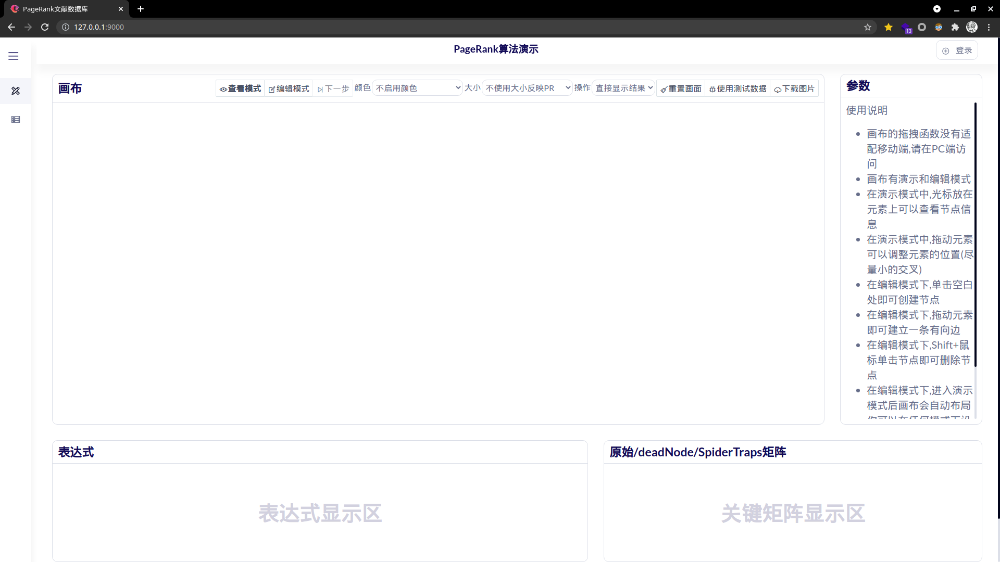

- 响应式布局

  

- PageRank功能正常

  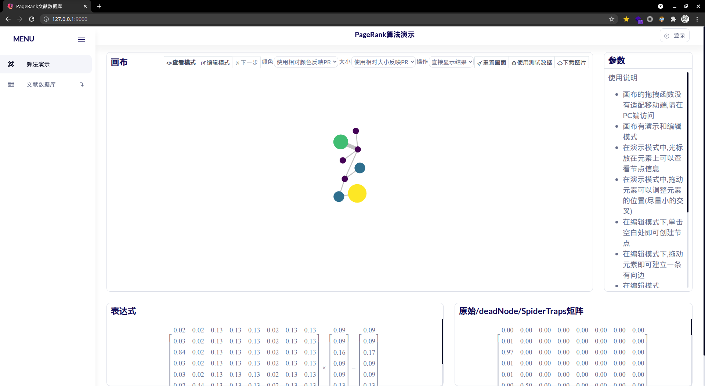

- 登录功能

  

- 登录失败

  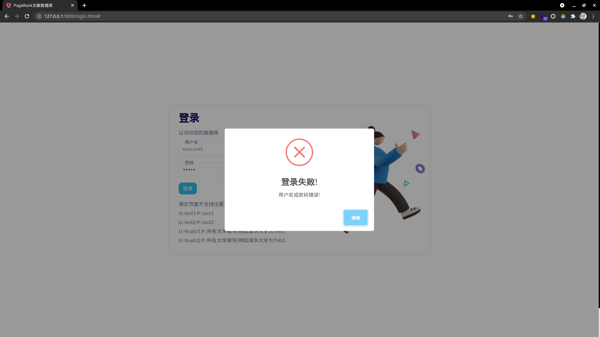

- 登录成功

  

- 查看文献数据库

  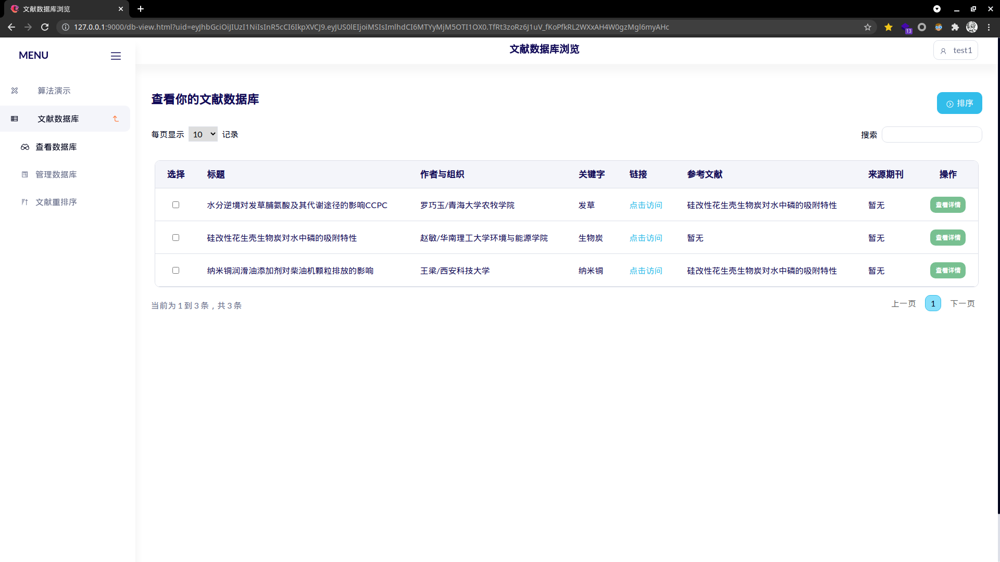

- 查看文献详情

  

  

- 文献排序

  

  

  

- 文献管理

  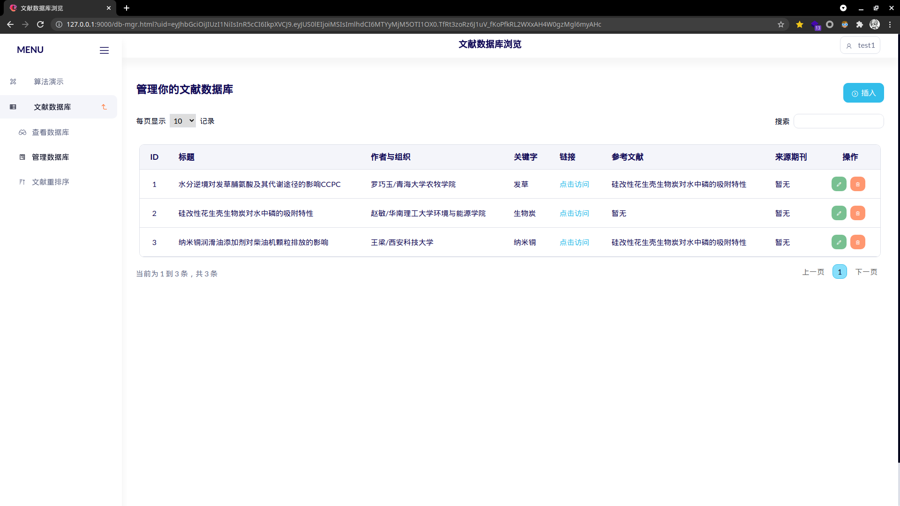

- 文献编辑

  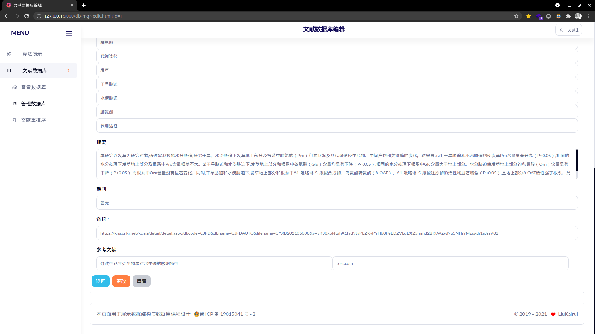

  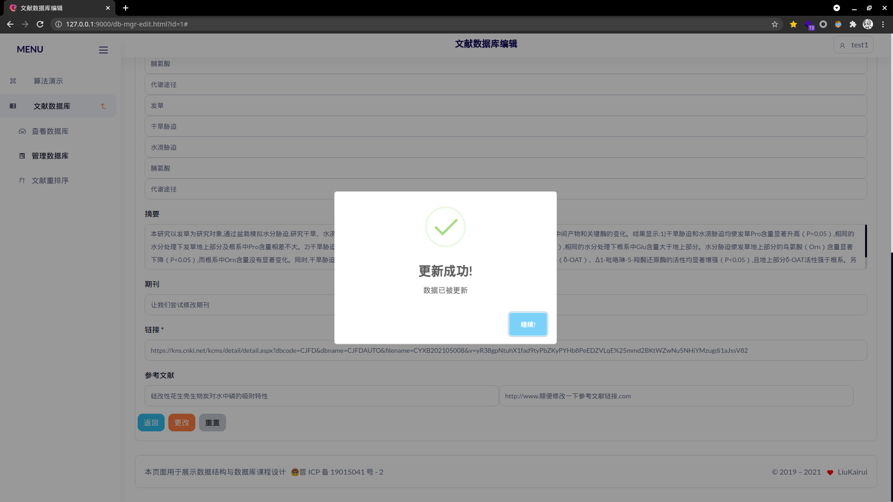

  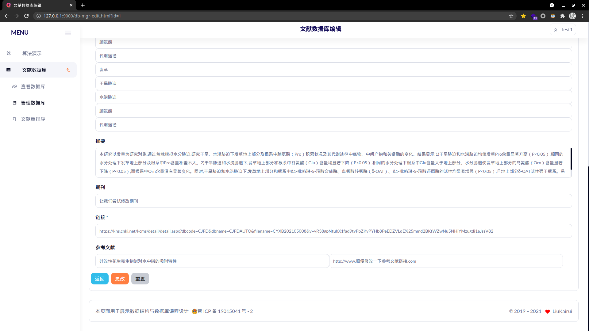

- 文献插入

  

  

  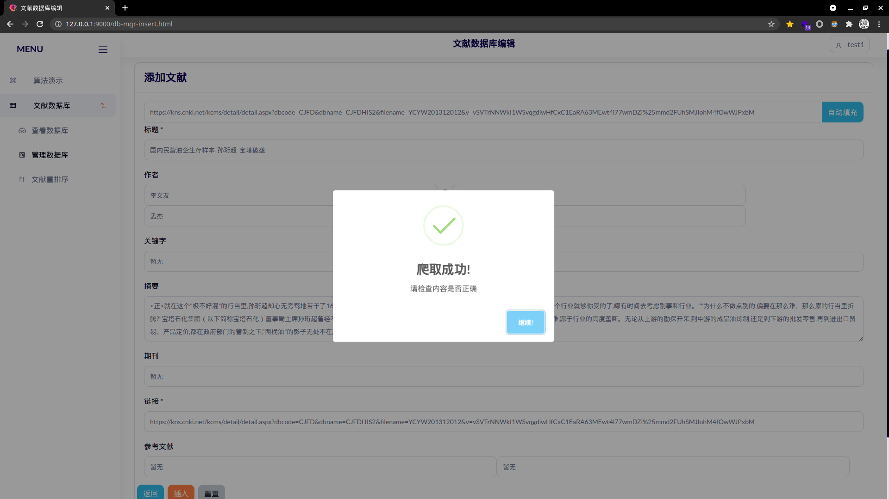

  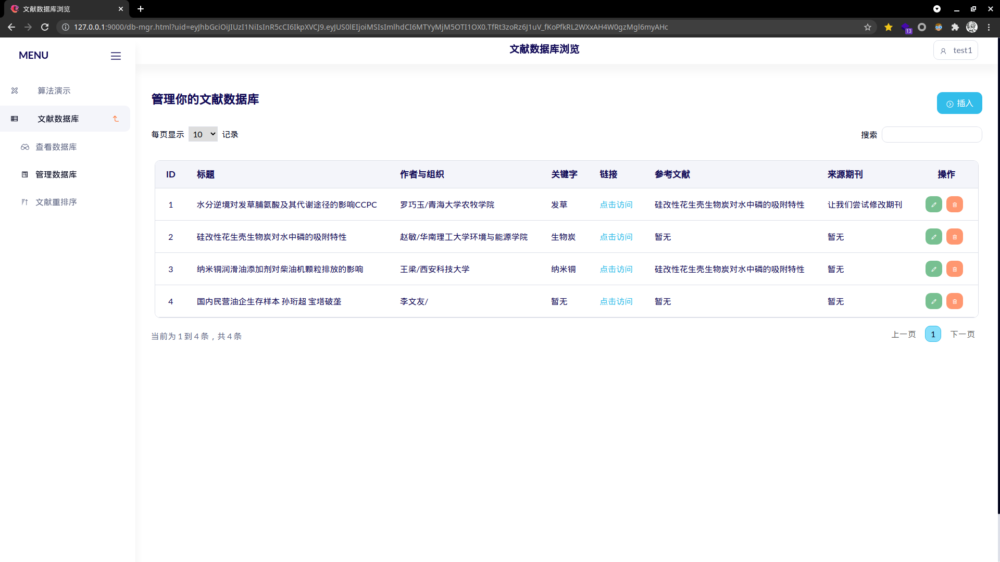

- 分页功能

  

  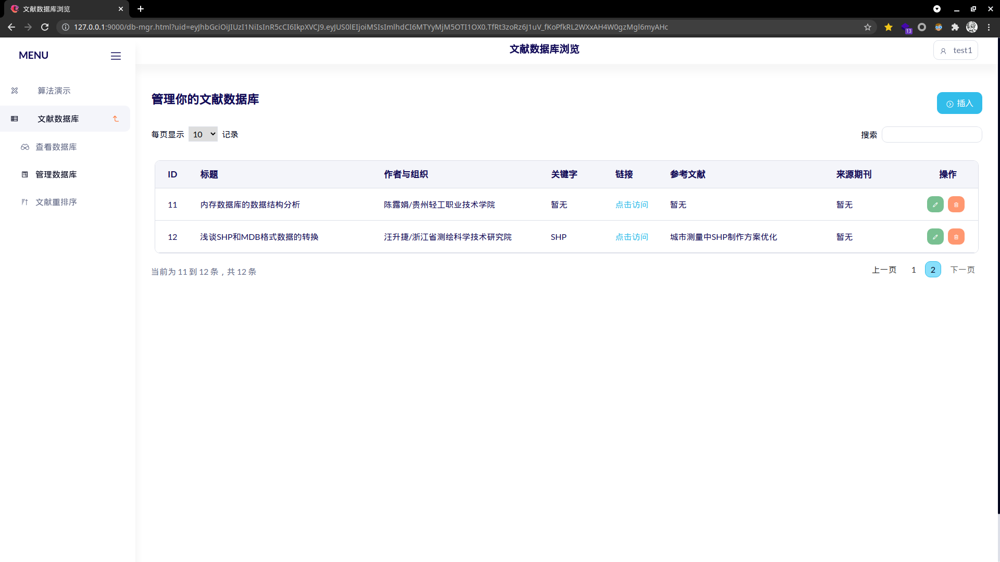

  

- 删除功能

  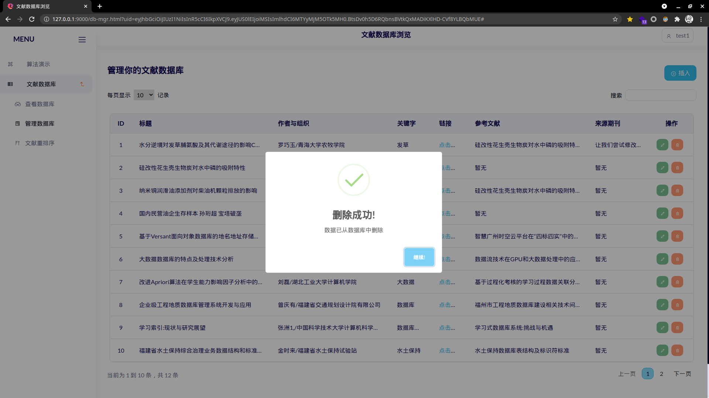

  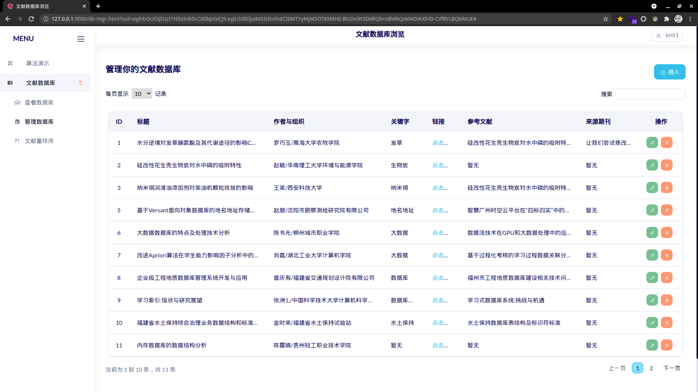

- 文献搜索

  

  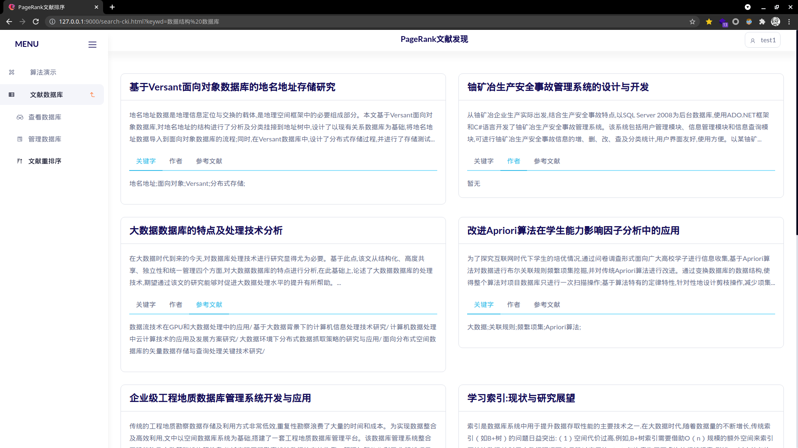

## 总结

- 在本次课程设计中我尝试将PageRank算法与数据库融合，使用NodeJS作为http服务端，取得了较好的效果
- 模块较为清晰科学，成员函数定义清晰，易复用
- 对象之间成员变量命名不是很统一，这导致对象之间的相互调用十分容易出错，同时API定义较差，这导致前端请求处理较为混乱
- 这是我第一次使用异步编程语言进行开发中，异步函数可以可以保证事件运行有序，不因为某些函数效率低而卡顿，但是部分必须同步执行的部分十分难以实现，在本次实验中我总结出来一套Promise与await/async搭配实现了回调函数同步执行的方法，这为今后的开发积累了经验
- JavaScript作为单线程语言(多线程机制较不完善)，在强制同步高压力场景延时较高，这导致我的程序可能要借助其他工具实现高并发场景的应用
- 由于对象之间之间语义上存在双向多对多的关系，我们通过一系列行为降低了数据荣誉，这位之后的设计开发积累了经验

## 参考文献

[1] Page L , Brin S , Motwani R , et al. The PageRank Citation Ranking: Bringing Order to the Web. 1998.
[2]郑璇. 基于D3和React的数据分析可视化组件设计与实现[D].东南大学,2019.
[3]于林轩,李业丽,曾庆涛.PageRank算法在主题网络爬虫中的应用[J].北京印刷学院学报,2020,28(10):143-147.
[4]贾瑞娜,张向利,闫坤,张红梅.基于可达查询的个性化PageRank算法[J].桂林电子科技大学学报,2020,40(01):39-43.
[5]The PageRank citation ranking: Bringing order to the web. L Page, S Brin, R Motwani, et al. Stanford Digital Libraries Working Paper 1999-0120 . 1998
